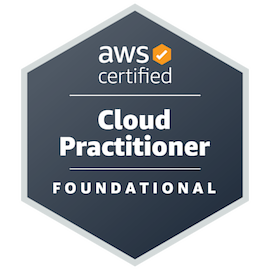
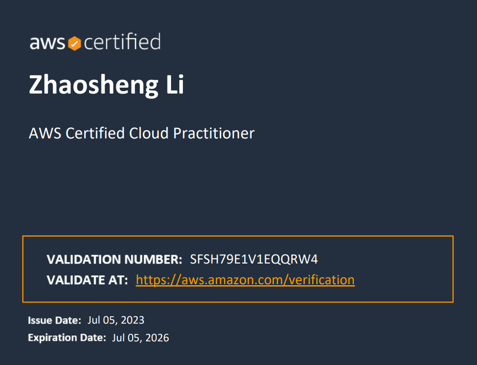

# Ultimate AWS Certified Cloud Practitioner - 2023

|  |  |
| :-------------------- | :-------------------- |
|   |  |

This folder contains my course note when I am taking the course offered by Stephane Maarek on [Udemy](https://www.udemy.com/course/aws-certified-cloud-practitioner-new/)

|  |  |
| :-------------------- | :-------------------- |
| **Domain 1**: Cloud Concepts  | **Domain 2**: Security and Compliance |
|  **Domain 3**: AWS Technology  | **Domain 4**: Billing and Pricing |

---

|  |  |
| :-------------------- | :-------------------- |
| Section 3. What is Cloud Computing?  | Section 4. IAM - Identity and Access Management |
| Section 5. EC2 - Elastic Compute Cloud | Section 6. EC2 Instance Storage Section  |
| Section 7. Elastic Load Balancing & Auto Scaling Groups Section | Section 8. Amazon S3 |
| Section 9. Databases & Analytics | Section 10. Other Compute Services: ECS, Lambda, Batch, Lightsail |
| Section 11. Deploying and Managing Infrastructure at Scale | Section 12. Leveraging the AWS Global Infrastructure |
| Section 13. Cloud Integration | Section 14. Cloud Monitoring |
| Section 15. VPC & Networking | Section 16. Security & Compliance |
| Section 17. Machine Learning | Section 18. Account Management, Billing & Support |
| Section 19. Advanced Identity | Section 20. Other AWS Services |
| Section 21. AWS Architecting & Ecosystem |  |
