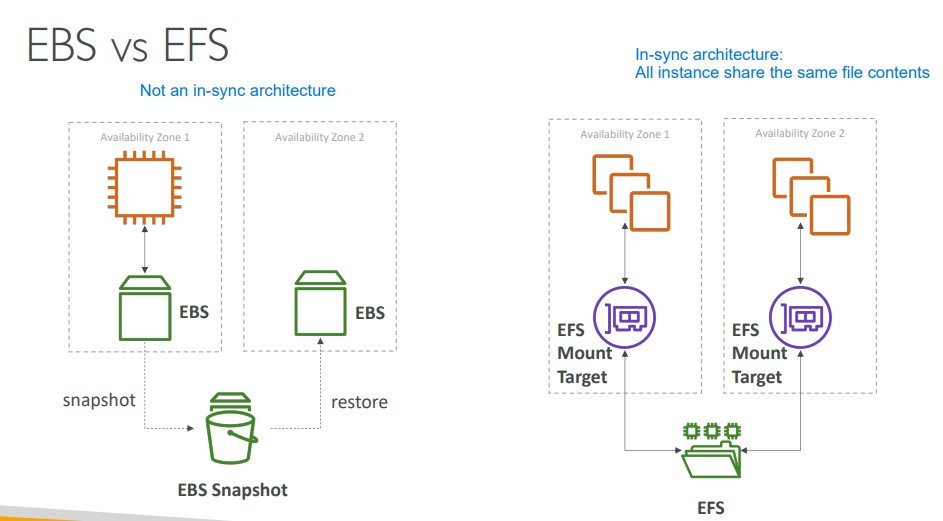

# Section 6. EC2 Instance Storage Section

EC2 instance can be running on three types of storages:

- `EBS (Elastic Block Store) Volume`
- `EC2 Instance Store`
- `EFS (Elastic File System)`

## EBS (Elastic Block Store) Volume

- A network drive (not a physical drive) attached to the EC2 instances which they run
- Can only be mounted to **one instance** at a time
- Lokced to an availability zone
- Good for long-term data storage

### Delete on Termination Attribute

- By default, the root EBS volume is deleted (attribute enabled)
- By default, any other attached EBS volume is not deleted (attribute disabled)
- This can be controlled by the AWS console / AWS CLI

### EBS Snapshots

- Make a backup (snapshot) of your EBS volume at a point in time
- Copy snapshots across Availability Zone or Region

## EC2 Instance Store

- High-performance hardware disk
    - Better I/O performance
    - But only good for short-term storage. EC2 Instance Store loses its storage if it is stopped (ephemeral)

## EFS (Elastic File System)

- Managed and shared NFS (Network File System) that can be mounted on hundreds of EC2 Instances
- Work with **Linux** EC2 instances in multi-AZ

### EFS Infrequent Access (EFS-IA)

- Storage class that is cost-optimized for files not accessed every day

*** 
## EBS vs EFS

(Image Retrieved from [1])

## AMI (Amazon Machine Image)

- Create EC2 instances with our **customization** on software, configuration, operating system, monitoring...
- Built for a **speific region** and can be copied across regions
- One can launch existing EC2 instances from:
    - **A Public AMI**: AWS provided
    - **Your own AMI**: you make and maintain them yourself
    - **An AWS Marketplace AMI**: An AMI someone else made (A third-party)
- Build an AMI will also create EBS snapshots

## EC2 Image Builder

- Automatically build, test, and distribute EC2 AMIs

## Amazon FSx

- If you don't want to use S3 or EFS, think about the third-party high-performance file systems on AWS - `Amazon FSx`
- **Amazon FSx for Windows File Server**
    - Network File System for Windows Servers
    - For business application
- **Amazon FSx for Lustre**
    - High performance computing Linux file system
    - For high-performance computing

## References
[1] S. Maarek, “Courses datacumulus,” Courses Datacumulus. [Online]. Available: https://www.datacumulus.com/. [Accessed: 3-May-2023]. 
