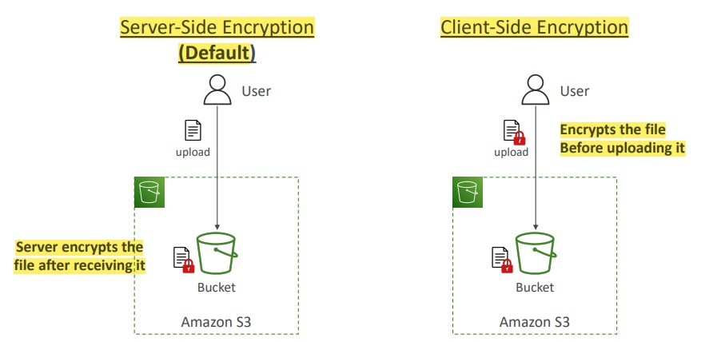

# Section 8. Amazon S3

Amazon S3 is advertised as infinitely scaling storage.

## Buckets & Objects

- Amazon S3 allows people to store `objects` (files) in `buckets` (directories)
    - Buckets must have a **globally unique name (across all regions all accounts)**
    - Buckets are defined at the region level

- Objects (files) have
    - `key`: absolute file path
    - `value`: the content of the body
    - `Metadata`: list of text key / value pairs
    - `Tags`: Unicode key / value pair - up to 10
    - `Version ID`

## Amazon S3 Security

- An `IAM principal` can access an S3 object if
    - The user IAM permissions allow it **OR** the resource policy allows it
    - **AND** there is no explicit deny
- S3 Encryption

(Image Retrieved from [1])

## Amazon S3 Static Website Hosting

- S3 can host static websites and have them accessible on the Internet
- Make sure the bucket policy allows public reads

## Amazon S3 Versioning & Replication

- Amazon S3 versioning is enabled at the **bucket level**
- To enable `replication`, the `versioning` in source and destination buckets must be enabled.
- Amazon S3 replication has two categories and the copying is asynchronous
    - `Cross-Region Replication (CRR)`
    - `Same-Region Replication (SRR)`

## S3 Storage Classes

Can move between classes `manually` or using `S3 Lifecycle configurations`.

`Durability` is the same for all storage classes, but the `Availability` varies depending on the storage class.

- `Amazon S3 Standard - General Purpose`
    - Used for frequently accessed data
    - Low latency and high throughput
- `Amazon S3 Infrequent Access`
    - For data that is less frequently accessed, but requires **rapid access** when needed.
    - `Amazon S3 Standard - Infrequent Access`
    - `Amazon S3 One Zone - Infrequent Access`
- `Amazon S3 Glacier Storage Classes`
    - Low-cost object storage, plus object retrieval cost
    - `Amazon S3 Glacier Instant Retrieval`
    - `Amazon S3 Glacier Flexible Retrieval`
    - `Amazon S3 Glacier Deep Archive` - for long term storage
- `Amazon S3 Intelligent Tiering`
    - Move object automatically between Access Tiers based on usage
    - **There are no retrieval charges in S3 Intelligent Tiering**

 
## AWS Snow Family

- Highly-secure, portable devices to 
    - Collect and process data at the edge
    - Migrate data into and out of AWS

- `AWS OpsHub` manages the `Snow Family` Device

### Data Migration

- `Snowball Edge`
    - Move TBs or PBs of data in or out of AWS
    - Two categories: `Storage Optimized` and `Compute Optimized`
    - Used for large data cloud migrations, data center decommission, disaster recovery
- `AWS Snowcone & Snowcone SSD`
    - **Snowcone**: 8TB of HDD Storage
    - **Snowcone SSD** 14TB of SSD Storage
    - Use Snowcone when Snowball does not fit (space-constraint environment)
- `AWS Snowmobile`
    - Transfer exabytes of data (1 EB = 1,000 PB = 1,000,000 TB)
    - Better than Snowball if you transfer more than 10 PB

### Edge Computing

Process data while it is being created on an edge location where there is limited / no internet access or easy access to computing power

- `Snowball Edge`
    - Two categories: `Storage Optimized` and `Compute Optimized`
- `Snowcone & Snowcone SSD (Smaller)`

## AWS Storage Gateway

Bridge what happens on-premises directly into AWS cloud.

## References
[1] S. Maarek, “Courses datacumulus,” Courses Datacumulus. [Online]. Available: https://www.datacumulus.com/. [Accessed: 14-May-2023]. 