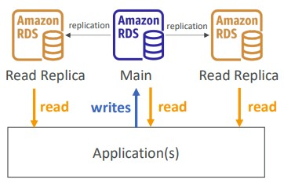
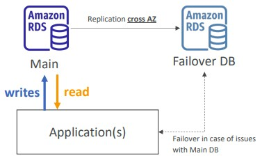
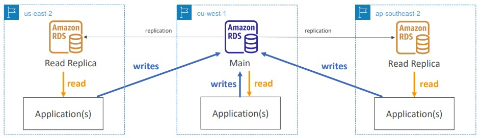

# Section 9. Databases & Analytics

## RDS (Relational Database Service)

- It is managed by AWS, hence you cannot SSH into your instances
- The RDS-relevant stuff will be showing in the exam include `Amazon Aurora` and `Amazon ElastiCache`
- Can be used for OLTP (Online Transaction Processing)

### RDS Deployments

- `Read Replicas`:
    - **Scale** the read workload of your database (DB)
    - Data is only written to the main DB

(Image Retrieved from [1])

- `Multi-AZ`:
    - **Failover** in case of AZ outage (high availability)
    - Data is only read/written to the main database

(Image Retrieved from [1])

- `Multi-Region (Read Replicas)`
    - **Disaster recovery** in case of region issue
    - **Local performance** for global reads. Reading from local database gives rise to less latency

(Image Retrieved from [1])

### Amazon Aurora

- Aurora is a proprietary technology from AWS
- `PostgreSQL` and `MySQL` are both supported as Aurora DB
- Aurora is AWS cloud optimized and its storage automatically grow

### Amazon ElastiCache

- ElastiCache is to get managed Redis or Memcached
- ElastiCache is in-memory database and reduces load off databases for read intensive workloads

## DynamoDB

- NoSQL database - not a relational database. DynamoDB is a key/value database
- DynamoDB is a serverless database
    - We don't need to provision an instance type, but there are still servers in the backend
- Single-digit millisecond latency - low latency retrieval
- The `Global Table` in DynamoDB provides access with low latency in multiple-regions
    - The `Global Table` is based on `Active-Active` replication (read/write to any AWS region)

### DynamoDB Accelerator - DAX

- Fully managed in-memory cache for DynamoDB
- DAX is only used for and is integrated with DynamoDB

## Redshift

- Based on PosgreSQL
- It is used for OLAP (Online Analytical Processing) (analytics and data warehousing)
- Columnar storage of data

## Amazon EMR (Elastic MapReduce)

- EMR helps creating Hadoop clusters (Big Data) to analyze and process vast amount of data

## Amazon Athena

- Serverless query service
- **Exam Tip:** analyze data in S3 using serverless SQL, use Athena

## Amazon QuickSight

- Serverless machine learning-powered business intelligence service to create interactive dashboards

## DocumentDB

- DocumentDB is the same for `MongoDB` (which is a NoSQL database)

## Amazon Neptune

- Fully managed **graph** database
- Popularly used graph dataset for social network.

## Amazon QLDB (Quantum Ledger Database)

- It is essentially a central database owned by Amazon, thereby there is **no concept of decentralization** 
- Recording financial transactions in a ledger
- Used to review history of all the changes made to your application data over time
- Immutable system: no entry can be removed or modified, cryptographically verifiable

## Amazon Managed Blockchain

- Execute transactions without the need for a trusted and central authority
- Compatible with two frameworks: `Heperledger Fabric` and `Ethereum`

## AWS Glue

- Managed extract, transform, and load (ETL) service

## DMS (Database Migration Service)

- Used to migrate databases to AWS

## References
[1] S. Maarek, “Courses datacumulus,” Courses Datacumulus. [Online]. Available: https://www.datacumulus.com/. [Accessed: 17-May-2023]. 