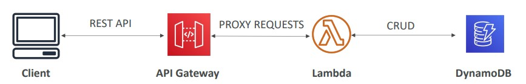

# Section 10. Other Compute Services: ECS, Lambda, Batch, Lightsail

## Docker

- A software development platform to deploy apps
- Apps are packaged in `containers` that can be run on any OS
- A Docker `image` is a file containing a set of instructions to build a Docker environment
- `Amazon ECR (Elastic Container Registry)` is a place to store Docker images

## Launching Docker Containers on AWS

- `ECS (Elastic Container Service)`
    - You must provision & maintain the infrastructure (the EC2 instances)

- `Fargate`
    - You do not provision the infrastructure (no EC2 instances to manage)
    - Serverless offering

- `Lambda Container Image`
    - The container image must implement the Lambda Runtime API

## Serverless

- Serverless is a new paradigm where developers don't have to **manage** servers
- Serverless == FaaS (Function as a Service)
- **Serverless does not mean there are no servers**, it means you just don't manage / provision / see them

## AWS Lambda (FaaS)

- Virtual functions - no servers to manage (i.e. serverless)
- Run on-demand
- Scaling is automated
- Integrated with the whole AWS suite of services
- Event-Driven: functions get invoked by AWS when needed
    - This makes `Lambda` a reactive service
- Billing:
    - **Pay per duration**: By the time run x By the RAM provisioned
    - **Pay per calls**: By the number of invocations

## Amazon API Gateway

- Fully managed service for developers to easily create, publish, maintain, monitor, and sercure APIs
- Serverless and scalable
- Expost Lambda functions as HTTP API

(Image Retrieved from [1])

## AWS Batch

- Fully managed batch processing at any scale
- Batch will dynamically launch EC2 Instances or Spot Instances
- AWS Batch provisions the right amount of compute / memory
- Batch jobs are defined as **Docker images** and **run on ECS**

## AWS Lightsail

- A service that is alternative to other AWS services
    - Great for people with little cloud experience
- Low & Predictable pricing

## References
[1] S. Maarek, “Courses datacumulus,” Courses Datacumulus. [Online]. Available: https://www.datacumulus.com/. [Accessed: 23-May-2023]. 