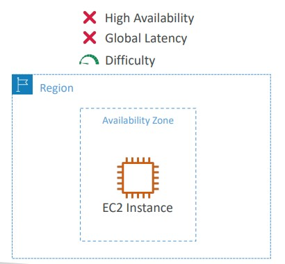
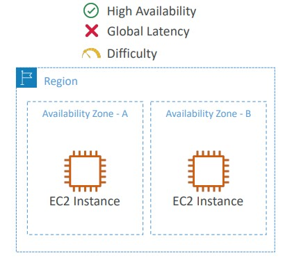
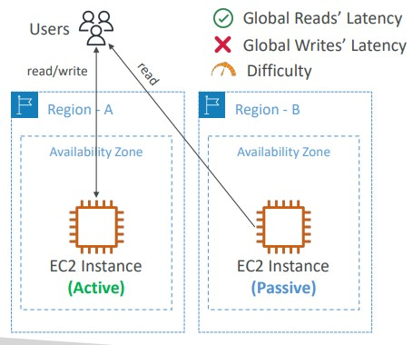
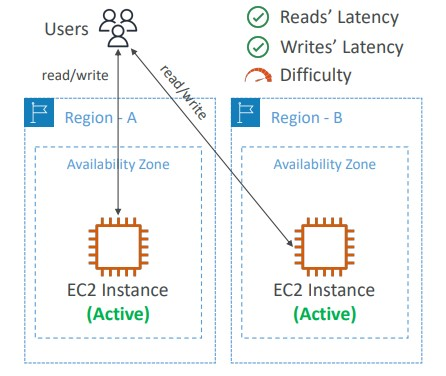
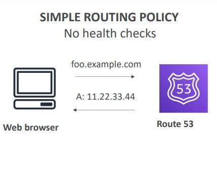
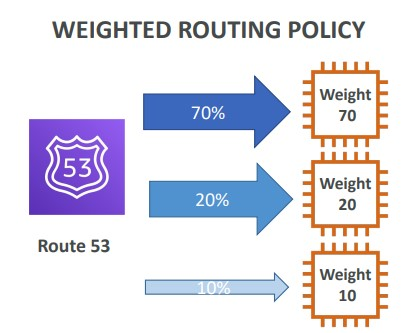
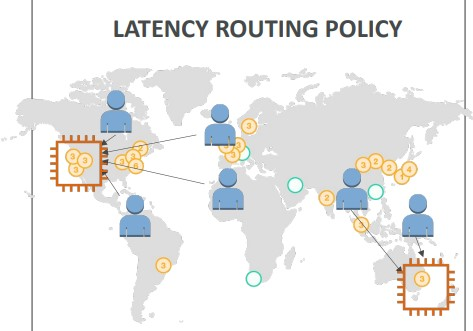
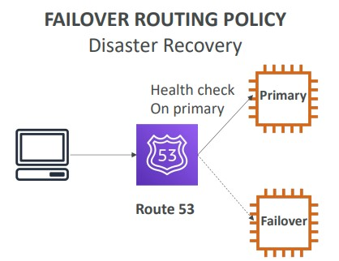

# Section 12. Leveraging the AWS Global Infrastructure

A `global application` is an application deployed in `Regions` and / or `Edge Locations`

## Reason for Making a Global Application

- Decreased Latency
- Disaster Recovery
- Attack Protection
    - Distributed global infrastructure is harder to attack

## Global Application Architecture

| Single Region, Single AZ        | Single Region, Multi AZ        |
| :----: | :----: |
| |  |

| Multi Region, Active-Passive        | Multi Region, Active-Active        |
| :----: | :----: |
| |  |

(Images Retrieved from [1])

## Amazon Route 53

- A managed DNS (Domain Name System)
- Features:
    - Domain Registration
    - DNS
    - Health Checks
    - Routing Policy

### Route 53 Routing Policies

| Simple Routing Policy        | Weighted Routing Policy        |
| :----: | :----: |
| |  |

| Latency Routing Policy        | Failover Routing Policy        |
| :----: | :----: |
| |  |

(Images Retrieved from [1])

*Weighted Routing Policy: route traffic to multiple resources in proportions that you specify*

## AWS CloudFront

- `Content Delivery Network (CDN)`
- Improve read performance, content is `cached` at the edge locations
- `Distributed Denial-of-Service (DDoS)` attack protection, integration with `Shield`, `AWS Web Application Firewall`
    - For additional protection against DDoS attacks, AWS also provides `AWS Shield Standard` and `AWS Shield Advanced`

### CloudFront vs S3 Cross Region Replication

- CloudFront is great for static content that must be available everywhere
- S3 Cross Region Replication is great for dynamic content that needs to be available at low-latency in few regions

## S3 Transfer Acceleration

- Accelerate global uploads & downloads into Amazon S3

## AWS Global Accelerator

- Improve global application `availability` and `performance` using the AWS global network.
- 2 `Anycast IP` are created for your application and traffic is sent through `Edge Locations`

### AWS CloudFront vs Global Accelerator

- CloudFront improves the performance for the cacheable content and the content is served at the edge.
- Global Accelerator speeds up the client request and **no caching**

## AWS Outposts

- For `Hybrid Cloud`
- Run AWS infrastructure and services on-premises for a hybrid cloud architecture
- AWS Outposts are “server racks” that offers the same AWS infrastructure, services, APIs & tools to build your own applications on-premises just as in the cloud.

## AWS Wavelength

- Brings AWS services to the edge of the `5G networks`
- Infrastructure deployments embedded within the telecommunications providers' datacenters at the edge of the 5G network.

## AWS Local Zones

- Place AWS services closer to end users to run latency-sensitive applications
- Extension of an AWS Region

## References
[1] S. Maarek, “Courses datacumulus,” Courses Datacumulus. [Online]. Available: https://www.datacumulus.com/. [Accessed: 04-Jun-2023]. 
