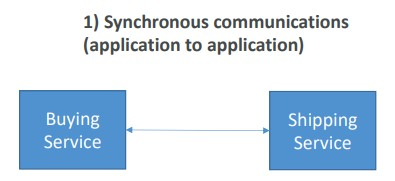
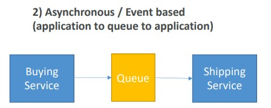

# Section 13. Cloud Integration

## Two Application Communication Patterns

| Synchronous Communications        | Asynchronous / Event-Based Communications        |
| :----: | :----: |
| |  |

The `Queue` is decouping the `Buying Service` and `Shipping Service`

(Images Retrieved from [1])

## Decouple Applications

- `SQS (Simple Queue Service)`: Queue model
    - No limit on how many messages can be in the queue
    - Messages are deleted after they are read by consumers
    - Consumers share the work to read messages & scale horizontally
- `SNS (Simple Notification Service)`: Pub/Sub model
    - `Event publisher` sends message to one SNS topic
    - `Event subscribers` to the topic will get all the messages
- `Kinesis`: Real-time big data streaming model

## Amazon MQ

- Managed message broker service for `RabbitMQ` and `ActiveMQ`
- Has both `SQS` and `SNS` features

## References
[1] S. Maarek, “Courses datacumulus,” Courses Datacumulus. [Online]. Available: https://www.datacumulus.com/. [Accessed: 04-Jun-2023]. 
