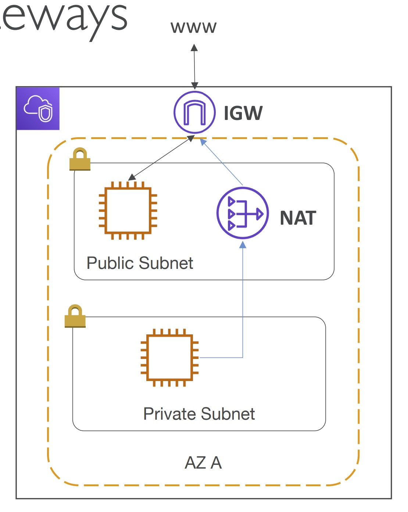
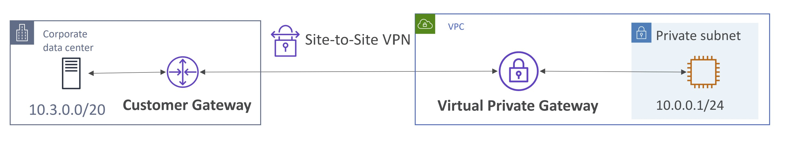

# Section 15. VPC & Networking

## Virtual Private CLoud (VPC)

- A virtual network dedicated to your AWS account.
- Logically isolated from other virtual networks in the AWS Cloud.
- Launch your AWS resources, such as Amazon EC2 instances, into your VPC.

## IPv4 & IPv6

### Ipv4

- Public IPv4
    - Used on the Internet.
    - Every time the instance starts or stops then starts, it will get a new public IP address.
    - `Elastic IP`: Attach a fixed public IPv4 address to an EC2 instance.
- Private IPv4
    - Used on private netoworks (LAN)

### IPv6

- Every IP address is public (no private range)

## VPC Fundamentals

- `VPC`: Private network to deploy your resources.
- `Subnets`: Allow you to partition your network inside your VPC, associated with an `Availability Zone`.
- `Public Subnet`: A subnet that is accessible from the Internet.
- `Private Subnet`: A subnet that is not accessible from the Internet.
- `Route Table`: Define access to the internet and between subnets.
- `Internet Gateways (IGW)`: Connect VPC with the Internet.
- `NAT Gateways (AWS-managed)` & `NAT Instances (self-managed)`:
    - NAT: Network Address Translation
    - Allow the instances in your `Private Subnets` to access the Internet while remaining private.
    - NAT is placed in the `Public Subnets`.

(Image Retrieved from [1])

## VPC Security

- `NACL (Network ACL)`
    - NACL: Network Access Control List
    - A firewall which controls traffic from and to subnet
    - Can have *ALLOW* and *DENY* rules
    - Are attached at the **Subnet** level
    - Is stateless: Return traffic must be explicitly allowed by rules
- `Security Groups`
    - A firewall that controls traffic to and from an `ENI (Elastic Network Interface) / an EC2 Instance`
    - Can have only *ALLOW* rules
    - Is stateful: Return traffic is automatically allowed, regardless of any rules
- `VPC Flow Logs`
    - Capture information about IP traffic going into your interfaces

## VPC Connection

- `VPC Peering`
    - Connect two VPC privately using AWS network
    - Make two connected VPC behave as if they were in the same network
    - `Not Transitive`: `VPC A` is connected with `VPC B` and `VPC C` does not mean `VPC B` and `VPC C` are connected
- `VPC Endpoints`
    - Connect to AWS Services using a private network instead of the public www network
    - `VPC Endpoint Gateway`: used to connect to `S3` and `DynamoDB`
    - `VPC Endpoint Interface`: used to connect to the rest of AWS Services
- `AWS PrivateLink (VPC Endpoint Services)`
    - Privately connect to a service in a `3rd party VPC`
    - Requires a `network load balancer` on the service VPC side and `ENI` on the customer VPC side.
    - Easier to manage and more secure and scalable than the `VPC Peering`
- `Site to Site VPN`
    - Connect an on-premised data center to AWS
    - Goes over the *public Internet*
    - On-premises: must use a `Customer Gateway (CGW)`
    - AWS: must use a `Virtual Private Gateway (VGW)`
- `Direct Connect (DX)`
    - Establish a `physical connection` between on-premises and AWS
    - Goes over the *private Internet*
    - Takes at least a month to establish

(Image Retrieved from [1])

- `AWS Client VPN`
    - Connect my computer to AWS VPC over the public Internet
- `Transit Gateway`
    - Have transitive peering between hundreds / thousands of VPC and on-premises, star connection.

## References
[1] S. Maarek, “Courses datacumulus,” Courses Datacumulus. [Online]. Available: https://www.datacumulus.com/. [Accessed: 07-Jun-2023]. 
