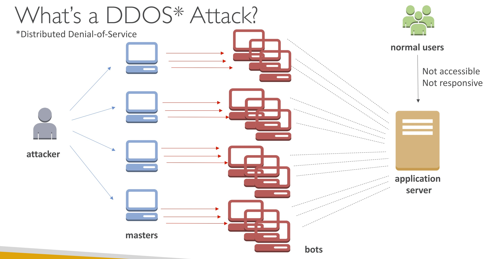

# Section 16. Security & Compliance

## AWS Shared Responsibility

- AWS Responsibility -- **Security of the Cloud**
- Customer Responsibility -- **Security in the Cloud**
    - This also includes server-side encryption, client-side data protection, customer data protection.
- Shared Controls: Patch Management, Configuration Management, Awareness & Training

## DDoS Protection on AWS

- `AWS Shield Standard`
    - Exclusive for the protection of `DDoS attack`
    - Free service that is activated for every AWS customer
    - Provide protection from `layer 3 / layer 4` attacks
- `AWS Shield Advanced`
    - Exclusive for the protection of `DDoS attack`
    - Protect against more sophisticated attack
    - 24/7 access to AWS DDoS response team (DRP)
- `AWS WAF - Web Application Firewall`
    - Protect web applications from common web exploits (Layer 7, which is `HTTP`)
    - Deploy on `Application Load Balancer`, `API Gateway`, `CloudFront`
- `CloudFront and Route 53`

(Image Retrieved from [1])

## Data at rest vs. Data in transit

- `At rest`: data stored or archived on a device
- `In transit (in motion)`: data being moved from one location to another over the network

- The data encryption can be deployed on those two stages as well.

## Penetration Testing on AWS

- AWS customers are welcome to carry out penetraion tests against their AWS infrastructure without prior approval, `BUT THERE ARE SOME PROHIBITED ACTIVITIES`, such as:
    - DNS zone walking
    - DDoS attack
    - Port flooding

## AWS Security-Related Service

| AWS Service        | Description        |
| :-------------: | ------------- |
| `AWS KMS (Key Managment Service)` | <ul><li>Manage the encryption keys for customers.</li><li>Encryption service at AWS.</li></ul> |
| `CloudHSM` | <ul><li>AWS provisions encryption hardware.</li><li>Customers manage their own encryption keys entirely.</li><li>Another encryption service at AWS.</li></ul> |
| `AWS Certificate Manager (ACM)` | <ul><li>Help users provision, manage, and deploy SSL / TLS Certificates.</li><li>The certificates are used to provide in-flight encryption for websites (HTTPS).</li><li>SSL: Secure Sockets Layer</li><li>TLS: Transport Layer Security</li></ul> |
| `AWS Secrets Manager` | <ul><li>Service for storing secrets.</li><li>Force rotation of secrets every X days, such as changing the password.</li><li>Integration with Amazon RDS.</li></ul> |
| `AWS Artifact` | <ul><li>Portal that provides customers with on-demand access to AWS compliance documentation and AWS agreements.</li></ul> |
| `Amazon GuardDuty` | <ul><li>Discover thread to protect AWS accounts and workloads.</li><li>Set up `EventBridge rules` to be notified in case of findings.</li><li>Protect against CryptoCurrency attacks.</li></ul> |
| `Amazon Inspector` | <ul><li>Carry out automated security assessments.</li><li>Only for `EC2 instances`, `Container Images` & `Lambda Functions`.</li></ul> |
| `AWS Config` | <ul><li>Audit and record compliance of AWS resources.</li><li>Record configurations and changes over time.</li></ul> |
| `AWS Macie` | <ul><li>Use machine leanring and pattern matching to discover and protect your sensitive data in AWS.</li><li>Help identify and alert user to sensitive data, such as personally identifiable information (PII).</li></ul> |
| `AWS Security Hub` | <ul><li>Central security tool to manage security across several AWS accounts and automate security checks.</li></ul> |
| `Amazon Detective` | <ul><li>Analyze, investigate, and quickly identify the **root cause** of security issues or suspicious activities (using ML and graphs).</li><li>Automatically collect and process events.</li></ul> |
| `AWS Abuse` | <ul><li>Report suspected AWS resources used for abusive or illegal purposes.</li></ul> |

## Actions that can Only be Performed by the Root User

- Change account settings
- Close your AWS account
- Change or cancel your AWS Support plan
- Register as a seller in the Reserved Instance Marketplace

## IAM Access Analyzer

- Find out which resources are shared externally by defining
    - `Zone of Trust`: AWS Account or AWS Organization
    - Access outside zone of trusts

## References
[1] S. Maarek, “Courses datacumulus,” Courses Datacumulus. [Online]. Available: https://www.datacumulus.com/. [Accessed: 09-Jun-2023]. 
