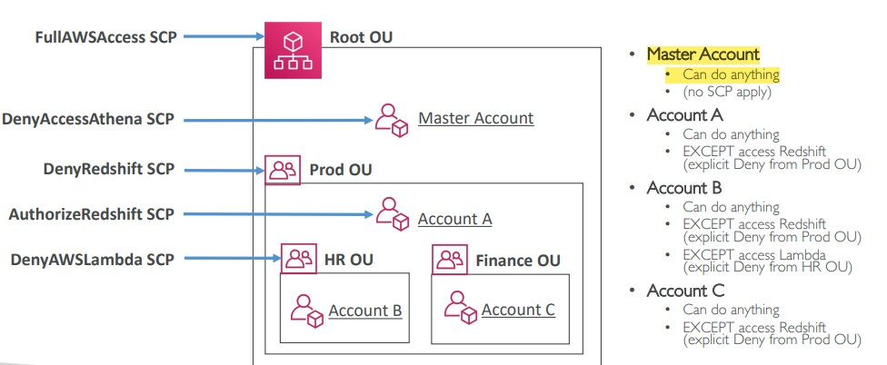
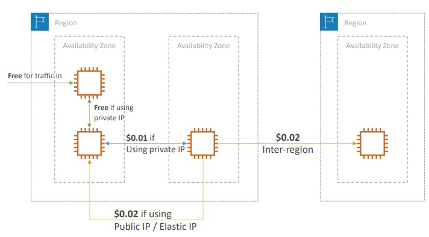

# Section 18. Account Management, Billing & Support

## AWS Organization

- Manage multiple AWS accounts
- The main account is the `master account`
- Cost Benefits:
    - Consolidated Billing across all accounts. (i.e. `Master account` makes payment for other accounts.)
    - Pricing benefits from aggregated usage. (Volume discount for EC2, S3)
    - Pooling of Reserved EC2 instances for optimal savings.
- API is available to automate AWS account creation
- Restrict account privileges using `Service Control Policies (SCP)`

## AWS Control Tower

- Easy way to set up and govern a secure and compliant **multi-account AWS environment** baesd on best practices.
- Set up the environment in a few clicks.

## Service Control Policies (SCP)

- Whitelist and blacklist IAM actions.
- Applied at `Organization Unit (OU)` or `Account` level.
- SCP is applied to all the Users and Roles of the Account, including Root User, but **does not apply to the Master Account**
- SCP must have an explicit allow (does not allow by default)
- SCP Hierarchy is like a tree. The account at lower level **inherits** the SCP at higher level.

(Image Retrieved from [1])

## AWS Service Catalog

- A quick self-service portal to launch a set of authorized products pre-defined by admins. So that users have easy access to the services and launch them easily.

## Pricing Models in AWS

| Pricing Models  |    Description        |
| :-------: | ------- |
| `Pay as you go` | <ul><li>Agile, responsive, meet scale demands.</li></ul> |
| `Save when you reserve` | <ul><li>Minimize risks, predictable manage budges, comply with long-terms requirements.</li></ul> |
| `Pay less by using more` | <ul><li>Volume-based discounts.</li></ul> |
| `Pay less as AWS grows` |  |

## Free Services & Free Tier in AWS

- IAM
- VPC
- Consolidated Billing
- Elastic Beanstalk
    - You do pay for the resoures created
- CloudFormation
    - You do pay for the resource created
- Auto Scaling Group
    - You do pay for the resource created

*NOTE:* `CloudFront` Pricing is different across different geographic regions.

## Networking Costs in AWS per GB

(Image Retrieved from [1])

- Use Private IP instead of Public IP for good savings and better network performance
- Use same AZ for maximum savings (at the cost of high availability)

## Savings Plans

| Saving Plans  |    Description        |
| :-------: | ------- |
| `EC2 Savings Plan` | <ul><li>Up to 72% discount compared to On-Demand.</li><li>Commit to usage of individual instance families in a region (e.g. C5 or M5).</li><li>Regardless of AZ, size (m5.xl to m5.4xl), OS (Linux/Windows) or tenancy.</li></ul> |
| `Compute Savings Plan` | <ul><li>Up to 66% discount compared to On-Demand.</li><li>Even more flexible than EC2 Savings Plan.</li><li>Regardless of Family, Region, size, OS, tenancy, compute options.</li></ul> |
| `Machine Learning Savings Plan` | <ul><li>SageMaker.</li></ul> |

## AWS Compute Optimizer

- Reduce costs and improve performance by recommending optimal AWS resources for your workloads.
- Use Machine Learning to analyze the `resource's configuration` and their `utilization CloudWatch metrics`.

## Billing and Costing Tools

| Tools  |    Description        |
| :-------: | ------- |
| **Estimating costs in the cloud**  ||
| `AWS Price Calculator` | <ul><li>Estimate the cost for your solution architecture.</li></ul> |
| **Tracking costs in the cloud**  ||
| `AWS Billing Dashboard` |  |
| `AWS Cost Allocation Tags` | <ul><li>Track your AWS costs on a detailed level.</li><li>`AWS generated tags`: start with prefix aws</li><li>`User-defined tags`: start with prefix user</li></ul> |
| `AWS Cost and Usage Reports` | <ul><li>The most comprehensive set of AWS cost and usage data available.</li></ul> |
| `AWS Cost Explorer` | <ul><li>Visualize the AWS costs and usage over time.</li><li>Choose an optimal Savings Plan (to lower prices on bills).</li><li>Forecast usage up to 12 months based on previous usage.</li></ul> |
| **Monitoring against costs plans**  ||
| `AWS Billing Alarms in CloudWatch` | <ul><li>Billing data metric is stored in CloudWatch us-east-I.</li><li>Billing data are for overall worldwide AWS costs.</li><li>Not as powerful as `AWS Budgets`</li></ul> |
| `AWS Budgets` | <ul><li>Create budget and send alarms when costs exceeds the budget.</li><li>4 types of budgets: Usage, Cost, Reservation, Saving Plans.</li></ul> |

## Tagging and Resource Groups

- Tags are used for
    - organizing resources
    - creating resource groups

## AWS Cost Anomaly Detection

- Continuously monitor your cost and usage using ML to detect unusual spends.

## AWS Service Quotas

- Notify you when you are close to a service quota value threshold.

## Trusted Advisor 

- High level AWS account assessment
- Analyze your AWS accounts and provides recommendation on 5 categories:
    - Cost optimization
    - Performance
    - Security
    - Fault tolerance
    - Service limits

| 7 Core Checks   Basic & Developer Support Plan  |    Full Checks   Business & Enterprise Support Plan        |
| :------- | :------- |
| <ul><li>S3 Bucket Permissions</li></ul>  | <ul><li>Full Checks available on the 5 categories</li></ul>  |
| <ul><li>Security Groups - Specific Ports Unrestricted</li></ul> | <ul><li>Ability to set CloudWatch alarms when reaching limits.</li></ul> |
| <ul><li>IAM Use (one IAM user minimum)</li></ul>  | <ul><li>Programmatic Access using AWS Support API</li></ul> |
| <ul><li>MFA on Root Account</li></ul> |  |
| <ul><li>EBS Public Snapshots</li></ul> |  |
| <ul><li>RDS Public Snapshots</li></ul> |  |
| <ul><li>Service Limits</li></ul> |  |

## AWS Support Plans

| AWS Support Plans  |    Description        |
| :-------: | ------- |
| `AWS Basic Support Plan` | <ul><li>Customer Service & Communities.</li><li>AWS Trusted Advisor.</li><li>AWS Personal Health Dashboard.</li></ul> |
| `AWS Developer Support Plan` | <ul><li>All Basic Support Plan + Business hours email access to Cloud Support Associates.</li></ul> |
| `AWS Business Support Plan (24/7)` | <ul><li>Intended to be used if you have production workloads.</li><li>Trusted Advisor - Full set of checks + API access.</li><li>24x7 phone, email, and chat access to Cloud Support Engineers.</li><li>Access to Infrastructure Event Management for additional fee.</li></ul> |
| `AWS Enterprise On-Ramp Support Plan (24/7)` | <ul><li>Intended to be used if you have production or business critical workloads.</li><li>All of Business Support Plan +</li><li>Access to a pool of Technical Account Managers (TAM).</li><li>Concierge Support Team (for billing and account best practices).</li><li>Infrastructure Event Management, Well-Architected & Operations Reviews.</li></ul> |
| `AWS Enterprise Support Plan (24/7)` | <ul><li>Intended to be used if you have mission critical workloads.</li><li>All of Business Support Plan +</li><li>Access to a **designated** Technical Account Manager (TAM).</li><li>Concierge Support Team (for billing and account best practices).</li><li>Infrastructure Event Management, Well-Architected & Operations Reviews.</li></ul> |

## Summary of Account Best Practices

- Operate multiple accounts using `Organizations`
- Use `SCP` (service control policies) to restrict account power
- Easily setup multiple accounts with best-practices with `AWS Control Tower`
- `Use Tags & Cost Allocation Tags` for easy management & billing
- `IAM guidelines`: MFA, least-privilege, password policy, password rotation
- `Config` to record all resources configurations & compliance over time
- `CloudFormation` to deploy stacks across accounts and regions
- `Trusted Advisor` to get insights, Support Plan adapted to your needs
- Send Service Logs and Access Logs to `S3 or CloudWatch Logs`
- `CloudTrail` to record API calls made within your account
- If your Account is compromised: change the root password, delete and rotate all passwords / keys, contact the AWS support
- Allow users to create pre-defined stacks defined by admins using `AWS Service Catalog`

## References
[1] S. Maarek, “Courses datacumulus,” Courses Datacumulus. [Online]. Available: https://www.datacumulus.com/. [Accessed: 11-Jun-2023]. 