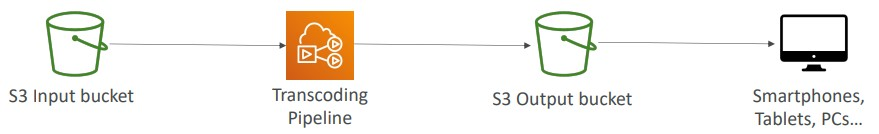

# Section 20. Other AWS Services

| AWS Services  |    Description        |
| :-------: | ----- |
| `Amazon WorkSpaces` | <ul><li>Managed Desktop as a Service (DaaS) solution to easily provision Windows or Linux desktops.</li><li>Help eliminate management of on-premise VDI (Virtual Desktop Infrastructure).</li><li>Gain access to both AWS Cloud and data centers.</li></ul> |
| `Amazon AppStream 2.0` | <ul><li>Desktop **Application** streaming service.</li><li>Deliver a desktop application to web browsers (no need to connect to a VDI).</li><li>Work with any device that has a web browser.</li></ul> |
| `Amazon Sumerian` | <ul><li>Create and run virtual reality (VR), augmented reality (AR), and 3D applications.</li><li>Create 3D models with animations.</li></ul> |
| `AWS IoT Core` | <ul><li>Easily connect IoT devices to the AWS Cloud.</li><li>IoT (Internet of Things): the network of internet-connected devices that are able to collect and transfer data.</li></ul> |
| `Amazon Elastic Transcoder` | <ul><li>Convert media files stored in S3 into media files in the formats required by consumer playback devices.</li><li>(Image Retrieved from [1])</li></ul> |
| `AWS AppSync` | <ul><li>Store and sync data across mobile and web apps in real-time.</li><li>Make use of `GraphQL` (mobile technology from Fackbook)</li></ul> |
| `AWS Amplify` | <ul><li>A set of tools and services that help you develop and deploy scalable full stack web and mobile applications.</li></ul> |
| `AWS Device Farm` | <ul><li>Fully-managed service that tests your web and mobile apps against desktop browsers, real mobile devices, and tablets.</li></ul> |
| `AWS Backup` | <ul><li>Fully-managed service to centrally manage and automate backups across AWS services.</li></ul> |
| `Disaster Recovery Strategies` | <ul><li>`Backup and Restore` is the cheapest.</li><li>`Multi-Site / Hot-Site` is the most expensive.</li></ul> |
| `AWS Elastic Disaster Recovery (DRS)` | <ul><li>Used to be named `CloudEndure Disaster Recovery`.</li><li>Quickly and easily recover your physical, virtual, and cloud-based servers into AWS.</li></ul> |
| `AWS DataSync` | <ul><li>Move large amount of data from on-premises to AWS.</li><li>The replication tasks are **incremental** after the first full load.</li></ul> |
| `AWS Migration Evaluator` | <ul><li>Provide a clear insight into what your organization is running before migration.</li></ul> |
| `AWS Application Discovery Service` | <ul><li>Plan migration projects by gathering information about on-premises data centers.</li><li>Two types: `Agentless Discovery (AWS Agentless Discovery Connector)` and `Agent-based Discovery (AWS Application Discovery Agent)`</li><li>Resulting data can be viewed within `AWS Migration Hub`.</li></ul> |
| `AWS Application Migration Service` | <ul><li>Lift-and-shift (rehost) solution which simplify migrating applications to AWS.</li></ul> |
| `AWS Fault Injection Simulator (FIS)` | <ul><li>Fully managed service for running fault injection experiments on AWs workloads.</li><li>Based on `Chaos Engineering`.</li></ul> |
| `AWS Step Functions` | <ul><li>Build serverless visual workflow to orchetrate your Lambda functions.</li></ul> |
| `AWS Ground Station` | <ul><li>Fully managed service that lets you control sattelite communications, process data, and scale your satellite operations.</li></ul> |
| `Amazon Pinpoint` | <ul><li>Scalable 2-way (outbound / inbound) marketing communications service.</li><li>The next evolution of Amazon SNS and SES in case you want to do full-blown marketing communication service.</li></ul> |
