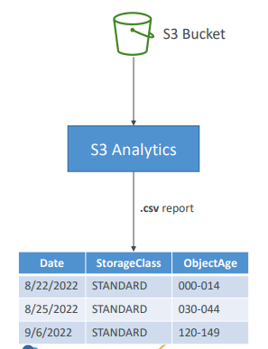
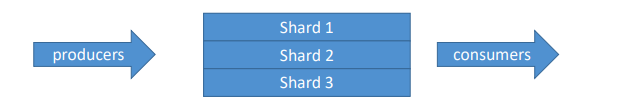
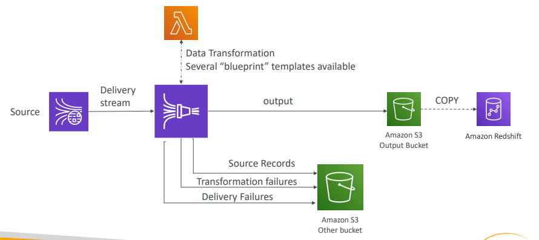
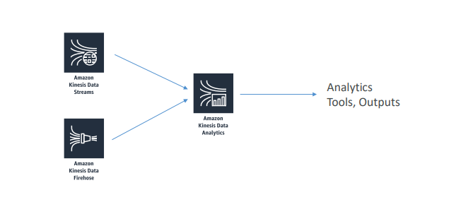
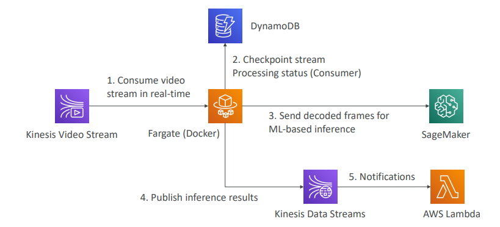
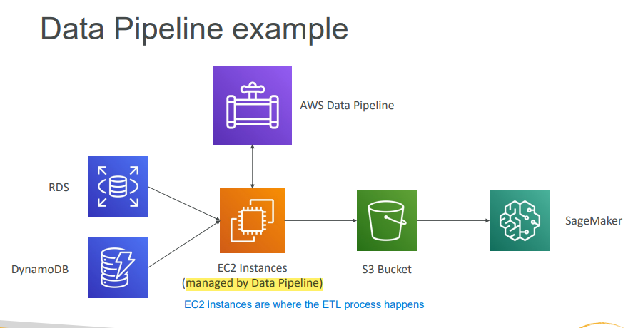
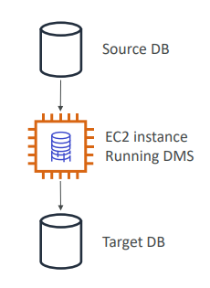
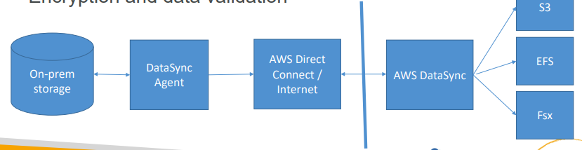

# Section 2. Data Engineering

# :one: Amazon S3

## :cloud: Fundamentals

- `Amazon S3` is backbone for many AWS Machine Learning services, such as `SageMaker`.
- `Durability`: High durability (99.999999999%, 11 9’s) of objects across multiple AZ.
- `Availability`: Varies denpending on `storage class`.

## :sunny: Amazon S3 Data Partitioning

- Pattern for speeding up range queries
- For example:
    - By Date: `s3://bucket/my-data-set/year/month/day/hour/data_00.csv`
    - By Product: `s3://bucket/my-data-set/product-id/data_32.csv`

## :umbrella: Amazon S3 Storage Classes

Can move between classes `manually` or using `S3 Lifecycle Rules`

`Durability` is the same for all storage classes, but the `Availability` varies depending on the storage class

`Data access pattern` is a main difference among all the classes

- `Amazon S3 Standard - General Purpose`
    - Used for frequently accessed data
    - Low latency and high throughput
- `Amazon S3 Infrequent Access`
    - For data that is less frequently accessed, but requires **rapid access** when needed.
    - Lower cost than S3 Standard

| Amazon S3 Standard - Infrequent Access | Amazon S3 One Zone - Infrequent Access |
|:-----|:-----|
|<li>Higher storage cost and lower retrieval cost than `Glacier`</li>|<li>20% cheaper than `S3 Standard - Infrequent Access`</li>|

- `Amazon S3 Glacier Storage Classes`
    - Low-cost object storage, plus object retrieval cost
    - Higher retrieval cost and lower storage cost than `Standard - IA`

| Amazon S3 Glacier Instant Retrieval | Amazon S3 Glacier Flexible Retrieval | Amazon S3 Glacier Deep Archive |
|:-----|:-----|:-----|
||<li>Expedited (1 - 5 mins)</li><li>Standard (3 - 5 hours)</li><li>Bulk (5 - 12 hours)</li>|<li>For long term storage</li><li>Take the most  time to retrieve data (`first byte latency`)</li><li>More cost-effective than `S3 Standard - IA` and `S3 One Zone - IA`</li>|

- `Amazon S3 Intelligent Tiering`
    - Move object automatically between Access Tiers based on usage
    - **There are no retrieval charges in S3 Intelligent Tiering**
    - For storing unpredictable accessed data

## :snowflake: Amazon S3 Lifecycle Rules

- Moving objects between `Storage Classes`
- `Transition Actions`: Configure object to transition to another storage class
- `Expiration Actions`: Configure object to expire (delete) after some time

## :snowman: Amazon S3 Analytics

|||
|:---|:---|
|<li>Help decide when to transition objects to the right storage class</li><li>Recommendations for `S3 Standard` and `S3 Standard IA`</li><li>Not work for `S3 One-Zone IA` or `S3 Glacier`</li>||

## :bear: Amazon S3 Security

- User-Based
    - `IAM Policies`
        - Define which API calls should be allowed for a specific user from IAM
- Resource-Based
    - `Bucket Policies`
        - JSON based policies

        - Grant public access to the bucket
        - **Force object to be encrypted with a specific encyrption type at upload**
        - Grant access to another account (`Cross Account`)
    - `Object Access Control List (ACL)` - finer grain
    - `Bucket Access Control List (ACL)` - Less common

## :zap: Amazon S3 Encryption

**NOTE**: `Bucket Policies` are evaluated **before** `Encryption`. This means you can apply `bucket policies` preemptively to force an encryption type

### Encryption At Rest

- Server-Side Encyption (SSE)

| Amazon S3-Managed Keys (SSE-S3) | KMS Keys stored in AWS KMS (SSE-KMS) | Customer-Provided Keys (SSE-C) |
|:------|:------|:------|
|<li>Keys are handled, managed, and owned by AWS</li><li>**Enabled by default for new buckets & new objects**</li><li>Encryption type is `AES-256`</li>|<li>Keys are handled and managed by AWS KMS (Key Management Service)</li><li>Advantanges: User control + audit ky usage via `CloudTrail`</li><li>Disadvantages: call `GenerateDataKey` KMS API for upload + call `Decrypt` KMS API for download</li>|<li>Keys are fully managed by customers, and `Amazon S3` does not store the encryption key</li><li>`HTTPS` must be used</li>|

- Client-Side Encryption
    - Use client libraries such as `Amazon S3 Client-Side Encryption Library`
    - Clients must encrypt / decrypt data themselves before sending to / retrieving from Amazon S3
    - Customer fully manages the keys and encryption cycle

### Encryption In Transit

- Encryption in flight / in transit is also called `SSL/TLS`
    - SSL: Secure Socket Layer
    - TLS: Transport Layer Security
- `Amazon S3` exposes two endpoints
    - `HTTP Endpoint`: non encrypted
    - `HTTPS Endpoint`: encryption in flight and highly recommended
    

## :cyclone: VPC Endpoint Gateway for S3

- Connect `Public Instance` in VPC to `S3` via `Internet Gateway`
- Connect `Private Instance` in VPC to `S3` via `VPC Endpoint Gateway`

# :two: AWS Kinesis

## :mouse: Summary

- `Kinesis` is a streaming service for real-time big data and is a managed alternative to `Apache Kafka` 

| Kinesis Services | Description |
|:------|:-------|
| `Kinesis Data Stream` | Create real-time machine learning applications |
| `Kinesis Data Firehose` | Ingest and **deliver** massive data near real time |
| `Kinesis Data Analytics` | Real-time ETL / ML algorithms on streams |
| `Kinesis Video Stream` | Real-time video stream to create ML applications |

## :ocean: Kinesis Streams

- Low latency streaming at scale
- Streams are divided in ordered `Shards` / `Partitions`

(Image Retrieved from [1])

- Capacity Modes
    - `Provisioned Mode` (If you can plan the capacity up front)
    - `On-Demand Mode` (If you don't know the capacity in advance)
- Limits to Know
    - Producer
        - 1MB / s or 1000 messages / s at write PER SHARD
        - `ProvisionedThroughputException` otherwise
    - Consumer
        - 2 MB / s at read PER SHARD across all consumers
        - 5 API calls / s PER SHARD across all consumers
    - Data Retention
        - 24 hours data retention by default
        - Can be extended to 365 days

## :foggy: Kinesis Firehose

- Fully managed service and near real time (60 seconds latency minimum for non full batches)
- Automatic scaling (No need to provision capacity in advance)
- Delivery destinations:
    - `Amazon S3`
        - Have data conversions from `CSV / JSON` to `Parquet / ORC`
        - Support compression such as GZIP, ZIP, and SNAPPY 
    - `Amazon Redshift`
        - First write into `Amazon S3` and then issue a `COPY` command into `Redshift`
    - `Amazon ElasticSearch`
        - First write into `Amazon S3` and then issue a `COPY` command into `ElasticSearch`
    - `Splunk`
- Data Transformation through `AWS Lambda`

(Image Retrieved from [1])

## :cat: Kinesis Analytics

- Take data either from `Kinesis Data Streams` or `Kinesis Data Firehose`, perform stuff in SQL, output to analytical tools or other destinations
- Serverless and automatic scaling (No need to provision capacity in advance)

(Image Retrieved from [1])

- Use Cases
    - Streaming ETL
    - Continuous metric generation
    - Responsive analytics
- **Machine Learning on Kinesis Data Analytics**
    - `RANDOM_CUT_FOREST`
        - A SQL function for `anomaly detection`
        - Only adaptive to `recent history`
    - `HOTSPOTS`
        - Locate and return information about relatively dense regions in yoru data

## :dog: Kinesis Video Stream

- Video playback capability
- Producers
    - `AWS DeepLens`
    - Security camera or body-worn camera
    - `RTSP camera`
    - **NOTE**: one producer per video stream
- Consumers
    - `AWS SageMaker`
    - `Amazon Rekognition Video`
    - `MXNet` or `TensorFlow`

(Image Retrieved from [1])

# :three: AWS Glue, AWS Data Pipeline, AWS Batch, & AWS Database Migration Service (DMS)

| AWS Glue | AWS Data Pipeline |
|:----|:----|
|<li>`Glue ETL` focuses on the ETL **(before doing analysis)** and runs `Apache Spark code` in `Scala` or `Python`</li><li>`Glue ETL` does not worry about configuring or managin the resources</li><li>`Glue Data Catalog`, which is the metadata repository for all the tables, makes the data available to `Athena` or `Redshift Spectrum`</li><li>`Glue Crawlers` can help build the `Glue Data Catalog` by going through the data to infer schemas and partitions</li>| <li>Orchestrate and move data</li><li>Manage task dependencies</li><li>More control over the environment, compute resources that run code, and code than `Glue`</li>|

| AWS Batch  |  AWS Database Migration Service (DMS) |
|:----|:----|
|<li>Run batch jobs as Docker images **for any computing job**</li><li>Fully serverless services</li><li>Optimize quantity and type based on volume and requirements</li><li>For any non-ETL related work, `Batch` is better than `Glue`</li>|<li>Quickly and securely migrate databases to AWS without negatively impacting performance</li><li>Continuous Data Replication using `Change Data Capture (CDC)`</li><li>No data transformation</li>|

## :hamster: AWS Glue Complements 

- `Glue ETL` is for transforming data, cleaning Data, enriching Data (before doing analysis)
- Glue ETL Transformations
    - *Bundled Transformations*
        - `DropFields`, `DropNullFields` -- remove (null) fields
        - `Filter` -- specify a function to filter records
        - `Join` -- enrich data
        - `Map` -- add fields, delete fields, perform external lookups
    - *Machine Learning Transformations*
        - `FindMatches ML`: identify duplicate or matching records in your dataset, even when the records do not have a common unique identifier and no fields match exactly.

## :rabbit: AWS Data Pipeline Complements 

- `EC2 instance` is where the `ETL process` happens

(Image Retrieved from [1])

## :wolf: AWS Database Migration Service (DMS) Complements

> CDC: Change Data Capture
>
> A set of software design patterns for determining and tracking the data that has changed (the "deltas"), so the action can be taken using the changed data. The result is a delta-driven dataset

- An `EC2 instance` must be created to perform the replication tasks

(Image Retrieved from [1])

# :four: AWS Data Stores for Machine Learning

| RedShift | RDS, Aurora | DynamoDB |
|:------|:------|:------|
|<li>Data Warehousing, SQL analytics (`OLAP - Online analytical processing`)</li><li>**Data is column based**</li><li>Must provision servers in advance</li><li>Query data directly in `S3`</li>|<li>Relational Store, SQL (`OLTP - Online Transaction Processing`)</li><li>**Data is row based**</li><li>Must provision servers in advance</li>|<li>NoSQL data store and **serverless**</li><li>Useful to store a machine learning model served by your application</li>|

| S3 | OpenSearch (previously ElasticSearch)| ElastiCache |
|:------|:------|:------|
|<li>Object storage</li><li>**Serverless** and is known for infinitely scaling storage</li>|<li>Search amongest data points by indexing of data</li><li>Useful for clickstream analytics</li>|<li>Caching mechanism</li>|

# :five: Other AWS Services

## :frog: AWS Step Functions

- Use to orchestrate workflows
- `Advanced Error Handling` and `Retry mechanism outside the code`

## :tiger: AWS DataSync

- For data migrations from on-premises to AWS storage services
- Data is going to be encrypted and validated `in transit`

(Image Retrieved from [1])

## :koala: Message Queuing Telemetry Transport (MQTT)

- A standard messaging protocol for `Internet of Things (IOT)`
- Help with transfer `sensor data` to your machine learning model

## :books: References

[1] "AWS Certified Machine Learning - Course Materials," Sundog Education with Frank Kane. https://www.sundog-education.com/aws-certified-machine-learning-course-materials/ (accessed Jul. 17, 2023).
