# Section 3. Exploratory Data Analysis

# :one: Major Types of Data

- `Numerial`
    - Represent some sort of quantitative measurement
- `Categorical`
    - Qualitative data that has no inherent mathematical meaning
- `Ordinal`
    - A mixture of `numerical` and `categorical`
    - Categorical data that has mathematical meaning

# :two: Data Distributions

| Discrete Data | Continuous Data |
|:------|:------|
| **Probability Mass Function** | **Probability Density Function** |
|<li>`Poisson Distribution`</li><li>`Binomial Distribution`: Sum of `Bernoulli Distribution`</li><li>`Bernoulli Distribution`: Special case of `Binomial Distribution` which only has 1 trail</li>|<li>`Normal Distribution`</li>|

# :three: Time Series Analysis

- `Additive Model`
    - `Seasonality` + `Trends` + `Noise` = time series
    - Seasonal variation is constant as the `trend` changes
- `Multiplicative Model`
    - `Seasonality` * `Trends` * `Noise` = time series
    - Seasonal variation increases as the `trend` increases
    - `Trend` amplifies `Seasonality` and `Noise`

# :four: Amazon Athena

- Interactive query service for S3 (SQL)
- **Serverless**
- Useful for Ad-hoc queries
- *Save lots of money by using columnar formats, such as `ORC` or `Parquet`*

# :five: Amazon QuickSight

- Generate highly formatted reports / visulization
- **Serverless**
- Datasets are imported into `SPICE` (Super-fast, Parallel, In-memory Calculation Engine)
- `Quicksight Q`: Answer business questions with Natural Language Processing
- `Quicksight Paginated Reports`: Based on existing `Quicksight dashboards`

## :pig: Machine Learning Insights

- Use cases:
    - `Anomaly detection`
    - `Forecasting`
    - `Auto-narratives`
        - Allow you to build rich dashboards with embedded narratives to tell the story

## :pig_nose: QuickSight Visual Types

| Visual Types | Screenshot | Description |
|:-----|:-----|:-----|
| `AutoGraph` |  | <li>The service selects the most appropriate visualization based on the properties of data</li> |
| `Bar Chart` | 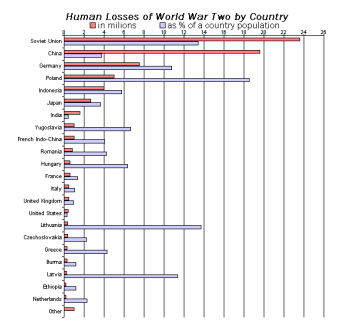 | <li>For comparison and distirbution (histograms)</li> |
| `Line Chart` | 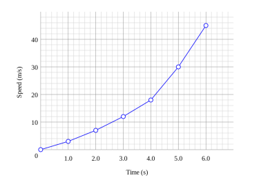 | <li>For changes over time</li> |
| `Scatter Plot` | 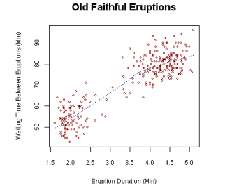 | <li>For correlation</li> |
| `Heat Map` | 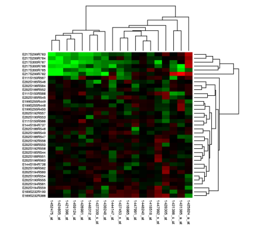 | <li>For correlation</li> |
| `Pie Chart` | 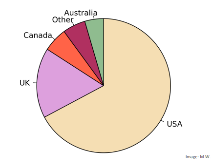 | <li>For aggregation</li> |
| `Tree Map` | 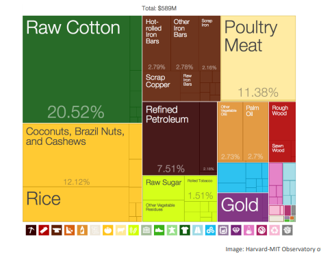 | <li>For heirarchical aggregation</li> |
| `Pivot Table` | 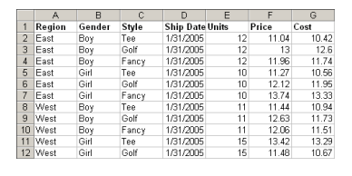 | <li>For tabular data</li><li>Think of pivot table if you are dealing with multi-dimensional data and apply statistical functions to it</li> |
| `KPI` | 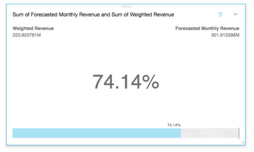 | <li>Compare key value to its target value</li> |
| `Geospatial Chart` | 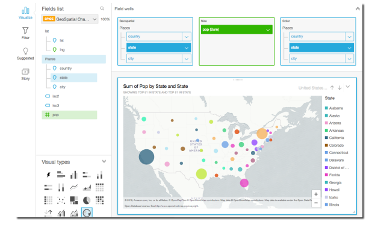 |  |
| `Donut Chart` | 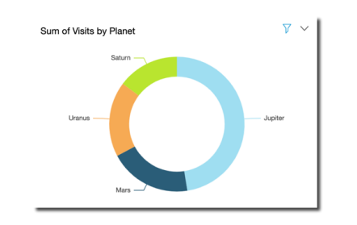 | <li>Percentage of total amount</li> |
| `Gauge Chart` | 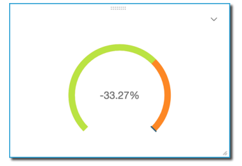 | <li>Compare values in a measure</li> |
| `Word Cloud` | 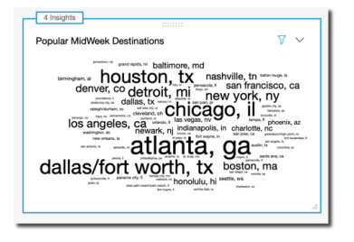 | <li>Word and phrase frequency</li> |

(Images Retrieved from [1])

# :six: Elastic MapReduce (EMR)

- Distribute the data processing load across a cluster of computers
- Managed `Hadoop` framework on EC2 instances

## :cow: EMR Cluster

- A collection of `EC2 Instances`
- Run the codebase on `EMR Notebook`

|||
|:---|:---|
|<li>`Master Node`: Manage the cluster</li><li>`Core Node`: Host HDFS data and run tasks</li><li>`Task Node`: Run task and does not host data</li>| 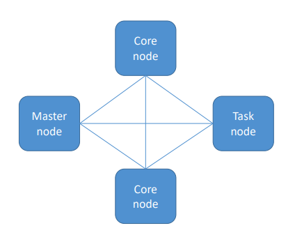|

(Image Retrieved from [1])

## :boar: EMR Usage

- `Transient Cluster`: Automatically terminated once all the pre-defined steps are completed

- `Load-Running Cluster`: Interact with the applications and manually terminate the cluster when you are done

## :monkey_face: EMR Storage

- `HDFS`: Hadoop Distributed File System
    - Default storage solution of EMR, but it is ephemeral (when you terminate the cluster, the storage is gone as well)
- `EMRFS`: access `S3` as if it were `HDFS`
- `Local File System`
- `EBS for HDFS`

## :monkey: Hadoop

|||
|:---|:---|
| 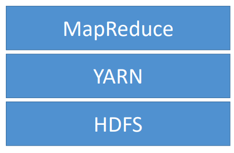| <li>`MapReduce`: A software framework for easily writing applications that process vast amount of data in parallel</li><li>`YARN` (Yet Another Resource Negotiator): Centrally manage cluster resources</li><li>`HDFS`: Distributed scalable file system for Hadoop</li> |

(Image Retrieved from [1])

# :seven: Apache Spark

- `Spark`: an open-source distributed processing system commonly used for big data wordloads
- `Apache Spark` has taken the place of `MapReduce` recently, due to its fast processing speed
- `Spark MLLib` (Machine Learning Library)
- Run the codebase on `Zeppelin`

|||
|:---|:---|
|<li>`Driver Program`: The code that you write to make Spark job run and coordinate the running job</li><li>`Cluster Manager`: Allocate resources across the applications</li><li>`Executor`: Processes that run computations and store data for your applications</li>| 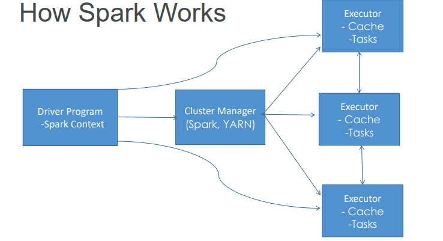|

(Image Retrieved from [1])

# :eight: Feature Engineering

- Select, create, or transform the features are important to what you are trying to predict and choose those features wisely

> The ones that can actually do Feature Engineering are the ones that are the most successful, and the most valueable in the job marketplace.
>
> -- Frank Kane

> Applied Machine Learning is basically Feature Engineering.
>
> -- Andrew Ng

> A big part of success in Machine Learning is not just choosing the algorithm or cleaning your data, but also choosing the data you are using in the first place.
>
> -- Frank Kane

## :horse: Imputing Missing Data

- **Mean Replacement**
    - Replace missing values with the mean value from the rest of the column
    - Fast & easy, won't affect mean of smaple size of overall dataset
    - Median may be a better choice than mean when outliers are present
    - *Tip*: If the exam is asking you what is the best way to impute missing data, dropping data probably is not the right answer
- **Dropping**
    - If not many rows contain missing data and dropping those rows doesn't bias your data
    - It is the quickest and easiest thing to do, but probably never going to be the best approach
    - *Tip*: If the exam is asking you what is the best way to impute missing data, dropping data probably is not the right answer
- **Machine Learning**

|||
|:---|:---|
| `KNN` | <li>Find K nearest (most similar) rows and average their values</li><li>Assume numerical data, not categorical</li> |
| `Deep Learning` | <li>Work well for categorical data</li> |
| `Regression` | <li>Find linear or non-linear relationships between the missing feature and other features</li><li>Most advanced technique: `MICE` (Multiple Imputation by Chained Equations)</li> |
- **Collect More Data**

## :racehorse: Handling Unbalanced Data

|||
|:---|:---|
| `Oversampling` | <li>Duplicate samples from the minority class</li> |
| `Undersampling` | <li>Instead of creating more minority class samples, remove majority class ones</li> |
| `SMOTE (Synthetic Minority Over-sampling TEchnique)` | <li>Artificially generate  new samples of the minority class using nearest neighbors</li><li>Generally better than `oversampling` and `undersampling`</li> |
| `Adjusting Thresholds` | <li>For example, the threshold of probability at which point you will flag something as the positive case (fraud)</li><li>Positive means the things you are testing for is what happend</li> |

## :camel: Handling Outliers

- Data points that lie more than one standard deviation from the mean can be considered unusual
- Sometimes it is appropriate to remove outliers from your training data. But do this responsibly and understand why you are doing this
- `AWS Random Cut Forest Algorithm` is made for outlier detection

|||
|:---|:---|
| `Binning` | <li>Bucket observations together based on ranges of values</li><li>Transform `numeric data` to `ordinal data`, along with covering some imprecision in the `numerical data`</li><li>Especially useful when there is uncertainty in the measurements</li> |
| `Transforming` | <li>Applying some function to a feature to make it better suited for training</li><li>That being said, it is not necessary to replace data with transformation</li> |
| `Encoding` | <li>Transform data into some new representation required by the model</li><li>`One-Hot Encoding`</li> |
| `Scaling / Normalization` | <li>Most models require feature data to at least be scaled to comparable values</li> |
| `Shuffling` | <li>Avoid models from learning residual signals in the training data resulting from the order in which they were collected</li> |

## :sheep: SageMaker Ground Truth

- `SageMaker Ground Truth` manages humans who will label your data for training purposes
    - But as this model learns, only images that the model is not sure about are sent to human labelers

# :nine: TF-IDF (Term Frequency and Inverse Document Frequency)

- `Term Frequency`: Measure how often a word occurs in a document
- `Document Frequency`: Measure how often a word occurs in an entire set of documents
- Commonly used in search algorithm / search engine.
- Figure out the relevancy of a word to a document:
$\frac{Term Frequency}{Document Frequency}$
- `TF-IDF` assumes a document is just a bag of words, thereby failing to pay attention to the relationship between words. An extension of `TF-IDF`, called `n-grams`, overcome this limitation
- In `TF-IDF Matrix`:
    - Row: Each document (corpus)
    - Column: Each individual and unique term (token)

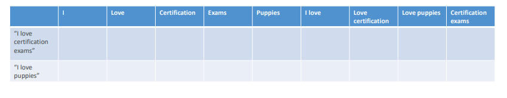

(Image Retrieved from [1])

## :books: References

[1] "AWS Certified Machine Learning - Course Materials," Sundog Education with Frank Kane. https://www.sundog-education.com/aws-certified-machine-learning-course-materials/ (accessed Jul. 19, 2023).
