# Section 4. Modeling 
# Part 1. General Deep Learning and Machine Learning

# :one: Activation Functions

| Activation Functions | Screenshot | Description |
|:-----|:-----|:-----|
| `Linear Activation Function` | 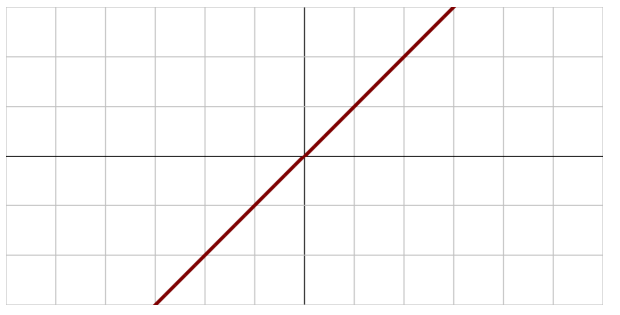 | <li>Are not very useful, since it can't do backpropagation</li> |
| `Binary Step Function` | 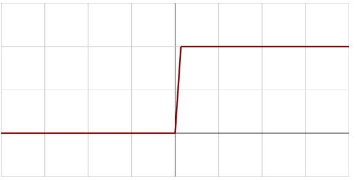 | <li>Can't handle multiple classification - it's binary after all</li><li>Prone to `gradient explode` due to the vertical line</li> |
| `Sigmoid / Logistic Function` | 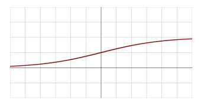 | <li>Scale everything `from 0 to 1`</li><li>Change slowly for high or low values, prone to `Vanishing Gradient` problem</li> |
| `TanH Function` |  | <li>Scale everything `from -1 to 1`</li><li>Change slowly for high or low values, prone to `Vanishing Gradient` problem</li><li>Computationally expensive since computers are not very good at doing trigonometry quickly</li><li>`TanH` generally preferred over `Sigmoid`, since it is nice to have things with mean around zero in machine learning field</li> |
| `Rectified Linear Unit (ReLU)` | 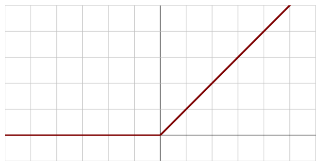 | <li>Easy & fast to compute</li><li>The problem lies in the inputs that are zero or negative. (The `Dying ReLU problem`)</li> |
| `Leaky ReLU` | 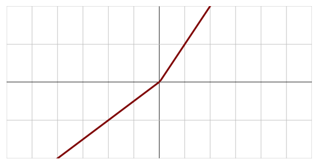 | <li>Solve `dying ReLU` by introducing a negative slope below 0</li> |
| `Parametric ReLU (PReLU)` | 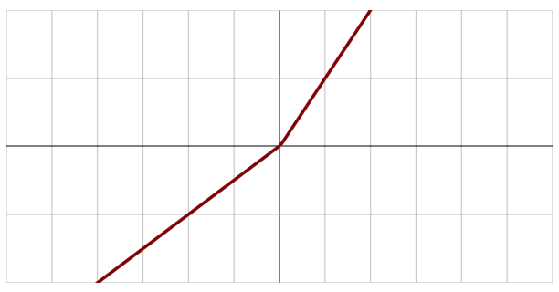 | <li>The slope in the negative part is learned via backpropagation</li> |
| `Exponential Linear Unit (ELU)` | 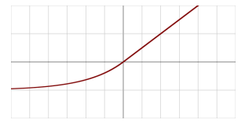 | |
| `Swish` | 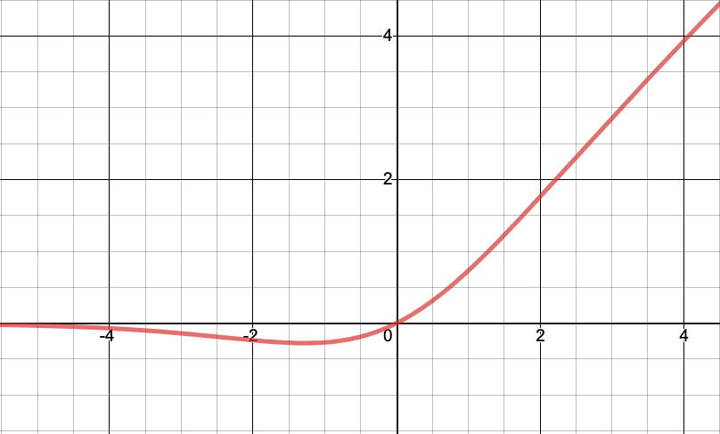 | <li>Mostly a benefit with very deep networks (40+ layers)</li><li>But it is from `Google`, not `Amazon`. Hence you probably not gonna see this in the exam</li> |
| `Maxout` | | <li>Output the max of the inputs</li><li>Not often practical since it doubles the number of trained parameters</li> |
| `Softmax` | 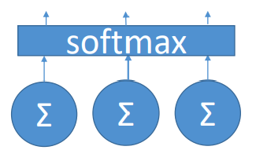 | <li>Used on the final output layer of a `multiple classificastion problem`</li><li>Convert outputs to probabilities of each classification</li> |

(Images Retrieved from [1] and [2])

## :elephant: Tips for Chossing an Activation Function

- For multiple classifcation, use `softmax` on the output layer
- `RNN` does well with `TanH`
- For everything else:
    - Start with `ReLU`
    - If you need to do better, try `Leaky ReLU`
    - Last resort: `PReLU`, `Maxout`
    - `Swish`

# :two: Convolutional Neural Network (CNN)

- Useful for the problem in which you don't know where the features or patterns you have within your data
- `CNN` finds things in your data that may not be exactly where you expect them to be
- But `CNN` is very resource-intensive

## :panda_face: CNN Components

- `Receptive Fields`
    - Scan the images
    - Groups of neurons that only respond to a part of what your eyes see (`subsampling`)
    - Overlap each other to cover the entire visual field (`convolutions`)
- `Filters`
    - Identify information, such as `horizontal lines`, `lines at different angels`, `shapes`, `objects`, etc.

# :three: Recurrent Neural Network (RNN)

- Useful for the problem of predicting the future behaviour given a sequence of data points over time

- Training RNN applies backpropagation over each time step. The state from earlier time steps get diluted over time.
- To overcome the issue above:
    - `Truncated backpropagation through time`: Limit backpropagation to a limited number of time steps
    - `LSTM Cell`
        - Maintain separate short-term (`Hidden State`) and long-term states (`Cell State`)
    - `GRU Cell`
        - Simplified `LSTM Cell` that performs about as well.
        - Only has `Hidden State` 

## :snake: RNN Topologies

| Topology | Examples |
|:-----|:-----|
| `Sequence to sequence` | Stock price prediction based on historical data |
| `Sequence to vector` | Words in a sentence to sentiment |
| `Vector to sequence` | Create captions from an image |
| `Encoder -> Decoder` (`Sequence->vector->sequence`) | Machine translation |

# :four: Modern Natural Language Processing

- Transformer-based natural language processing model
    - `BERT: Bi-directional Encoder Representations from Transformers`
    - `GPT: Generative Pre-trained Transformer`
- The transformer adopts mechanism of `self-attention`:
    - Weight significance of each part of the input data
    - The `attention` mechanism provides context, so no need to process one word at a time
- In NLP applications, words in a sentence may be significant regardless of their position. This explains why some many language models do not apply `CNN`

# :five: Transfer Learning

- `Hugging Face` offers a `Deep Learning Container (DLC)` for some NLP models
- You can `fine-tune` those models with your own training data through `transfer learning`

## :bird: Transfer Learning Approaches

- **Fine-tuning: Continue training a pre-trained model**
    - When the pre-trained model has way more training data than you will ever have
    - Use a **low learning rate** to ensure you are just incrementally improving the model
- **Add new trainable layers to the top of a frozen model**
    - Add new layers, then fine tune as well
    - Turn old features into predictions on new data
- **Retrain from scratch**
    - If you have large amounts of training data, and it is fundamentally different from what the model was pre-trained with
    - Also if you have the computing capacity for it
- **Use it as-is**

# :six: Tuning Neural Networks

## :baby_chick: Learning Rate

- Modulate how quickly the minimization of cost function is done
- **Large `learning rate` can overshoot the optimal solution**
- **Small `learning rate` will take long time to find the optimal solution, thereby increasing training time**

## :hatched_chick: Batch Size

- Denote how many training samples are used within each batch
- **Large `batch size` can end up converging on the wrong solution at random**
- **Small `batch size` can work their way out of *local minima* more easily**

# :seven: Overfitting & Vanishing Gradient

## :chicken: Overfitting

- Models that are good at making predictions on the data they were trained on, but not on new data it hasn’t seen before

## :hatching_chick: Approaches to Avoid Overfitting

- Regularization
- Dropout
- Early Stopping

## :penguin: Vanishing Gradient

- When the slope of the `learning curve` approaches zero, things can get stuck.

## :turtle: Fixing the Vanishing Gradient Problem

- **Multi-Level Hierarchy**
    - Break up models into sub-networks trained individually
- **Long Short-Term Memory**
- **Residual Network**
- **Better Choice of Activation Function**
    - `ReLU` is a good choice

# :eight: Regularization

## :bug: L1 Regularization

- `L1 term` is the sum of weights
- Perform feature selection
- Because it removes information, the computation is inefficient and the output is sparse
- Useful to mitigate the `curse of dimensionality`

## :honeybee: L2 Regularization

- `L2 term` is the sum of the square of the weights
- All features remain considered, just weighted
- Computationally efficient and dense output
- If you think all of your features are important, L2 is probably a better choice

# :nine: Confusion Matirx & Metrics

## :snail: Confusion Matrix

||||
|:----:|:----:|:----:|
|| **Actual YES** | **Actual NO** |
| **Predicted YES** | `True Positive` | `False Positive` |
| **Predicted NO** | `False Negative` | `True Negative` |

**NOTE:** The location of actual and predicted results may be flipped. **Don't jump in assuming a confusion matrix is of a certain format.**

## :octopus: Metrics

| Accuracy | Recall | Precision |
|:----|:----|:----|
|$\frac{TP + TN}{TP + TN + FP+ FN}$| $\frac{TP}{TP + FN}$ | $\frac{TP}{TP + FP}$ |
|| a.k.a. `Sensitivity`, `True Positive Rate`, `Completeness` | a.k.a. `Correct Positives` |
|| Percent of positives rightly predicted | Percent of relevant results |
|| Good choice of metric when you care a lot about `false negatives`, such as `fradu detection` | Good choice of metric when you care a lot about `false positives`, such as `medical screening`, `drug testing` |

| Specificity | F1 Score | RMSE |
|:----|:----|:----|
|$\frac{TN}{TN + FP}$| $\frac{2TP}{2TP + FP + FN}$  $2\cdot\frac{Precision \cdot Recall}{Precision + Recall}$ | $\sqrt{\frac{\sum_{i=1}^{n} (x_{i} - \hat{x_{i}})^2}{N}}$ |
| True Negative Rate | Harmonic mean of `precision` and `sensitivity` | `Accuracy` measurement |
| | When you care about `precision` and `recall` | Only care about right & wrong answers |

| Receiver Operating Characteristic Curve (ROC Curve) | Area Under the Curve (AUC) |
|:----|:----|
| Plot of `true positive rate` (`recall`) vs `false positive rate` at various threshold settings | `ROC AUC` of 0.5 is a useless classifier, 1.0 is perfect |
| Points above the diagonal represent good classification (better than random) ||

# :keycap_ten: Ensemble Learning

| Bagging | Boosting |
|:-----|:-----|
|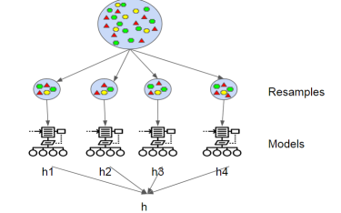|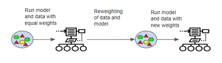|
| Generate N new training sets by randomly sampling with replacement | Data is weighted. At the very beginning, each data is assigned with equal weight. As training proceeds, the weights of each data is changing |
| Each resampled model can be trained **in parallel** | Training is **sequential**, each classifier takes the previous one's success into account |
| A good choice if you care about **avoiding overfitting**, having a regularization effect, having a more parallelizable architecture | A good thing to try out if you care about **accuracy** |

(Images Retrieved from [1])

## :books: References

[1] "AWS Certified Machine Learning - Course Materials," Sundog Education with Frank Kane. https://www.sundog-education.com/aws-certified-machine-learning-course-materials/ (accessed Jul. 20, 2023).

[2] S. Singh, “Swish as an Activation Function in Neural Network,” Deep Learning University, Jun. 08, 2020. https://deeplearninguniversity.com/swish-as-an-activation-function-in-neural-network/
