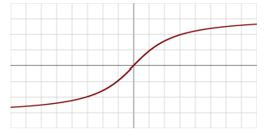

# Section 4. Modeling 
# Part 1. General Deep Learning and Machine Learning

# :one: Activation Functions

| Activation Functions | Screenshot | Description |
|:-----|:-----|:-----|
| `Linear Activation Function` |  | <li>Are not very useful, since it can't do backpropagation</li> |
| `Binary Step Function` |  | <li>Can't handle multiple classification - it's binary after all</li><li>Prone to `gradient explode` due to the vertical line</li> |
| `Sigmoid / Logistic Function` |  | <li>Scale everything `from 0 to 1`</li><li>Change slowly for high or low values, prone to `Vanishing Gradient` problem</li> |
| `TanH Function` |  | <li>Scale everything `from -1 to 1`</li><li>Change slowly for high or low values, prone to `Vanishing Gradient` problem</li><li>Computationally expensive since computers are not very good at doing trigonometry quickly</li><li>`TanH` generally preferred over `Sigmoid`, since it is nice to have things with mean around zero in machine learning field</li> |
| `Rectified Linear Unit (ReLU)` |  | <li>Easy & fast to compute</li><li>The problem lies in the inputs that are zero or negative. (The `Dying ReLU problem`)</li> |
| `Leaky ReLU` |  | <li>Solve `dying ReLU` by introducing a negative slope below 0</li> |
| `Parametric ReLU (PReLU)` |  | <li>The slope in the negative part is learned via backpropagation</li> |
| `Exponential Linear Unit (ELU)` |  | |
| `Swish` |  | <li>Mostly a benefit with very deep networks (40+ layers)</li><li>But it is from `Google`, not `Amazon`. Hence you probably not gonna see this in the exam</li> |
| `Maxout` | | <li>Output the max of the inputs</li><li>Not often practical since it doubles the number of trained parameters</li> |
| `Softmax` |  | <li>Used on the final output layer of a `multiple classificastion problem`</li><li>Convert outputs to probabilities of each classification</li> |

(Images Retrieved from [1] and [2])

## :elephant: Tips for Chossing an Activation Function

- For multiple classifcation, use `softmax` on the output layer
- `RNN` does well with `TanH`
- For everything else:
    - Start with `ReLU`
    - If you need to do better, try `Leaky ReLU`
    - Last resort: `PReLU`, `Maxout`
    - `Swish`

# :two: Convolutional Neural Network (CNN)

- Useful for the problem in which you don't know where the features or patterns you have within your data
- `CNN` finds things in your data that may not be exactly where you expect them to be
- But `CNN` is very resource-intensive

## :panda_face: CNN Components

- `Receptive Fields`
    - Scan the images
    - Groups of neurons that only respond to a part of what your eyes see (`subsampling`)
    - Overlap each other to cover the entire visual field (`convolutions`)
- `Filters`
    - Identify information, such as `horizontal lines`, `lines at different angels`, `shapes`, `objects`, etc.

# :three: Recurrent Neural Network (RNN)

- Useful for the problem of predicting the future behaviour given a sequence of data points over time

- Training RNN applies backpropagation over each time step. The state from earlier time steps get diluted over time.
- To overcome the issue above:
    - `Truncated backpropagation through time`: Limit backpropagation to a limited number of time steps
    - `LSTM Cell`
        - Maintain separate short-term (`Hidden State`) and long-term states (`Cell State`)
    - `GRU Cell`
        - Simplified `LSTM Cell` that performs about as well.
        - Only has `Hidden State` 

## :snake: RNN Topologies

| Topology | Examples |
|:-----|:-----|
| `Sequence to sequence` | Stock price prediction based on historical data |
| `Sequence to vector` | Words in a sentence to sentiment |
| `Vector to sequence` | Create captions from an image |
| `Encoder -> Decoder` (`Sequence->vector->sequence`) | Machine translation |

# :four: Modern Natural Language Processing

# :five: Transfer Learning

## Transfer Learning Approaches

# :six: Tuning Neural Networks

## Learning Rate

## Batch Size

# :seven: Approaches to Avoid Overfitting

- Regularization
- Dropout
- Early Stopping

# :eight: Regularization

## L1 Regularization

## L2 Regularization

# :nine: Confusion Matirx & Metrics

## Confusion Matrix

||||
|:----:|:----:|:----:|
|| **Actual YES** | **Actual NO** |
| **Predicted YES** | `True Positive` | `False Positive` |
| **Predicted NO** | `False Negative` | `True Negative` |

**NOTE:** The location of actual and predicted results may be flipped. **Don't jump in assuming a confusion matrix is of a certain format.**

## Metrics

| Accuracy | Precision | Recall |
|:----:|:----:|:----:|
|$\frac{TP + TN}{TP + TN + FP+ FN}$| **Actual YES** | **Actual NO** |

| Specificity | F1 Score | RMSE |
|:----:|:----:|:----:|
|$\frac{TP + TN}{TP + TN + FP+ FN}$| **Actual YES** | **Actual NO** |

| Receiver Operating Characteristic Curve (ROC Curve) | Area Under the Curve (AUC) |
|:----:|:----:|
|$\frac{TP + TN}{TP + TN + FP+ FN}$| **Actual YES** |

# :keycap_ten: Ensemble Learning

## Bagging

## Boosting

## :books: References

[1] "AWS Certified Machine Learning - Course Materials," Sundog Education with Frank Kane. https://www.sundog-education.com/aws-certified-machine-learning-course-materials/ (accessed Jul. 20, 2023).

[2] S. Singh, “Swish as an Activation Function in Neural Network,” Deep Learning University, Jun. 08, 2020. https://deeplearninguniversity.com/swish-as-an-activation-function-in-neural-network/
