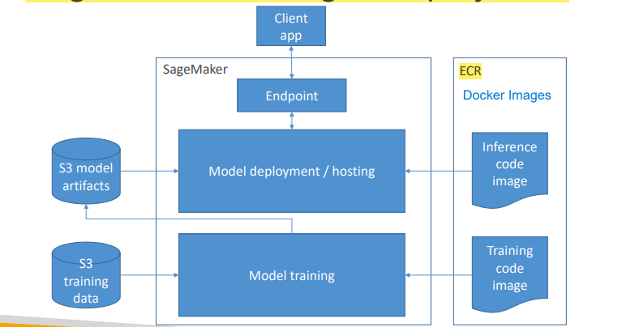
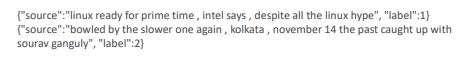

# Section 5. Modeling -- Amazon SageMaker

`SageMaker` is built to handle the entire machine learning workflow

# :one: SageMaker Deployment

- `SageMaker Notebook` & `SageMaker Console` is built to run and monitor the workflow
- The data in the data processing usually comes from `S3`, so does the output processed data
- The training process
    - Load data from `S3`
    - Load training code from the `Docker Image` that contains the training code and environment

(Image Retrieved from [1])

- Trained models can be deployed in two ways:
    - Persistent `endpoint` for making individual predictions on demand
    - `SageMaker Batch Transform` to get predictions for an entire dataset
- Lots of cool options:

| `Inference Pipelines` | `SageMaker Neo` | `Elastic Inference` | `Automatic Scaling` | `Shadow Testing` |
|:-----|:-----|:-----|:-----|:-----|    
| For more complex processing | For deploying to edge devices | For accelerating deep learning models | Increase the number of endpoints as needed | Evaluate new models against currently deployed model to catch errors |

# :two: SageMaker's Built-In Algorithms

- `File Mode`: Copy all the training data over as a **single file** at once to all your training instances
- `Pipe Mode`: Pipe and stream data from `S3` as needed, which is more efficient, especially with larger training sets
- `Multi-GPU`: Multiple GPUs on one machine
- `Multi-Machine GPU`: GPUs on multiple machines
- `Serialization`: Converting the `state of an object` into a `byte stream` (`string`)
- `Deserialization`: Converting `byte stream` to the actual `object`

|| Linear Learner | XGBoost | Seq2Seq |
|:-----:|:-----|:-----|:-----|
|`Description and Used for`|<li>`Linear Regression`: Fit a line to your training data</li><li>Can handle both `regression` predictions and `classification` predictions (if a linear threshold function is used)</li> |<li>eXtreme Gradient Boosting</li><li>New trees made to correct the errors of previous trees</li><li>Can be used for `classification` and `regression` (using regression trees)</li> |<li>Both input and output are a sequence of tokens</li><li>Implemented with `RNN` and `CNN` with `attention`</li><li>Machine Translation, Text Summarization, Speech to Text</li> |
|`Expected Input`|<li>`RecordIO-wrapped protobuf` (most performant option and `float 32` data only)</li><li>`CSV` (First column assumed to be the lable)</li><li>`File` or `Pipe` mode both supported</li>  |<li>`CSV`, `libsvm`, `RecordIO-Protobuf`, and `Parquet`</li>|<li>`RecordIO-Protobuf` -- tokenized text files</li><li>Must provide `data` and `vocabulary files`</li> |
|`How Is It Used`|<li>Training data must be **normalized** manually or automatically by `Linear Learner`, so that all features are weighted the same</li><li>Training data should also be shuffled</li>|<li>Models are serialized / deserialized with `Pickle`</li> |<li>Training for machine translation can take days, even on `SageMaker`</li><li>Therefore, pre-trained models and public training dataset are more feasible</li>|
|`Hyperparameters`|<li>`Balance_multiclass_weights`</li><li>`Learning_rate` & `Batch_size`</li><li>`L1` & `L2` regularization</li> |<li>`Subsample`: Prevent overfitting</li><li>`Eta`: Step size and prevent overfitting</li><li>`Gamma`: Minimum loss reduction to create a partition; larger = more conservative</li><li>`Alpha`: L1 regularization term; larger = more conservative</li><li>`Lambda`: L2 regularization term; larger = more conservative</li><li>`eval_metric`</li><li>`scale_pos_weight`: Adjust balance of positive and negative weights and helpful for unbalanced classes</li><li>`max_depth`: Max depth of the tree</li> |<li>`Batch_size`</li><li>`Optimizer_type`</li><li>`Learning_rate`</li><li>`Num_layers_encoder`</li><li>`Num_layers_decoder`</li><li>Can optimize on<ul><li>`Accuracy`: versus provided validation dataset</li><li>`BLEU score`: Compares against multiple reference translations</li><li>`Perplexity`: Cross-entropy</li></ul></li>|
|`Instance Types`|<li>Training on single or multi-machine CPU or GPU</li> |<li>CPU for multiple instances</li><li>Single-instance GPU training</li>|<li>Can only use GPU instance types and single machine for training</li>|

|| DeepAR | BlazingText | Object2Vec |
|:-----:|:-----|:-----|:-----|
|`Description and Used for`|<li>Implement `RNN`</li><li>Forecast one-dimensional time series data</li>|<li>Intended for use with **sentences**, **not entire documents**</li><li>For `text classification` and `Word2vec` (`Word Embedding`)</li>|<li>Developed upon `Word2vec` but focus on more **complex objects**</li><li>Create low-dimensional dense embedddings of high-dimensional objects</li><li>Useful in `Recommendations`</li>|
|`Expected Input`|<li>`JSON` lines format</li>|<li>`Text Classification`: one sentence per line and first word in the sentence is the string `__label__` followed by the label **OR** `augmented manifest text format`1</li><li>`Word2vec`: text file with one training sentence per line</li>|<li>Pairs of tokens and/or sequences of tokens</li><li>Data must be tokenized into integers</li>|
|`How Is It Used`|<li>Always include entire time series for training, testing, and inference</li><li>Train on many time series and not just one when possible</li>|<li>`Word2vec` has multiple modes:</li><ul><li>Cbow (Continuous Bag of words)</li><li>Skip-gram</li><li>Batch skip-gram</li></ul>|<li>Encoder choices:</li><ul><li>`Average-pooled embeddings`</li><li>`CNN`</li><li>`Bidirectional LSTM`</li></ul>|
|`Hyperparameters`|<li>`Context_length`</li><li>`Epochs`</li><li>`Batch_size`</li><li>`Learning_rate`</li><li>`Num_cells`</li>|<li>`Text Classification`<ul><li>`Epochs`</li><li>`Learning_rate`</li><li>`Word_ngrams`</li><li>`Vector_dim`</li></ul></li><li>`Word2vec`</li><ul><li>`Mode` (cbow, skipgram, batch_skipgram)</li><li>`Learning_rate`</li><li>`Window_size`</li><li>`Vector_dim`</li><li>`Negative_samples`</li></ul>|<li>Usual deep learning hyperparamters2</li><li>Encoder choice</li>|
|`Instance Types`|<li>**Training**: CPU or GPU, single or multi machine</li><li>**Inference**: CPU only</li> |<li>`Text Classification`<ul><li>Training data less than 2 GB: single CPU instance</li><li>Training data larger data 2 GB: single GPU instance</ul></li><li>`Word2vec`</li><ul><li>cbow and skipgram: single CPU or single GPU</li><li>batch_skipgram: single or multiple CPU instances</li></ul>|<li>**Training**: single machine (CPU, GPU, or multi-GPU)</li><li>**Inference**: GPU</li>|

|| Object Detection | Image Classification | Semantic Segmentation |
|:-----:|:-----|:-----|:-----|
|`Description and Used for`|<li>Identify all objects in an image with bounding boxes</li>|<li>Assign one or more labels to an image, but doesn't tell where objects are</li>|<li>Pixel-level object classification</li>|
|`Expected Input`|<li>`RecordIO` or `Image` (jpg or png), along with a `JSON file` for annotation data</li>| |<li>`JPG` images and `PNG` annotations</li>|
|`How Is It Used`|<li>Two variants: `MXNet` and `TensorFlow`</li><li>*Input*: Image / Video</li><li>*Output*: All instances of objects in the image with categories and confidence scores</li>|<li>Two variants: `MXNet` and `TensorFlow`</li>|<li>Built on `MXNet Gluon` and `Gluon CV`</li>|
|`Hyperparameters`|<li>Usual Deep Learning Hyperparameters2</li>|<li>Usual Deep Learning Hyperparameters2</li>|<li>Usual Deep Learning Hyperparameters2</li>|
|`Instance Types`|<li>**Training**: Multi-GPU or Multi-Machine GPU</li><li>**Inference**: CPU or GPU</li>|<li>**Training**: Multi-GPU or Multi-Machine GPU</li><li>**Inference**: CPU or GPU</li>|<li>**Training**: GPU on a single machine</li><li>**Inference**: CPU or GPU</li>|

|| Random Cut Forest | Neural Topic Model | LDA |
|:-----:|:-----|:-----|:-----|
|`Description and Used for`|<li>Used for `Anomaly Detection`</li><li>`Unsupervised`</li>|<li>Organize documents into topics</li><li>`Unsupervised`</li>|<li>Latent Dirichlet Allocation</li><li>Another topic modeling algorithm</li><li>`Unsupervised`</li><li>Maybe cheaper / more efficient than `Neural Topic Model`</li>|
|`Expected Input`|<li>`RecordIO-protobuf` </li><li>`CSV`</li><li>`File` and `Pipe` modes are supported</li>|<li>`RecordIO-protobuf` </li><li>`CSV`</li><li>`File` and `Pipe` modes are supported</li><li>Words must be tokenized into integers</li>|<li>`RecordIO-protobuf` </li><li>`CSV`</li><li>`Pipe` mode is only supported with `RecordIO`</li><li>Words must be tokenized into integers</li>|
|`How Is It Used`|<li>Create a forest of trees where each tree is a partition of the training data</li><li>Look at expected change in complexity of the tree as a result of adding a point into it</li>|<li>User define the number of topics</li><li>These topics are a latent representation based on the ranking words</li>|<li>Generate the number of topics that users specify</li>|
|`Hyperparameters`|<li>`Num_trees`</li><li>`Num_samples_per_tree`</li>|<li>`Batch_size`</li><li>`Learning_rate`</li><li>`Num_topics`</li>|<li>`Num_topics`</li><li>`Alpha0`: Initial guess for concentration parameter. Smaller value generates sparse topic mixtures</li>|
|`Instance Types`|<li>CPU for training and inference</li>|<li>GPU or CPU</li>|<li>Single-instance CPU training</li>|

|| KNN | K-Means | PCA |
|:-----:|:-----|:-----|:-----|
|`Description and Used for`|<li>K-Nearest-Neightbors</li><li>Simple `Classification` or `Regression` algorithm</li><li>`Classification`: Return the most frequent label among the K closest points</li><li>`Regression`: Return the average value of the K closest points</li>|<li>Unsupervised clustering</li>|<li>Principal Component Analysis</li><li>`Dimensionality reduction`, the reduced dimensions are called `components`</li><li>`Unsupervised`</li>|
|`Expected Input`|<li>`RecordIO-protobuf`</li><li>`CSV`</li><li>Both `File` and `Pipe` modes are supported</li>|<li>`RecordIO-protobuf`</li><li>`CSV`</li><li>Both `File` and `Pipe` modes are supported</li>|<li>`RecordIO-protobuf`</li><li>`CSV`</li><li>Both `File` and `Pipe` modes are supported</li>|
|`How Is It Used`|<li>Data is first sampled before running the algorithm</li>|<li>Divide data into K groups, where members of a group are as similar as possible to each other</li>|<li>`Regular mode`: For sparse data and moderate number of observations and features</li><li>`Randomized mode`: For large number of observations and features</li>|
|`Hyperparameters`|<li>`K`</li><li>`Sample_size`</li>|<li>`K`: use `elbow method` to determine</li><li>`Batch_size`</li><li>`Extra_center_factor`</li><li>`Init_method`: Method to create initial clusters</li>|<li>Algorithm mode</li><li>`Subtract_mean`</li>|
|`Instance Types`|<li>**Training**: CPU or GPU</li><li>**Inference**: CPU for lower latency, GPU for higher throughput on large batches</li>|<li>CPU or GPU, but CPU recommended</li>|<li>GPU or CPU</li>|

|| Factorization Machines | IP Insights | 
|:-----:|:-----|:-----|
|`Description and Used for`|<li>Dealing with **sparse** data</li><li>`Supervised`: `Classification` or `Regression`</li><li>Usually used in the context of `recommender systems`</li>|<li>`Unsupervised` learning of IP address usage patterns</li><li>Identify suspicious behavior from IP addresses</li>|
|`Expected Input`|<li>`RecordIO-protobuf` with float 32</li>|<li>`CSV` only. The `CSV` entails `entity` (user names, account IDs, etc.) and `IP`</li>|
|`How Is It Used`|<li>Find factors we can use to multiply together to predict a classification or value given a **sparse** matrix</li>|<li>Use a `neural network` to learn latent vector representations of `entities` and `IP addresses`</li>|
|`Hyperparameters`|<li>Initialization methods for biase, factors, and linear terms</li>|<li>`Num_entity_vectors`</li><li>`Vector_dim`</li><li>Usual deep learning hyperparamters2</li>|
|`Instance Types`|<li>CPU or GPU, but CPU recommended. GPU only works with dense data</li>|<li>CPU or GPU, but GPU recommended</li>|

**Notes**

1.  `Augmented Manifest Text Format`:

(Image Retrieved from [1])

2. Usual Deep Learning Hyperparameters:

- Dropout, early stopping, epochs, learning 
rate, batch size, layers, activation 
function, optimizer, weight decay

## :tropical_fish: Reinforcement Learning

- **Essence**: Some sort of agent that explores some space
- Terminologies:
    - `Environment`: the layout of the board, maze, etc.
    - `State`: Where the agent / player / pieces are
    - `Action`: Move in a given direction
    - `Reward`: Value associated with the action from that state
    - `Observation`: Surroundings in a maze, chess board, etc.
- `Q-Learning`, a specific implementation of `reinforcement learning`, which has
    - A set of environmental states `s`
    - A set of possible actions in those states `a`
    - a value of each state/action `Q`
- Exploration Approaches
    - `Simple approach` (Exploitation)
        - Choose the action for a given state with the highest `Q`.
        - If there is a tie, choose at ramdom
    - `Better approach` (Exploration)
        - Introduce an `epsilon` term. Generate a random number, if the number is less than the `epsilon` term, simply take a path and try out, instead of following the highest-Q path
        - Explore wider range of possibilities
- Use multi-core or multi-instance for training, and GPU is helpful

# :three: Automatic Model Tuning

- Define the hyperparameters you care about, the range you want to try, and the metrics you are optimizing for
- `SageMaker` spins up a *HyperParameter Tuning Job* that trains as many combinations as you will allow
- **It learns as it goes**, so it doesn't have to try every possible combination as time goes by

## :fish: Best Practices

- Don't optimize too many hyperparameters at once
- Limit the ranges to as small as possible
- Use logarithmic scales when appropriate
- Don't run too many training jobs concurrently, otherwise it limits how the the process can learn as it goes
- Make sure training jobs running on multiple instances report the correct objective metric in the end

# :four: SageMaker and Spark

- Connect `SageMaker Notebook` to a remote EMR cluster running `Spark` (or `Zeppelin`)
- Allow users to combine pre-processing big data in `Sparl` with training and inference in `SageMaker`

# :five: Modern SageMaker

|||
|:-----:|:-----|
|`SageMaker Studio`|<li>Visual IDE for machine learning</li>|
|`SageMaker Notebooks`|<li>Something like Jupyter notebooks</li>|
|`SageMaker Experiments`|<li>Organize, capture, compare, and search your ML jobs</li>|
|`SageMaker Debugger`|<li>Save internal model state at periodical intervals</li><li>SageMaker Studio Debugger Insights Dashboard</li><li>Auto-generated training reports profiling system resource usage and training</li><li>Built-in actions to receive notifications or stop training</li><li>Use `SMDebug client library` to integrate `SageMaker Debugger` with your own training code</li>|
|`SageMaker Autopilot`|<li>A wrapper on `AutoML`1</li><li>Automate</li><ul><li>Algorithm selection</li><li>Data preprocessing</li><li>Model tuning</li><li>All infrastructure</li></ul><li>Problem types:</li><ul><li>Binary classification</li><li>Multiclass classification</li><li>Regression</li></ul><li>Data must be `tabular CSV` or `Parquet`</li><li>Integrate with `SageMakere Clarify`</li>|
|`SageMaker Model Monitor`|<li>Get alerts on quality deviations on the deployed models via `CloudWatch`</li><li>Visualize data drift, detect anomalies, outliers, and new features</li><li>Integrate with `SageMaker Clarify` which detects potential bias</li>|
|`SageMaker Clarify`|<li>Tell users how different features contribute to each prediction</li><li>Increase the transparency on how model arrives at predictions</li>|
|`Deployment Guardrails`|<li>Control shifting traffic to new models</li><li>Blue / Green Deployments2</li><ul><li>`All at once`: shift everything, monitor, terminate `blue fleet`</li><li>`Canary`: shift a small portion of traffic and monitor</li><li>`Linear`: shift traffic in linearly spaced steps</li></ul>|
|`Shadow Tests`|<li>Compare performance to shadow variants to production</li><li>Monitor in `SageMaker Console` and decide when to promote it</li>|
|`SageMaker Canvas`|<li>No-code machine learning for business analysts</li><li>Upload `csv` data and select a column to predict</li><li>Automatic data cleaning</li><li>Bias Measures in `SageMaker Canvas`3</li>|
|`SageMaker Training Compiler`|<li>Optimize code and unroll loops, optimize at the machine learning level on GPU instances</li><li>Integrated into `AWS Deep Learning Containers (DLC)`</li><li>Accelerate training up to 50%</li><li>Convert model into hardware-optimized instructions</li><li>Incompatible with `SageMaker` distributed training libraries</li><li>Best Practices4</li>|
|`SageMaker JumpStart`|<li>One click to deploy models and algorithms from model zoos</li>|
|`SageMaker Data Wrangler`|<li>Import / transform / analyze / export data within `SageMaker Studio`</li>|
|`SageMaker Feature Store`|<li>A repository in `SageMaker Studio` for storing features</li>|
|`SageMaker Edge Manager`|<li>Software agent for edge devices</li><li>Model optimized with `SageMaker Neo`</li>|
|`Asynchronous Inference Endpoints`||

**Notes**

1. `AutoML`: Automatically figure out what the right model and algorithm is to make predictions basedon your data

2. `Blue Fleet` contains the previous model, whereas the `Green Fleet` entails the new model

3. Bias Measures in `SageMaker Canvas`
    - `Class Imbalance (CL)`
        - One facet (demographic group) has fewer training values than another
    - `Difference in Proportions Labels (DPL)`
        - Imbalance of positive outcomes between facet values
    - `Kullback-Leibler Divergence (KL)`, `Jensen-Shannon Divergence (JS)`
        - How much **outcome distributions** of facets diverge
    - `Lp-norm (LP)`
        - P-norm difference between **distributions of outcomes** from facets
    - `Total Variation Distance (TVD)`
        - L1-norm difference between **distributions of outcomes** from facets
    - `Kolmogorov-Smirnov (KS)`
        - Measure outcomes in distributions
        - Maximum divergence between outcomes in distributions from facets
    - `Conditional Demographic Disparity (CDD)`
        - Disparity of outcomes between facets as a whole and by subgroups

4. Best Practices:
    - Ensure GRU instances are used
    - `PyTorch` models must use `PyTorch/XLA`'s model save function
    - Enable debug flag in `compiler_config` parameter to enable debugging

## :books: References

[1] "AWS Certified Machine Learning - Course Materials," Sundog Education with Frank Kane. https://www.sundog-education.com/aws-certified-machine-learning-course-materials/ (accessed Jul. 23, 2023).
