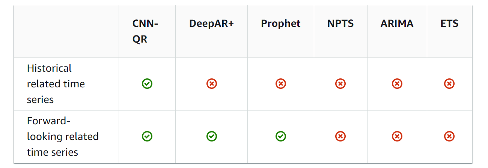

# Section 6. Modeling -- High-Level ML Services

# :one: Tables of AWS ML Services

|||
|:---:|:-------|
|`Amazon Comprehend`|<li>**Natural Language Processing** and Text Analytics</li><li>Extract key phrases, entities, sentiment, langauge, syntax, topics, and document classifications</li><li>Event detection, Perfonally Identifiable Information (PII) Identification & Redaction</li>|
|`Amazon Translate`|<li>Use **deep learning** for translation</li><li>Support custom terminology provided in `CSV` or `TMX` format</li>|
|`Amazon Transcribe`|<li>Convert speech to text</li><li>`Speaker Identification`: User specify the number of speakers, and the service distinguish among the voices of those speakers</li><li>`Custom Vocabularies` are stored in `Vocabulary Lists` or `Vocabulary Tables`</li>|
|`Amazon Polly`|<li>Convert text to speech</li><li>`Lexicons`: Customize pronunciation of specific words & phrases, especially acronyms</li><li>`Speech Synthesis Markup Language (SSML)`: Make the output speech sound more natural. Alternatvie to plain text</li><li>`Speech Marks`: Encode when sentence / word starts and ends in the audio stream</li>|
|`Amazon Rekognition`|<li>Computer vision, especially object and scene detection</li><li>Use cases include `Facial Analysis`, `Face Comparison`, `Image Moderation`, `Celebrity Recognition`</li><li>Can accept **Images** and **Videos** as input</li><ul><li>**Images**: From `S3` or a `request` entailing image bytes. But `S3` will be faster</li><li>**Videos**: From `Kinesis Video Streams`</li></ul><li>User can train the model with customized labels of items</li>|
|`Amazon Forecast`|<li>Fully managed service to deliver highly accurate forecast on time-series data</li><li>Use `AutoML` techniques to choose the best `Forecast Algorithm`1 **automatically**</li>|
|`Amazon Lex`|<li>Inner workings of `Alexa`</li><li>To build an `Alexa`, you would use `Amazon Transcribe` and `Amazon Polly`</li><li>Natural-language chatbot engine</li><li>**The service is not built to understand what is being said, but built around `Intents` by mapping the input text to pre-defined intents**</li><li>`Utterances` invoke intents (e.g. I want to order a pizza)</li><li>`Slots` specify extra information needed by the intent (such as pizza size, toppings)</li><li>A `Slot` contains one or more specific information (such as 9-inch, pepperoni), which are called `Slot Values`</li>|
|`Amazon Personalize`|<li>Fully-managed recommender engine used by `Amazon`</li><li>Feed in data via `S3` or `API`</li><li>Has the feature of `Intelligent User Segmentation` for marketing campaigns</li><li>Inject promoted content and business rules into recommendations</li>|

**Notes**

1. Forecast Algorithms

- `Convolutional Neural Network - Quantile Regression (CNN-QR)`
    - Best for large datasets with hundreds of time series
    - Accept both related historical and forward-looking related time series data2 & metadata
- `DeepAR+`
    - Implemented with `Recurrent Neural Network`
    - Best for large datasets
    - Accept related forward-looking time series data & metadata
- `Prophet`
    - Additive model with non-linear trends and seasonality
    - Accept related forward-looking time series data & metadata
- `Non-Parametric Time Series (NPTS)`
    - Good for sparse data
- `Autoregressive Integrated Moving Average (ARIMA)`
    - Commonly used for simple datasets (< 100 time series)
- `Exponential Smoothing (ETS)`
    - Commonly used for simple datasets (< 100 time series)

2. 
- `Related Time Series Dataset` includes time-series data that is not included in a `target time series dataset` and might improve the accuracy of your prediction
- `Historical Time Series`: Time series withouth data points within the forecast horizon
- `Forward-Looking Time Series`: Time series with data points within the forecast horizon

(Image Retrieved from [2])

# :two: Complements of Amazon Personalize

## :whale: Amazon Personalize Terminology

- Datasets
    - Users, Items, Interactions
- Recipes
    - `USER_PERSONALIZATION`
    - `PERSONALIZED_RANKING`
    - `RELATED_ITEMS`
    - `USER_SEGMENTATION`
- Solutions
    - Train the model
    - Optimize for relevance as well as your additional objectives
    - Hyperparameter Optimization (HPO)
- Campaigns
    - Deploy your solution version
    - Deploy capacity for generating real-time recommendations

## :whale2: Amazon Personalize Hyperparameters

There are a bunch of knobs and dials of `Amazon Personalize`

- User-Personalization, Personalized-Ranking
    - `hidden_dimension` (HPO)
    - `bptt` (back-propagation through time - RNN)
    - `recency_mask` (weights recent events)
    - `min/max_user_history_length_percentile` (filter out robots)
    - `exploration_weight`, ranging from 0 to 1, control relevance
    - `exploration_item_age_cut_off`, how far back in time you go
- Similary-items
    - `item_id_hidden_dim` (HPO)
    - `item_metadata_hidden_dim` (HPO with min & max range specified)

## :dolphin: Maintaining Relevance

- Keep your datasets current
    - Incremental data import
- Use `PutEvents` operation to feed in real-time user behavior
- Retrain the model
    - `New solution version`
    - Update every 2 hours **by default**
    - Should do a full retrain (set `trainingMode` = FULL) weekly

## :cow2: Amazon Personalize Security

- Data not shared across accounts
- Data may be encrypted with `KMS`
- Data may be encrypted at rest in your region (SSE-S3)
- Data in transit between your account and Amazon's internal systems encrypted with `TLS 1.2`
- Access control via `IAM`
- Data in `S3` must have appropriate `bucket policy` for `Amazon Personalize` to process it
- Monitoring & Logging via `CloudWatch` and `CloudTrail`

# :three: Other AWS Services 

|||
|:---:|:-------|
|`Amazon Textract`|<li>`OCR` with forms, fields, tables support</li>|
|`Amazon DeepRacer`|<li>`Reinforcement learning` powered 1/18-scale race car</li>|
|`DeepLens`|<li>Deep learning-enabled video camera</li>|
|`AWS Panorama`|<li>Bring computer vision to your existing IP cameras or edge devices</li><li>More general-purpose than `DeepLens`</li>|
|`Amazon Lookout`|<li>Detect anomalies in three aspects:</li><ul><li>`Equipment`: Detect abnormalities from sensor data automatically to detect equipment issues</li><li>`Metrics`: Monitor metrics from `S3`, `RDS`, `Redshift`, `3rd party SaaS apps`</li><li>`Vision`: User computer vision to detect defects in silicon wafers, circuit boards, etc.</li></ul>|
|`Amazon Monitron`|<li>End-to-end system for monitoring industrial equipment & predictive maintenance</li>|
|`TorchServe`|<li>Model serving framework for `PyTorch`</li>|
|`AWS Neuron`|<li>`SDK` for ML inference specifically on `AWS Inferentia chips`</li>|
|`AWS DeepComposer`|<li>AI-powered keyboard</li><li>Compose a melody into an entire song</li>|
|`Amazon Fraud Detector`|<li>Assess risk from:</li><ul><li>New accounts</li><li>Guest checkout</li><li>"Try before you buy" abuse</li><li>Online payments</li></ul>|
|`Amazon CodeGuru`|<li>Automated code reivews powered by machine learning</li><li>Currently support `Java` and `Python`</li>|
|`Contact Lens for Amazon Connect`|<li>For customer support call centers</li>|
|`Amazon Kendra`|<li>`Alexa`'s sister</li><li>Fully managed document search service powered by machine learning</li><li>Extract answers from within a document and build its own knowledge base</li><li>Learn from user interactions / feedback to promote preferred results (Incremental Leanring)</li>|
|`Amazon Augmented AI (A2I)`|<li>Human review of machine learning predictions</li><li>Build workflow for reviewing low-confidence predictions</li><li>More flexible and general-purpose than `SageMaker Ground Truth`</li>|

## :books: References

[1] "AWS Certified Machine Learning - Course Materials," Sundog Education with Frank Kane. https://www.sundog-education.com/aws-certified-machine-learning-course-materials/ (accessed Jul. 24, 2023).

[2] “Using Related Time Series Datasets - Amazon Forecast,” docs.aws.amazon.com. https://docs.aws.amazon.com/forecast/latest/dg/related-time-series-datasets.html (accessed Jul. 24, 2023).
