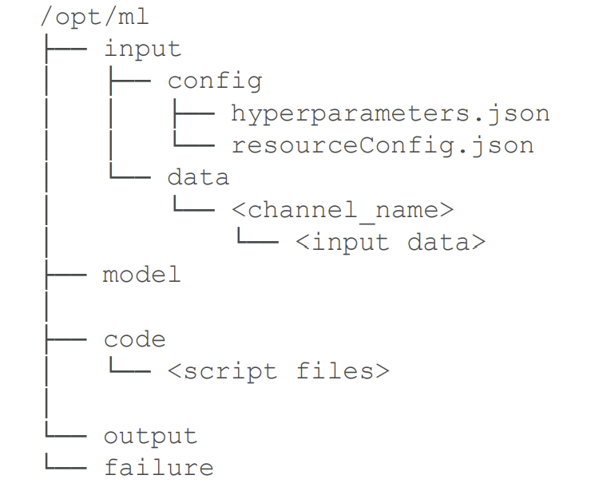

# Section 7. ML Implementation and Operations

# :one: SageMaker and Docker Containers

- All models in `SageMaker` are hosted in `Docker` containers
- `Docker` containers support distributed training via `Horovod` or `Parameter Servers`
- Fundamentals of Docker:
    - `Docker` containers are created from `Images`
    - `Images` are built from a `Dockerfile`
    - `Images` are saved in a `repository` (e.g. `Elastic Container Registry (ECR)`)

|Structure of a Training Container|Structure of a Deployment Container|
|:---:|:---:|
|||

- Structure of `Docker Image`
    - WORKDIR
        - `nginx.conf`
            - A configuration file for the `NGINX` front end. Configure the web server we are running at deployment time
        - `predictor.py`
            - The program implementing a `Flask` web server for making predictions at runtime
        - `serve/`
            - The program inside will be started when the container is started for hosting
        - `train/`
            - The program inside will be invoked when you run the container for training
        - `wsgi.py`
            - A small wrapper used to invoke the `Flask` application for serving resutls
- `Production Variants` allows you to do `A/B Test` on multiple models

# :two: SakeMaker on the Edge -- SageMaker Neo

- `SageMaker Neo` consists of a `compiler` and a `runtime`
    - `Compiler`: Compile the code into bytecode expected by the edge processors
    - `Runtime`: Run on edge devices to consume the Neo-generated code
- Neo Compiled models can be deployed to
    - An `HTTPS` endpoint
        - **But the instance type for running inference code must be the same with the one hosting the trained model**
    - `IoT Greengrass`
        - Form a duot with `SageMaker Neo`
        - Inference at the edge with local data, using model trained in the cloud
        - Use `Lambda` inference applications

# :three: SageMaker Security

- Protecting Data at Rest in `SageMaker`
    - `AWS Key Management Service (KMS)`
    - `S3`
- Protecting Data in Transit in `SageMaker`
    - All traffic supports `TLS/SSL`
    - `IAM` roles are assigned to a SageMaker to give it permissions to access resources
    - Inter-node training communication may be optionally encrypted (`Inter-container traffic encryption`)
        - But this increases training time and cost with deep learning
- `SageMaker` + `VPC`
    - Training jobs run in a `Virtual Private Cloud (VPC)`
    - Use a `private VPC` for even more security
        - But setting up `S3 VPC endpoints` is necessary for accessing `S3`
    - Notebooks, training containers, inference containers are Internet-enabled **by default**
        - This can be a security hole
        - **If disabled, your VPC needs an interface endpoint (PrivateLink) or NAT Gateway, and allow outbound connections, for training and hosting to work**
- `CloudWatch` monitors machine and the performance of humans doing your labeling tasks in `SageMaker Ground Truth`
- `CloudTrail` audits and records actions from users, roles, and services within `SageMaker`

# :four: SageMaker Resources

- In general, algorithms that rely on `deep learning` will benefit from `GPU` instances (`P3`, `g4dn`) for training
- Inference is usually less demanding and you can ofter get away with compute instances there (`C5`)
- One can use `EC2 Spot Instance` for training.
    - But `EC2 Spot Instance` can be interrupted, one needs to use `checkpoints` to `S3` so training can resume
    - This yields the cost of long training time

## :ram: Elastic Inference (EI)

- Accelerate deep learning inference
- The price is at fraction of the cost of using a `GPU` instance for inference
- EI acclerators may be added alongside a `CPU` instance

## :rat: Automatic Scaling

- User sets up a `scaling policy` to define target metrics, min/max capacity, cooldown periods
- Works with `CloudWatch`

## :water_buffalo: Serverless Inference

- Take `Automatic Scaling` to the next level
- Underlying capacity is automatically provisioned and scaled
- Good for infrequent or unpredictable traffic

## :tiger2: Amazon SageMaker Inference Recommender

- Recommends best instance type & configuration for your models
- `Instance Recommendations`
    - Run load tests on recommended instance types
    - Take about 45 minutes
- `Endpoint Recommendations`
    - Run load tests on customized instance types, traffic patterns, latency requirements, throughput requirements
    - Take about 2 hours

## :rabbit2: SageMaker and Availability Zones (AZ)

- `SageMaker` automatically attempts to distribute instances across `availability zones`
- Configure `VPC` with at least two `subnets`, each in different AZ

# :five: Inference Pipelines

- Chaining multiple `inference containers` into one pipeline
- Linear sequence of 2-15 containers
- Can handle both `real-time inference` and `batch transforms`

# :six: MLOps with SageMaker

## :dragon: Kubernetes

- `Kubernetes` contains the existing MLOps pipelines
- Enable hybrid ML workflows (on-prem + cloud)
- Two options:
    - `Amazon SageMaker Operators for Kubernetes`
    - `Amazon SageMaker Components for Kubeflow Pipelines`

## :goat: SageMaker Projects

- `SageMaker Studio`'s native MLOps solutions with CI/CD
- Using `SageMaker Pipelines` to chain different steps, such as processing, training, evaluation, etc.

## :books: References

[1] "AWS Certified Machine Learning - Course Materials," Sundog Education with Frank Kane. https://www.sundog-education.com/aws-certified-machine-learning-course-materials/ (accessed Jul. 25, 2023).
