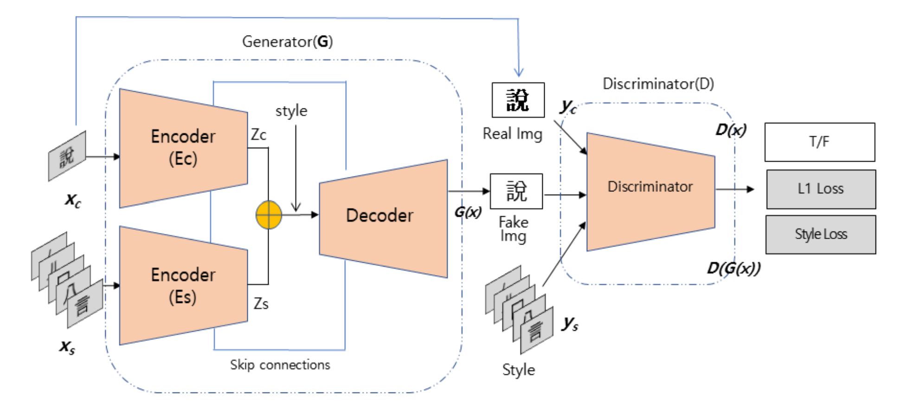
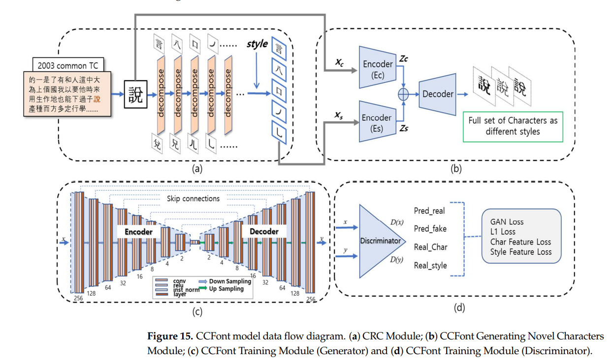
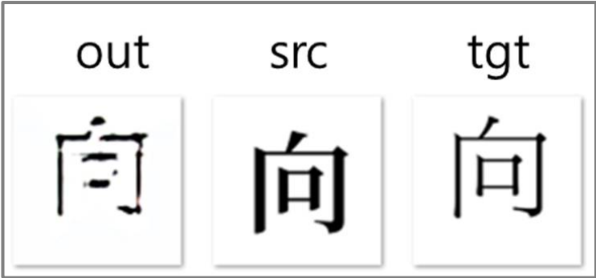

# CCFont: Component-Based Chinese Font Generation Model Using Generative Adversarial Networks (GANs)[1]

## Contributions

- The CCFont model automatically generates all Chinese characters using Chinese character components
- The CCFont model generates high-quality results without any additional training for the first-seen characters and styles.
- The CCFont model can be adpoted as a multi-lingual font-generation model, that can be applied to all languages, which can be divided into components, such as Traditional Chinese, Simplified Chinese, Korean, Thai.

## Mechanisim

**The CCFont model obtains style information from the components, not from the glyphs.**

1. Decompose the character into components (up to 17 components).
2. Transform the decomposed components into styles.
3. Recombine the transformed components to generate a new style of character. 

## Model Architecture

- **Input**:
    - A content image (Xc)
    - A set of style images (Xs)
- **Output**: Generated resulting image (G(x))

(Image Retrieved from [1])

- `Character-to-Radical-to-Components Module (CRC)`
    - Decompose characters and add style information as an input style.
    - The number of Chinese radicals is unknown
    - Radical: 偏旁， Component：部首
- `Content Encoder`(Ec) and `Style Encoder`(Es)
    - Generate font content information (Zc) and font style information (Zs)
    - Eight convolutional layers for each encoder
- `Decoder`
    - Generate content in a transformed style.
    - Consist of eight deconvolutional layers

(Image Retrieved from [1])

## Limitation

By using Python `CJKradlib RadicalFinder’s API`, all characters could be separated into basic components (up to 17 components). But sometimes the separated image of component is different from the shape of the original component.

For example:

`{‘character’: ‘向’, ‘compositions’: [‘丿’, ‘冂’, ‘口’]}`

(Image Retrieved from [1])

## References
[1] J. Park, A. U. Hassan, and J. Choi, “CCFont: Component-based Chinese font generation model using generative adversarial networks (Gans),” Applied Sciences, vol. 12, no. 16, p. 8005, 2022. 

