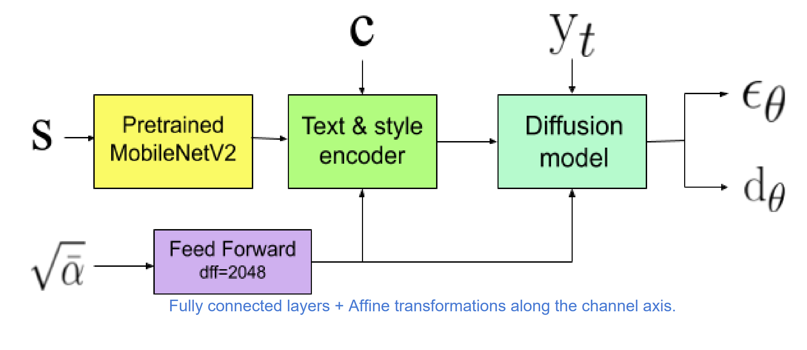

# Diffusion Models for Handwriting Generation[1]

## Diffusion Model

> Diffusion models are a class of generative models where samples start from Gaussian noise and are gradually denoised to produce output.

A diffusion model consists of two processes:

- A noise adding process
    - This is a fixed Markov Chain process, with Gaussian noise added to the original data gradually.
    - Eventually the data has nothing but Gaussian noise.
    - Compute $q(y_{t} \mid y_{t-1})$
- A reverse process (diffusion process)
    - Get deep learning model involved to remove the Gaussian noise and estimate the data at previous timestamps. 
    - Compute $q(y_{t-1} \mid y_{t})$

## Motivation and Contributions

- `RNN-based` architecture requires the writer style data to be in `online format`, and recording the pen strokes of users during sampling is tricky.
- `GAN-based` method works with style images direcly, but it is cumbersome to train a GAN model since it requires at least two auxiliary networks: the discriminator and a text recognition network to control the content of the generated text.

- This paper proposes a diffusion model which can
    - Incorporate writer stylistic features from `offline data`.
    - **Generate samples in `online format`.**
    - Eliminate the need for text recognition, text-based, style-based, or adversarial loss functions or the training of auxiliary network.
- Plus, this paper proposes a sampling method, which first estimates $\hat{y}_{0}$ from $y_{t}$, then finds $y_{t-1}$ based on $\hat{y}_{0}$. This method leads to more realistic samples.

## Model Architecture

Each data point $x_{t}$ is composed of:
    - A real valued pair representing the `pen offset` from the previous stroke in the `x` and `y` directions
    - A binary entry for pen-down (0) or pen-up (1)

This paper splits each data point $x_{t}$ into two sequences of equal length:
    - $y_{t}$: The real valued pen strokes
    - $d_{t}$: Ground-truth of whether the pen was down

- **Inputs**:
    - An `offline image` containing the information of writer's style (s)
    - A discrete `character` sequence describing what is written (c)
    - Gaussian Noise level ($\sqrt{\overline{\alpha}}$), which equals to 1 - $\beta$, where $\beta$ is the standard deviation of the Gaussian noise
    - Real valued pen strokes ($y_{t}$)
- **Outputs**: 
    - Prediction of Gaussian noise level ($\epsilon_{\theta}$)
    - Estimation of whether the pen was down ($\hat{d}_{\theta}$)

(Image Retrieved from [1])

- `Pretrained MobileNet V2`
    - Extract stylistic features from the image
- `Feed Forward`
    - Consists of two fully connected layers followed by affine transformations
- `Text & Style Encoder`
    - Incorporate stylistic featurs extracted from `MobileNet V2` with `character-level` text sequence
    - Compute attention between the text sequence and the extracted features
- `Diffusion Model`
    - Consists of downsampling (`pooling`) blocks and upsampling blocks
    - Consists of convolutional blocks and attentional blocks

## Evaluation Metrics

Both metrics have the property of **lower is better**

- Frechet Inception Distance (FID)
    - Use `Inception V3` network to compute
    - Plot the generated online sequence on an image and resize the image to a fixed size
- Geometry Score (GS)
    - Compute the topological similarity between data manifolds
    - Compare the online samples directly

## References
[1] T. Luhman and E. Luhman, “Diffusion models for Handwriting Generation.,” arXiv (Cornell University), Nov. 2020. 
