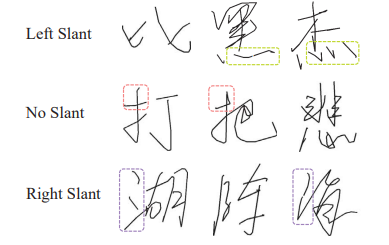
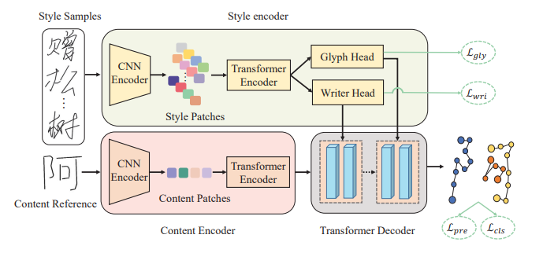
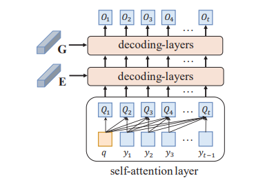

# Disentangling Writer and Character Styles for Handwriting Generation[1]

## Motivation and Contributions

- `RNN-based` methods only focus on capturing writer's overall writing style, overlooking the subtle style inconsistencies between characters produced by the same writer.
    - Each row in the figure below depicts the characters written by the same person.
    - Despite sharing similar overall writing style (i.e. `glyph slant`), subtle character-wise style discrepancy can still be observed among them (i.e. `stroke length`, `location`, and `curvature`)

(Image Retrieved from [1])

- This paper aims to automatically generate online Chinese handwritings that
    - Not only correspond to specific textual content,
    - But also emulate the calligraphic style of a given exemplar writer, including both `writing-wise style` and `character-wise style`.

- In this paper, a model named `Style Disentangled Transformer (SDT)` is proposed. This model
    - Disentangles the style representaions at both writer and character levels, thereby improving the performance of handwriting imitation.
    - Extracts the style commonalities of reference samples and capture the detailed style patterns of each sample.
    - Captures more find-grained details, compared with DSD[2].
    - Obtains content and style information, and thus synthesize characters with arbitrary styles well.
    - Synthesizes realistic stylized `online handwritten characters`.

- This work contributes to
    - Enhancing Chinese handwriting generation.
    - Outperforming other state-of-the-art model on datasets in Chinese, English, Japanese, and Indic.

## Model Architecture

- **Input**:
    - A content image (`content reference`)
    - A set of style images (`Style Samples`)
- **Output**: online handwritten Chinese character that
    - Reflects the calligraphic style
    - Retains the textual content of the `content reference`

(Image Retrieved from [1])

- `Style Encoder`
    - Learn both the writer-wise and character-wise styles distentangled by the `dual heads`, which is built on `self-attention`.
    - Consist of a sequential combination of a CNN and a `Transformer Encoder`.
    - Both `Glyph Head` and `Writer Head` are encouraged to learn those two styles via `contrastive learning` technique.
        - `Glyph Head` maximizes the mutual information between diverse views of a character.
        - `Writer Head` learns a latent space where style features from the same writer are closer than those from different writers.
- `Content Encoder`
    - Uses `Resnet 18` as the CNN backbone to learn the compact feature map.
    - Uses `Transformer Encoder` to extract the textual content representation with a global context.
        - Transformer has the capability of capturing long-range dependencies between feature patches.
- `Transformer Decoder`
    - Progressively generate realistic online characters based on global content feature and the obtained style representations.
    - At training phase, the ground-truth points are involved to accelerate the convergence of model performance.
    - Supervised by `pen prediction loss` and `pen state classification loss`

(Image Retrieved from [1])

*** 
Compared to Chinese, English script contains fewer character classes and a smaller number of trajectory points (averaging 30), making their imitation easier compared to other scripts.

## References
[1] Dai, G., Zhang, Y., Wang, Q., Du, Q., Yu, Z., Liu, Z., & Huang, S. (2023). Disentangling Writer and Character Styles for Handwriting Generation. ArXiv. /abs/2303.14736

[2] Atsunobu Kotani, Stefanie Tellex, and James Tompkin. Generating handwriting via decoupled style descriptors. In European Conference on Computer Vision, pages 764–780, 2020

