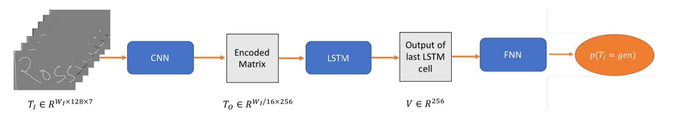

# Generative Adversarial Network for Handwritten Text[1]

## Motivation and Contributions

- The synthesized texts generated by `RNN-based` models are not as natural as human-being's normal written text.
- `GAN-based` model is less applied on sequential data generation. For offline stroke output, an additional effective `Ink Grab algorithm` is required for the conversion from image to online stroke.

- This paper proposes a handwriting generative adversarial network (HWGANs) which can generate more natural and realistic English handwritten text.
    - Design a discriminator consisting of a `CNN-LSTM` based feature extraction, followed by an auxiliary feedforward neural network.
    - Use the `prediction network` or `synthesis network` proposed by [Alex Grave](https://arxiv.org/abs/1308.0850)[2] as the generator.

## Proposed Approach

- **Inputs**:
    - The coordinates and pen up/down status of the i-th stroke ($x_{i}$, $y_{i}$, $s_{i}$)
    - Prefix text information (what texts to generate)
        - The text is an one-hot vector processed from the input string
        - This input is for systhesis generator ($G_{s}$) only
- **Output**: 
    - Probability of current stroke as genuine written text

### Discriminator (D)

- Distinguish realistic handwritten text from forgery ones.
    - In essence, it is a binary classifier to predict handwritten text of digital ink as forgery or not.
- Comprise a CNN-LSTM model and a feed-forward network (FNN).
- Before feeded into the discriminator, the generated data is process by `Path Signature Features (PSF)`
    - PSF encodes geometrical and order information of stroke points into seven path signature maps.
    - The seven-channel tensor serves as the input of the discriminator.

(Image Retrieved from [1])

### Generator ($G_{p}$ and $G_{s}$)

- Forge realistic handwritten text to cheat discriminator adversarially.
    - In essence, it is stacked LSTMs with sampling layers for generating strokes points from a certain initial point.

## References
[1] B. Ji and T. Chen, “Generative Adversarial Network for Handwritten Text.,” arXiv (Cornell University), Jul. 2019.

[2] A. Graves. Generating sequences with recurrent neural networks. arXiv preprint arXiv:1308.0850, 2013.
