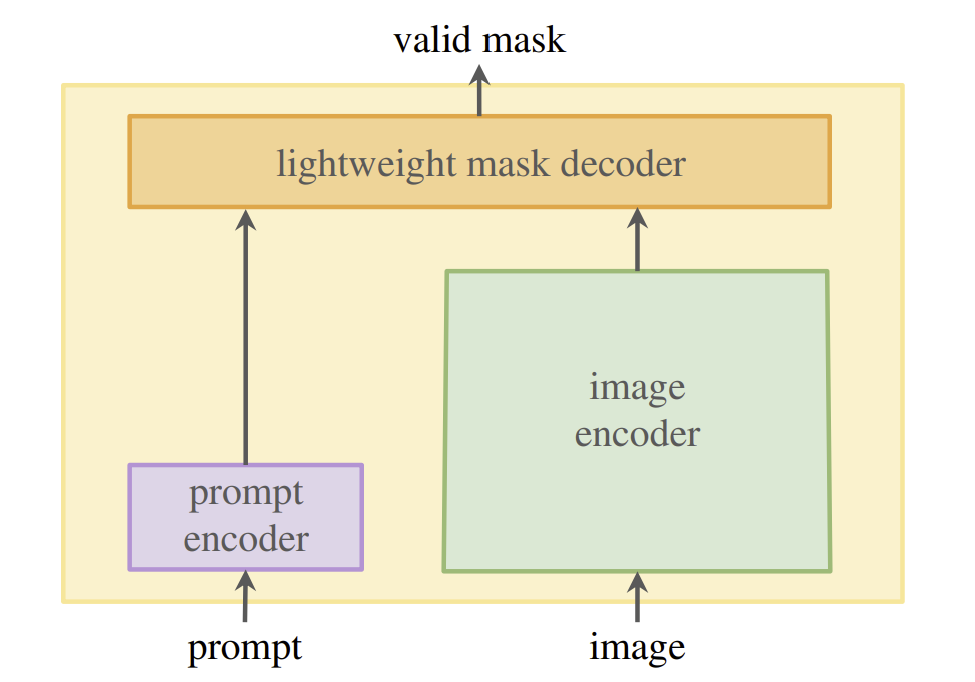
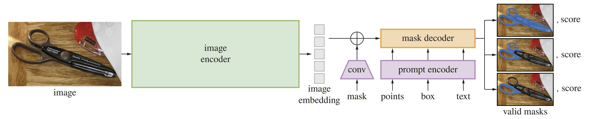

# Segment Anything[1]

## Mechanism

(Image Retrieved from [1])

This paper aims to solve the `promptable segmentation task` and return a valid segmentation mask given any prompt. In this paper, a foundation model named `Segment Anything Model (SAM)` is proposed.

A valid output mask means the output should be a reasonable mask for at least one of the objects even when a prompt is ambiguous and could refer to multiple objects.

The image encoder computes an image embedding, the prompt encoder embeds prompts, and then the two information sources are combined in a lightweight mask decoder to predict segmentation masks.

## Concepts

- **Foundation Model**: a.k.a. Pretrained Model. Models that are trained on broad data at scale and are adaptable to a wide range of downstream tasks.
- **Zero-Shot Learning**: A problem setup in machine learning where, at test time, a learner observes samples from classes which were not observed during training, and needs to predict the class that they belong to.
- **One-Shot Learning**: A machine learning based object classification algorithm that assesses the similarity and difference between two images.
- **Few-Shot Learning**: Feeding models with very minimal data, contrary to the practice of feeding large amounts of data, so the model can generalize well on unseen data with very few examples.

## Model Architecture

- The `Image encoder` and `Mask decoder` are adapted from Vision Transformer and Transformer decoder block respectively.
- The `Prompt encoder` can be fed with two sets of prompts:
    - Sparse prompt: points, boxes, text
    - Dense prompt: masks 
- The head is a `dynamic mask prediction head`. That is the model predict multiple output masks for a single prompt. This comes in handy especially when the prompt is ambiguous. When training, only the minimal loss over masks is backpropogated.

(Image Retrieved from [1])

## Limitations

- Missing fine structures.
- Generating small disconnected components at times.
- Failing to produce crisply boundaries.

Overall, SAM is designed for generality and breadth of use rather than high IoU interactive segmentation. This paper is an exploratory research into the `text-to-mask` task.

## References
[1] A. Kirillov et al., “Segment Anything,” arXiv [cs.CV], 2023. [arXiv](https://arxiv.org/pdf/2304.02643.pdf)

