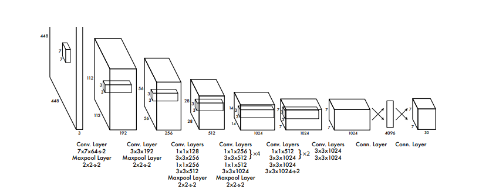

# You Only Look Once_Unified, Real-Time Object Detection^[1]^

## Mechanism

(Image Retrieved from [1])
- **Preprocess**: Resize image to `448 x 448`
- **Model Inference**:
    - Divide the input image to an `S x S` grid. The grid cell is responsible for dectecting an object whose center falls inside.
    - Each grid cell predicts `B` bounding boxes, and each bounding box consists of 5 predictions:
        - `(x, y)`: the center of the predicte box relative to the bounds of grid cell.
        - `w, h`: normalized width and height of the bounding box by the image width and height.
        - `confidence`: IoU between the predicted box and ground truth box.
- **Postprocess**: Threshold the bounding boxes via non-max supression

## Model Architecture

(Image Retrieved from [1])

## Limitations

## References
[1] J. Redmon, S. Divvala, R. Girshick, and A. Farhadi, “You only look once: Unified, real-time object detection,” 2016 IEEE Conference on Computer Vision and Pattern Recognition (CVPR), 2016. [arXiv](https://arxiv.org/pdf/1506.02640.pdf)

[2] M. Chen, “Real-time video object detection with temporal feature aggregation,” thesis, 2021. [thesis](https://ruor.uottawa.ca/handle/10393/42790)