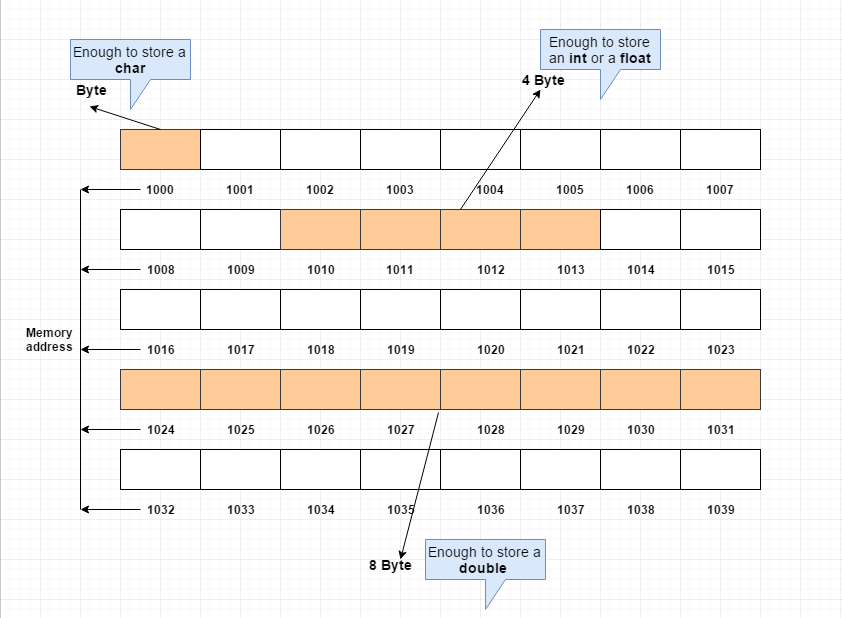

# Chapter 1. Why Data Structures Matter

## Prerequisite
- Measuring the speed of an operation in terms of time is hardware-specific. Hence, to measure how fast an operations takes, we refer to how many computational steps that operation takes.
- Each cell in a computer memory has a specific address, just like a street address
    - A computer can jump to any address in one step.
    - When allocating an array, the computer makes note at which memory address the array begins.

(Image Retrieved from [1])

## Operations

> Many data structures are used in four basic ways.

- **Read**: Given an `index`, a computer returns the `value` contained there.
- **Search**: Look for a particular value within the data structure. (Given a `value`, a computer returns the `index` of that value's location.)
- **Insert**: Add a new value to the data structure.
- **Delete**: Remove a value from the data structure.

## Number of Steps for Each Operation and Data Structure.

Let's say there are `N` cells in the data structure, and we solely consider the worst case.

|        | **Read** | **Search** | **Insert** | **Delete** |
| :----: |    :----:   |    :----:     |    :----:     |
| **Array** | 1       | N1  | N + 12  | N1  |
| **Set**   | 1       | N1  | 2N + 13 | N 1 |
1

*Notes*:
1. Iterate through the whole data structure and find out the value's location.

2. When inserting a value at the beginning of an array, we need to shift the `N` elements to the right by one cell, and then insert the new value.

3. When inserting a value at the beginning of an array, **since Set has the constraint of barring duplicates**, we need to go through the `N` elements and make sure the inserted value does not exits in the set. Only after that can we shift the `N` elements to the right by one cell, and then insert the new value.

4. When deleting a value at the beginning of an array or a set, we need to remove the first element first and shift the remaining `N - 1` elements to the left by one cell.

## Reference

[1] “Computer memory address,” Computer memory address basics. [Online]. Available: https://www.log2base2.com/C/pointer/computer-memory-address-basics.html. [Accessed: 16-Jan-2023]. 
