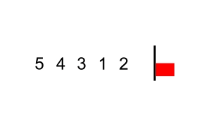

# Chapter 4. Speeding Up Your Code with Big O

## Bubble Sort

- In each pass-through of the array, through the combination of `comparison` and `swap` steps, bubbling up the **highest unsorted element** to its correct position (a.k.a. the last index of each iteration round).
- Keep on iterating through the array until we have an iteration in which no `swap` is executed.
- The algorithm has a time complexity of O(N2), which is considered to be `quadratic time` and a relatively inefficient algorithm.

(Image Retrieved from [this link](https://commons.wikimedia.org/wiki/File:Bubble_sort_with_flag.gif))

## Optimize An Algorithm from O(N2) to O(N)

- **Purpose**: write an algorithm checking if an array contains any duplicate numbers

- **Algorithm**:
    - Instead of using `nested for loop`, which has time complexity of O(N2), initialize an empty array (called auxiliary array below). 
    - Iterate through the array for checking duplication, using the `value` of the checking array element as the `index` of the auxiliary array, and assign a value `1` to the empty array on that `index`.
    - When encountering a `value` of the checking array that already used as an `index` of the auxiliary array, return `True` directly.
    - If the whole checking array is passed through, return `False`.

