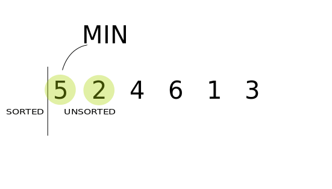

# Chapter 5. Optimizing Code with and without Big O

## Selection Sort

- Keep track of the **lowest value** in each pass-through.
- Swap the **lowest value** element with the one we begin with our pass-through.
- Repeat this process until we start at the end of the array.

(Image Retrieved from [this link](https://stackabuse.com/selection-sort-in-javascript/))

## Big O Categories

> Big O Notation ignores constants

This is because multiplying or dividing the number of steps by a constant number does not change them into another category.

- When two algorithms fall under the same big O category, further analysis is necessary for determining which one is faster.

