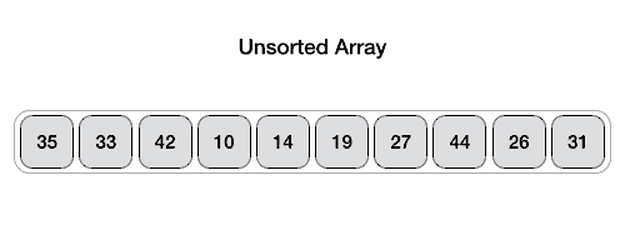

# Chapter 13. Recursive Algorithms for Speed

## Quicksort

- Use `Partition` to find the pivot point in an array. 
- Quicksort the left partition excluding the pivot point
- Quicksort the right partition excluding the pivot point

This is a recursive algorithm, whose base case is when there are only zero of one element in the subarray.

In best-case and average-case scenarios, `Quicksort` has an efficiency of O(N logN). While in the worst-case scenario (when pivot always ends up on one side of the subarray instead of in the middle), `Quicksort` has an efficiency of O(<sup>N</sup>)

*NOTE:* In many programming languages, the sorting algorithm is employed under the hood is `Quicksort`.


## Partition

Once each parition is done, the pivot ends up in the appropriate position. The number that is less than the pivot point is to the left of the pivot, while the number that is greater than thte pivot point is to the right of the pivot.

### Parition Procedure

1. Choose the right-most element as the pivot. (It is unnecessary to the the right-most point, but this is a common practice.)

2. Move the left pointer until it reaches a value that is greater or equal to the pivot point.

3. Move the right pointer until it reaches a value that is less or equal to the pivot point OR **if it reaches the beginning of the array**.

4. If the left pointer has reached or gone beyond the right pointer, move on to Step 5. Otherwise, swap the left and right pointers and **increment the left pointer index by 1**, then return to Step 2 and 3.

5. Swap the left pointer and the pivot point.

6. Return the left pointer.




For `Quicksort` and `Partition` algorithms, please refer to the [Exercise Question 1 in this chapter](./exercises/Chapter%2013/Q1.py)

## Quickselect

> Plenty of algorithms employs sorting as part of a larger process.
And sorting is served as a preceding process. `Quickselect` is one of those algorithms

`Quickselect` can be thought of as a hybrid of `Quicksort` and `Binary Search`

We can find the correct value without having to sort the entire array. That is, we only focus on the half in which we know the value we are seeking will be found.

`Quickselect` has a efficiency of O(N)

Find the kth-to-lowest value in an array:

```python
def quickSelect(kth_lowest_value, left_index, right_index):
    if right_index - left_index <= 0:
        return array[left_index]
    
    pivot_index = partition(left_index, right_index)

    if kth_lowest_value < pivot_index:
        quickSelect(kth_lowest_value, left_index, pivot_index - 1)
    elif kth_lowest_value > pivot_index:
        quickSelect(kth_lowest_value, pivot_index + 1, right_index)
    else:
        return array[pivot_index]
```
