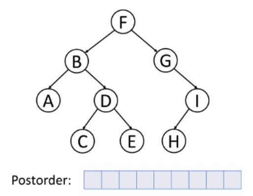

# Chapter 15. Speeding Up All the Things with Binary Search Trees

## Fundamentals of Trees
- `Root`, `Ancestors`, `Descendants`.
- Each `level` is a row within the tree.
- A tree is balanced when its nodes' subtrees have the same number of nodes in it.

## Binary Search Tree (BST)

BST abides by the following tso rules:

1. Each node can have **at most** one left child and **at most** one right child.

2. All the values that are less than the node are within the left descendant of the node itself, whereas all the values that are greater than the node are among the right descendant of the node itself.

Example of BST:

(Image Retrieved from [this link](https://www.javatpoint.com/binary-search-tree))

- Search, insertion, and deletion in BST are O(logN)
- Search in BST is O(logN)
    - Eliminate half of the remaining values with each step of search proceeding.
    - Alternatively, each step of search moves down a level. If there are N nodes in a balanced binary tree, there will be about log N levels (or say, rows).
    - Searching a BST has the same efficiency as binary search within an ordered array.
- Deletion is the most tricky operation within a BST.
    - The algorithm for deletion from a BST:
    > - If the node being deleted has no children, simply delete it.
    > - If the node being deleted has one child, delete the node and plug the child into the spot where the deleted node was.
    > - When deleting a node with two children, replace the deleted node with the successor node.
        > - Find the successor node: visit the right child of the deleted node, and keep visiting the left child of each subsuquent child until there are no more left children. The bottom value is the successor node.
        > - If the successor node has a right child, after copying the successor node value to the delete node, put the right child of the successor node into the left child of the parent of the successor node.
- BST is an efficient choice for scenarios in which we need to store and manipulate ordered data, especially when we will be modifying the data often.
- The operations in BST, including search, insertion, deletion, and traversal, makes heavy use of `recursion`. 

## Traversal

The process of visiting every node in a data structure is known as  traversing the data structure. Tree traversal is O(N), since it visits all N nodes of the tree.

|   Pre-order    | In-order |  Post-order    |
|    :----: |    :----:   |    :----:   |
|   |   |   |
| (Image Retrieved from [this link](https://commons.wikimedia.org/wiki/File:Preorder-traversal.gif))     | (Image Retrieved from [this link](https://commons.wikimedia.org/wiki/File:Inorder-traversal.gif))  | (Image Retrieved from [this link](https://commons.wikimedia.org/wiki/File:Postorder-traversal.gif))  |
