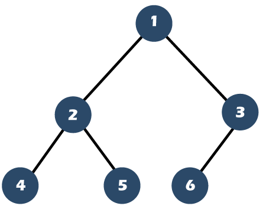
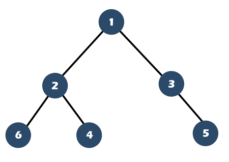

# Chapter 16. Keeping Your Priorities Straight with Heaps

## Priority Queue

- Difference between a `Priority Queue` and a `Queue`:
    - Both are the same in terms of `search` and `deletion`. But when it comes to `insertion`, `Priority Queue` always makes sure the data remains in a sorted order.
- `Heap` is a great tool for implementing `Priority Queue`, since `Heap` can give up immediate access to the highest-priority item.

## Heap

*NOTE:* This book only focuses on the `binary heap`.

The `Max Heap` is a binary tree which abides by the following two conditions:

1. **Heap Condition:** The value of each node must be greater than any of its descendants.

2. The tree must be complete.
    - Complete Tree: If you read from left to right, all the nodes are there. However, the bottom row can have empty positions, as long as there aren't any nodes to the right of these empty positions.
    |   Complete Tree    | Incomplete Tree |
    |    :----: |    :----:   |
    |   |   |
    | (Image Retrieved from [this link](https://www.javatpoint.com/full-binary-tree-vs-complete-binary-tree))     | (Image Retrieved from [this link](https://www.javatpoint.com/full-binary-tree-vs-complete-binary-tree))  |

### Heap Properties

1. Compared to `binary search trees`, `heaps` are *weakly ordered*. The orders remains in a heap is not worthwhile enough to search through.

2. In a max heap, the root node will always have the greatest value. Whereas in a min heap, the root node will always have the smallest value.

3. A heap's last node is the rightmost node in its bottom level.

### Heap Insertion

*Time Complexity:* O(logN)

> 1. Create a node containing the new value and insert it at the next available rightmost spot in the bottom level. Thus, this value becomes the heap's last node.
> 2. Compare the new node with its parent node.
> 3. If the new node is greater than its parent node, swap the new with the parent node.
> 4. Repeat Step 3 until trickling the new node up to a position where its parent node is greater than it.

(Image Retrieved from [this link](https://www.tutorialspoint.com/data_structures_algorithms/heap_data_structure.htm))

### Heap Deletion

*Time Complexity:* O(logN)

> 1. Move the last node to the root node. Thus the last node is the root node and the trickle node.
> 2. Compare the trickle node and both children of it.
> 3. If the trickle node is smaller than the larger of the two child nodes, swap the trickle node with the larger child node.
> 4. Repeat Step 2 and 3 until trickling the new node down to a position where it has no children node greater than it.

(Image Retrieved from [this link](https://www.tutorialspoint.com/data_structures_algorithms/heap_data_structure.htm))

## Array-Based Heap

Heaps are usually implemented by arrays.

Some useful formulas:
- The last node will always be the final element of the array
- To find the left child of any node, use the formula `(index * 2) + 1`
- To find the right child of any node, use the formula `(index * 2) + 2`
- To find the right child of any node, use the formula `(index - 1) // 2`
    - *NOTE:* This is an integer division which throws away any numbers beyond the decimal point.
