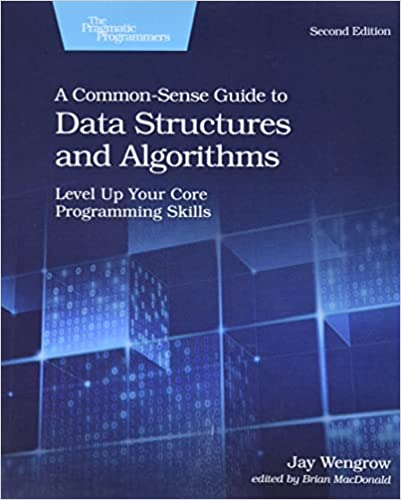

# A Common-Sense Guide to Data Structures and Algorithms, Second Edition: Level Up Your Core Programming Skills

(Image Retrieved from [Amazon](https://www.amazon.ca/Common-Sense-Guide-Structures-Algorithms-Second/dp/1680507222/ref=rvi_sccl_1/147-8772558-6073865?pd_rd_w=1eZ4e&content-id=amzn1.sym.8b4d8c20-8e51-4634-a76f-c00a1995a502&pf_rd_p=8b4d8c20-8e51-4634-a76f-c00a1995a502&pf_rd_r=8VVNM444G7DZHPRWKFS7&pd_rd_wg=5N5gU&pd_rd_r=1716398e-cfb4-4eca-ae02-0333f2c1a9ba&pd_rd_i=1680507222&psc=1))

| Chapter | Description |
| ---------------------- | ---------------------- |
| [1. Why Data Structures Matter](Chapter%2001%20Why%20Data%20Structures%20Matter.md) | Analyze two data structures: `arrays` and `sets` |
| [2. Why Algorithms Matter](Chapter%2002%20Why%20Algorithms%20Matter.md) | Introduce another data structure: `ordered array` and compare two algorithms: `linear search` and `binary search` |
| [3. O Yes! Big O Notation](Chapter%2003%20O%20Yes!%20Big%20O%20Notation.md) | Introduce O(N), O(1), and O(logN) |
| [4. Speeding Up Your Code with Big O](Chapter%2004%20Speeding%20Up%20Your%20Code%20with%20Big%20O.md) | Introduce `bubble sort` whose time complexity is O(N2). Optimize duplication checking algorithm from O(N2) to O(N) by compromising space complexity |
| [5. Optimizing Code with and without Big O](Chapter%2005%20Optimizing%20Code%20with%20and%20without%20Big%20O.md) | Introduce `selection sort` whose time complexity also is O(N2). Two algorithms may have different performance, even though they have the same time complexity. |
| [6. Optimizing for Optimistic Scenarios](Chapter%2006%20Optimizing%20for%20Optimistic%20Scenarios.md) | Introduce `insertion sort` whose time complexity also is O(N2). Unveil another major rule of *Big O Notation*. Demonstrate an example for optimizing an algorithm with adding one line of code. |
| 7. Big O in Everyday Code | Introduce a bunch of examples with analysis on time complexity of each code. Plus, O(N * M) can be considered as the range between O(N) and O(N2) |
| [8. Blazing Fast Lookup with Hash Tables](Chapter%2008%20Blazing%20Fast%20Lookup%20with%20Hash%20Tables.md) | Introduce `hash table` which can be used to look up data in 0(1), as long as the key is known. |
| [9. Crafting Elegant Code with Stacks and Queues](Chapter%2009%20Crafting%20Elegant%20Code%20with%20Stacks%20and%20Queues.md) | Introduce `Stack` and `Queue`, which are utilized to handle temporary data in algorithms |
| [10. Recursively Recurse with Recursion](Chapter%2010%20Recursively%20Recurse%20with%20Recursion.md) | Introduce `recursion` and `call stack`. Demonstrate how to read recursive code |
| [11. Learning to Write in Recursive](Chapter%2011%20Learning%20to%20Write%20in%20Recursive.md) | Bring in `bottom-up` and `top-down` processes to solve recursion problems. Illustrate the method to write recursive algorithm. Talk about `Staircase Problem` in 1D and `Unique Path Problem` in 2D. |
| [12. Dynamic Programming](Chapter%2012%20Dynamic%20Programming.md) | Avoid unnecessary recursive calls by getting a temporary variable involved to speed up recursion. Use `Dynamic Programming` with `memoization` and `iteration loop` to optimize recursions with overlapping subproblems.  |
| [13. Recursive Algorithms for Speed](Chapter%2013%20Recursive%20Algorithms%20for%20Speed.md) | Introduce `Quicksort` algorithm which has time complexity of O(NlogN) and is based on `partition`, a recursive algorithm. Also bring in `Quickselect` algorithm making use of `Quicksort`.  |
| [14. Node-Based Data Structures](Chapter%2014%20Node-Based%20Data%20Structures.md) | Introduce `Linked List` and `Doubly Linked List`, along with four base operations (i.e., `Reading`, `Searching`, `Insertion`, `Deletion`). From this chapter, all the data introduced data structures are node-based.  |