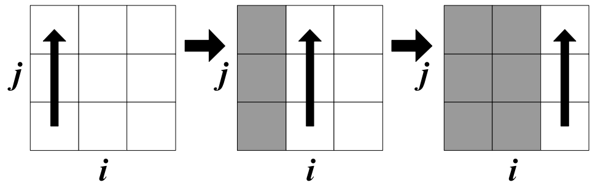
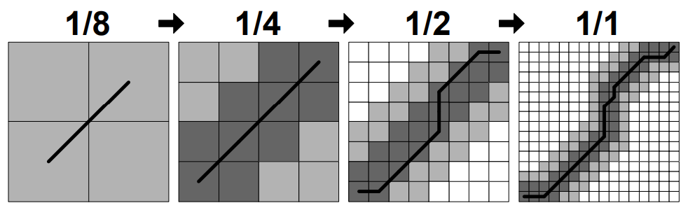

# FastDTW: Toward Accurate Dynamic Time Warping in Linear Time and Space<sup>[1]</sup>


## Fundamentals

- `Dynamic time warping (DTW)` is a technique that finds the optimal alignment between two time series. The alignment is achieved by warping one time series non-linearly by stretching or shrinking it along the time axis.
- Since a single point may map to multiple points in the other time series, the time series do not need to be of equal length.
- Unlike standard DTW, `FastDTW` is an approximation of DTW that has a **linear** time and space complexity.
- The warp path distance is the difference between the two time series, which is measured by the sum of the distances between each pair of points connected by the vertical lines.
- *Normalizing the time series to the same scale* and *Comparing two time series denoting the same content* are necessary.
- `Dynamic Programming` is involved in the implementation of the DTW algorithm.


(Image Retrieved from [1])

## Cost Matrix

- Given two time series $$X$$ and $$Y$$, a two-dimentional `cost matrix` D is constructed, $$D(i, j)$$ denotes the minimum distance between $$X_{i}$$ and $$Y_{j}$$
- $$D(i, j) = Dist(i, j) + \max(D(i - 1, j), D(i, j - 1), D(i - 1, j - 1))$$
- The cost matrix is filled one column at a time from the bottom up, from left to right.
- After the entire matrix is filled, a `warp path` can be found in reverse order starting at D(X, Y) through greedy search.




(Image Retrieved from [1])


## FastDTW Algorithm

- Speed up the DTW algorithm with the combination of two methods:
    - *Constraints*: Limit the number of cells that are evaluated in the `cost matrix`.
    - *Data Abstraction*: Perform DTW on a reduced representation of the data.
- FastDTW uses a `multilevel approach` with three key operations:
    - *Coarsening*: Reduce the size / resolution of a time series by averaging adjacent pairs of points. Herein serveral coarsed resolutions of the time series is generated.
    - *Projection*: Take a warp path calculated at a `lower resolution`. Determine what cells in the next `higher resolution` time warp path passes through.
    - *Refinement*: Find the optimal warp path in the neighborhood of the heuristic projected path, where the size of the neighborhood is determined by the `radius` parameter.
- In the multilevel approach, the cost matrix is only filled in the neighborhood of the path projected from the previous resolution.



(Image Retrieved from [1])


```python

def fastDTW(X, Y, radius):
    ''' return the approximate distance between 2 time series with O(N) time and memory complexity
    Parameters
    ----------
    X : array_like
        input array 1
    Y : array_like
        input array 2
    radius : int
        distance to search outside of the projected warp path from the previous resolution when refining the warp path

    Returns
    -------
    distance : float
        the approximate distance between the 2 time series
    path : list
        a minimum distance warp path between X and Y
    '''

    # The minimum size of the coarest resolution
    minTSsize = radius + 2 

    if len(X) <= minTSsize or len(Y) <= minTSsize:
        # BASE CASE: run old-fashioned DTW for small time series
        return DTW(X, Y)
    
    else:
        # RECURSIVE CASE: run old-fashioned DTW only along the projected path
        # Coarsening
        shrunkX = X.reduceByHalf()
        shrunkY = Y.reduceByHalf()

        # Invoke recursive calls and generate warp path in low resolution
        lowResPath = fastDTW(shrunkX, shrunkY, radius)

        # Project and refine the warp path in high resolution
        window = ExpandedResWindow(lowResPath, X, Y, radius)

        return DTW(X, Y, window)

```


## Reference

[1] Stan Salvador, and Philip Chan. "FastDTW: Toward accurate dynamic time warping in linear time and space." Intelligent Data Analysis 11.5 (2007): 561-580.

