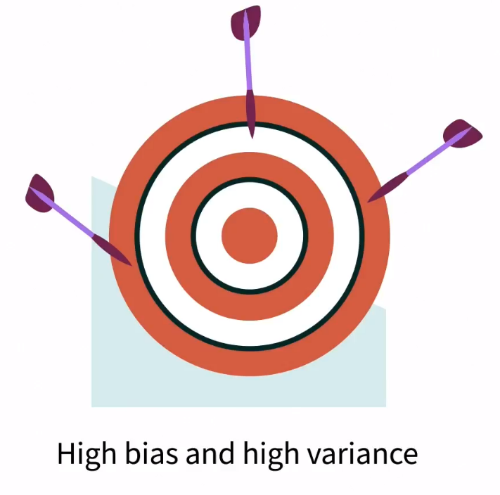
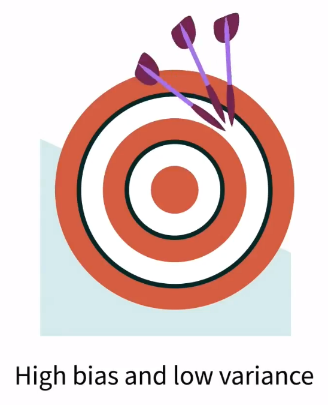
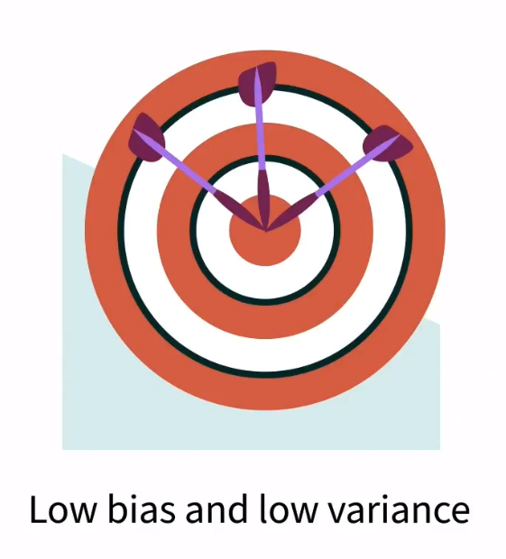

# Introduction to Artificial Intelligence

## Fundamentals

- `Artificial Intelligence`: A system that shows behavior that could be interpreted as human intelligence
- `Chinese Room Argument`: published by John Searle in 1980
    - You are in a windowless room with only one slot to communicate with the world. Inside the room, there are a bunch of `Post-It Notes` on the wall containing different Chinese sequences and a `Phrase Book` showing which `Post-It Notes` you should use to response to the notes that come through the slot.
> Sometimes systems can seem intelligent, but they are just mindlessly matching patterns.
> -- <cite>John Searle</cite>
- `Strong AI`: Machine displays all person-like behavior.
- `Weak AI`: AI that is confined to a very narrow task.
- `Aritificial Neural Network`: AI systems that mimics the structure of the human brain to break down massive datasets.

## Some Common Machine Learning Algorithms

- `K Nearest Neighbor (KNN)`: An algorithm that plots new data and compares it to existing data.
- `K-Means Clustering`: It is an unsupervised machine learning algorithm. It is used to create clusters based on what the machine sees in the data.
- `Regression Analysis`: A supervised machine learning algorithm that looks at predictors and the outcome.
- `Naive Bayes`: Assume that all the predictors are independent from one another, this is why it is called naive. (Classify item based on features of data)

## Ensemble Modeling

- `Bagging`: Use several versions of the same machine-learning algorithm with different datasets, and the algorithms are running **in parallel**.
- `Boosting`: Use several versions of the same machine-learning algorithm with different datasets, and the algorithms are running **in sequence**.
- `Stacking`: Use several different machine-learning algorithms.

## Bias and Variance

- `Bias`: The gap between the `predicted value` and the `actual outcome`.
- `Variance`: The extent in which the `predicted values` are scattered all over the place.

| High Bias and High Variance | High Bias and Low Variance | Low Bias and Low Variance |
| :---: | :---: | :---: |
||||

(Images Retrieved from [1])

## References

[1] “Follow the data - Introduction to Artificial Intelligence Video Tutorial | LinkedIn Learning, formerly Lynda.com,” LinkedIn. https://www.linkedin.com/learning/introduction-to-artificial-intelligence/follow-the-data?contextUrn=urn%3Ali%3AlyndaLearningPath%3A6477ad5c498e72fec31ca876 (accessed Jul. 09, 2023).