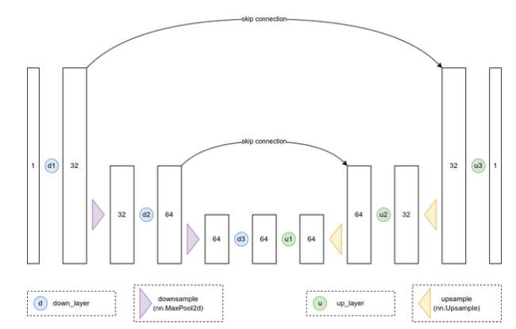

# Chapter 1. Diffusion Models


## Fundamentals

- `Diffusion models` generate their output by iterating over many steps.
- `Unconditioned Image Generation`: Generating images that resemble the training data.


## Essence of Diffusion Model

- We want the model to learn how to 'fix' (`denoise`) both extremely noisy images and images that are close to perfect.
    - Objective: The model predicts a mix of $x_{0}$ and $\epsilon$ at different timestamps.
        - $x_{0}$: Denoised the version of the input image.
        - $\epsilon$: `Unit-variance noise` that is used to create the noisy version of input.
- During training,
    - We use a `noise schedule` (i.e. `scheduler`) to add noise to the input.
        - The amount of added noise can drastically affect the performance of a given model.
        - The approaches to add noise are shown in the code below.
        - A good noise schedule will ensure that the model sees a mix of images at different noise levels.
    - Each step is a small update to the input, based on the model's prediction for the noise at that timestep.

```python
# Essence: Linear interpolation between images and random noise with some amount.

# Continuous time approach
def corrupt(x, noise, amount):
    amount = amount.view(-1, 1, 1, 1)
    return x * (1 - amount) + noise * amount

# Discrete time approach
def add_noise(x, noise, timesteps):
    amount = timesteps / num_train_timesteps
    return corrupt(x, noise, amount)
```


## Math behind Noise Adding

$q(x_{t} \mid x_{t-1}) = \mathcal{N}(x_{t};\sqrt{1 - \beta_{t}} x_{t-1},\beta_{t}I)$

- $\beta_{t}$ is defined for all timestamps and is used to specify how much noise is added at each step.
- $x_{t}$ is a distribution with a mean of $\sqrt{1 - \beta_{t}} x_{t-1}$ and a variance of $\beta_{t}$.
    - In other words, $x_{t}$ is a mix of $x_{t-1}$ (scaled by $\sqrt{1 - \beta_{t}}$) and some random noise $\epsilon$ (`unit-variance noise` scaled by $\sqrt{\beta_{t}}$)

    - $x_{t} = \sqrt{1 - \beta_{t}} x_{t-1} + \sqrt{\beta_{t}} \epsilon$
- We can find a formula to move to any timestep $t$ in one go. We define $\alpha_{t} = 1 - \beta_{t}$
    - $x_{t} = \sqrt{\alpha_{t}} x_{0} + \sqrt{1 - \alpha_{t}} \epsilon$


## Effect of Input Image Resolution and Scaling

- Images at `high resolution` tend to contain a lot of *redundant information* spread over pixels.
    - This is not the case for `low-resolution` image, where a single pixel can contain a lot of information.
- Adding the same amount of noise to a low-resolution image will result in a much more corrupted image than adding the equivalent amount of noise to a high-resolution image.

- If the images are represented as floats between 0 and 1 then they will have a lower variance than the noise (which is typically unit variance) and thus the `signal-to-noise ratio` will be lower for a given noise level than if the images were represented as floats between -1 and 1 (which we used in the training example above) or something else.


## Evaluation Metric - Fréchet Inception Distance (FID)

- Measure how closely generated samples match real-world samples.
- **The lower the FID, the better the quality and realism of the generated images.**
- *CAVEATS*:
    - There are some minor differences between how resizing is handled by different deep learning frameworks, which can result in small differences in the `FID score`.
    - The format and compression can affect the `FID score`. Avoid low-quality JPEG images where possible.
    - `FID score` is just a rough measure of quality and do not perfectly capture the nuances of what makes images look more `real`.
- Use `FID score` to get an idea of how one model performs relative to another, but also look at the images generated by each model to get a better sense of how they compare.

> Human preference is still the gold standard for quality in what is ultimately a fairly subjective field.


## UNet

- `Skip connection` connects the `downsampling` layer's output to the `upsampling` layer's input, allowing the `upsampling` layer to 'see' the higher-resolution representations from earlier in the network.
- Capabilities of `UNet`:
    - Take in a noisy image and estimating how to denoise it.
    - Take in an image of arbitraty size and output an image of the same size.
    - Make precise predictions at the pixel level.
    - Capture higher-level information about the image as a whole.
- `AutoEncoder` or `VAE` is less capable of making precise predictions at the pixel level.



(Image Retrieved from [1])

- Improvement of `UNet`:
    - Add more parameters
    - Add residual connections
    - Add normalization
    - Add regularization
        - Especially important when working with smaller datasets
    - Add attention
        - Typically use attention at lower resolutions
    - Add an additional input


## Alternative Architectures

| Architectures  | Description  |
| :-------:  | :-------  |
| `Transformers` | <li>The better performance is achieved at the cost of high computation and memory overhead, especially at higher resolutions.</li> |
| `UViT` | <li>Replace the middle layers of the UNet with a large stack of transformer blocks.</li><li>During pre-processing, the model uses `wavelet transform` to reduce the spatial resolution of the input image while keeping as much as possible.</li> |
| `Recurrent Interface Networks (RIN)` | <li>First mapping high-resolution inputs to a more manageable and lower-dimensional `latent` representation which is then processed by a stack of transformer blocks before being decoded back out to an image.</li> |


## References

[1] “Hands-On Generative AI with Transformers and Diffusion Models [Book],” www.oreilly.com. https://www.oreilly.com/library/view/hands-on-generative-ai/9781098149239/ (accessed Jul. 07, 2023).
