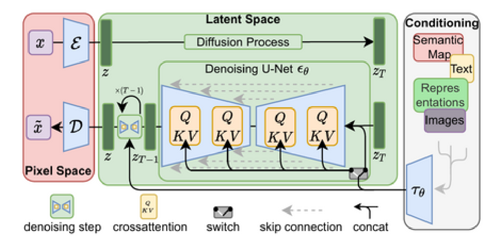

# Chapter 2. Building up to Stable Diffusion


## Fundamentals

- `Conditioning`: The model generate not just any image, but an image belonging to a pre-defined class encompassed in the addtional input (usually a `text prompt`).
    - The additional input is turned into `embeddings` that the model uses during its forward pass.
- `Stable Diffusion`: A text-conditioned `latent diffusion` model.


## Latent Diffusion

- Doing `diffusion` in an architecture entailing `self-attention` layer has a large computational overhead. `Latent Diffusion` mitigates this issue by using a separate model called `Variational Auto-Encoder (VAE)`
- `VAE`, which has an `encoder-decoder` architecture, produces a much smaller representation of an input image and then reconstructs the image based on the small latent representation with a high degree of fidelity.
    - In short, `VAE` compresses images into a smaller latent representation and back again.



(Image Retrieved from [1])

- `VAE` is usually trained separately and used as a frozen component during the diffusion model training and sampling process.


## Classifier-Free Guidance (CGF)

- During training, `text conditioning` is sometimes kept blank.
- During inference, we make two separate predictions:
    - One with the `text prompt` as conditioning and one without.
    - Use some scaling factor (`guidance scale`) and the difference between those two predictions to create a prediction biasing towards `text-conditioned prediction`
    
```python
with torch.no_grad():
    noise_pred = pipe.unet(latent_model_input, t,encoder_hidden_states=text_embeddings).sample

    # Split the prediction into unconditional and conditional versions:
    noise_pred_uncond, noise_pred_text = noise_pred.chunk(2)
    
    # Perform classifier-free guidance
    noise_pred = noise_pred_uncond + guidance_scale *(noise_pred_text - noise_pred_uncond)

```


## References

[1] “Hands-On Generative AI with Transformers and Diffusion Models [Book],” www.oreilly.com. https://www.oreilly.com/library/view/hands-on-generative-ai/9781098149239/ (accessed Jul. 07, 2023).
