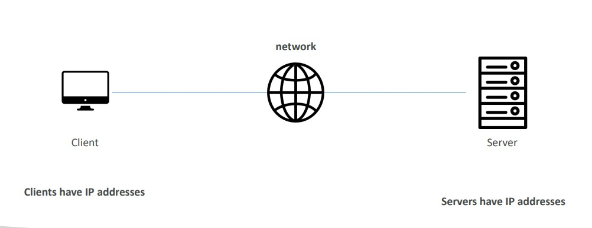
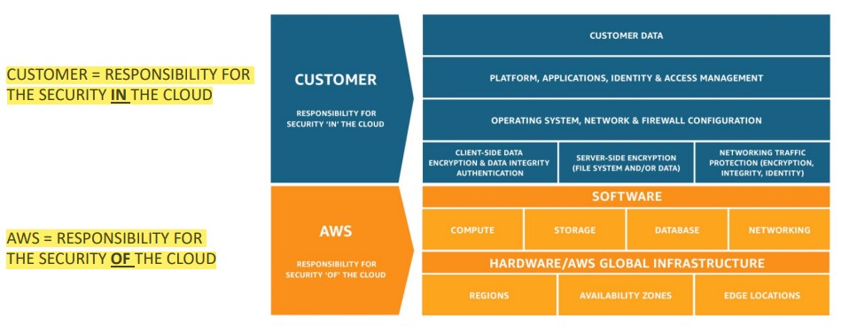

# Section 3. What is Cloud Computing?

## How Websites Work

(Image Retrieved from [1])

Network is working like a *post office* delivering requests and responses between clients and servers.

## Components of a Server

- **Compute**: CPU
- **Memory**: RAM
- **Storage** / **Database**
- **Network**: Routers, switch, DNS server

## Cloud Computing

- *Definition*
    - Cloud computing is the on-demand delivery of compute power, database storage, applications, and other IT resources.
    - On-demend: pay-as-you-go pricing model
- Deployment Models of the Cloud
    - **Private Cloud**
        - Cloud services used by a single organization, not exposed to the public.
    - **Public Cloud**
        - Cloud resources owned and operated by a third-party cloud service provider delivered over the Internet.
    - **Hybrid Cloud**
        - Keep some servers on premises and extend some capabilities to the Cloud.

- Five Characteristics of Cloud Computing
    - On-demand self service
    - Broad network access
    - Multi-tenancy and resource pooling
    - Rapid elasticity and scalability
    - Measured service (Usage is measured)

- Six Advantages of Cloud Computing
    - Trade capital expense for operation expense
    - Benefit from massive economies of scale
    - Stop concerning of capacity
    - Increase speed and agility
    - Stop spending money running and maintaining data centers
    - Go global in minutes

- Types of Cloud Computing
    - Infrastructure as a Service (IaaS)
        - Service provider provides building blocks for cloud IT, along with networking, computers, data storage space
        - Example: Amazon EC2
    - Platform as a Service (PaaS)
        - User only needs to focus on the deployment and management of applications
        - Example: Elastic Beanstalk
    - Software as a Service (SaaS)
        - Completed product that is run and managed by the service provider
        - Example: Many AWS services (ex. Rekognition for Machine Learning)

(Image Retrieved from [1])

## Pricing Fundamentals

AWS has 3 pricing fundamentals following the pay-as-you-go pricing model

- **Compute**: pay for compute time
- **Storage**: pay for data stored in the cloud
- **Data transfer OUT of the cloud**: data transfer IN is free

## AWS Global Infrastructure

- **AWS Regions**
    - Each region has many Availability Zones (3-6)
    - A region is a cluster of data centers
    - How to choose an AWS Region
        - Compliance with data governance and legal requirements
        - Proximity to customers
        - Available services within a Region
        - Pricing

- **AWS Availability Zones (AZ)**
    - Each AZ has one or more separate and independent data centers

- **AWS Data Centers**

- **AWS Points of Presence (Edge Locations)**
    - For low-latency content delivery network (CDN)

## Global Services and Region-Scoped Services

- AWS has global services:
    - Identity and Access Management (IAM)
    - Route 53 (DSN service)
    - CloudFront (Content Delivery Network)
    - WAF (Web Application Firewall)

- Most AWS services are region-scoped:
    - Amazon EC2 (IaaS)
    - Elastic Beanstalk (PaaS)
    - Lambda (Function as a Service)
    - Rekognition (SaaS)

## Shared Responsibility Model Diagram

(Image Retrieved from [1])

## References
[1] S. Maarek, “Courses datacumulus,” Courses Datacumulus. [Online]. Available: https://www.datacumulus.com/. [Accessed: 18-Mar-2023]. 
