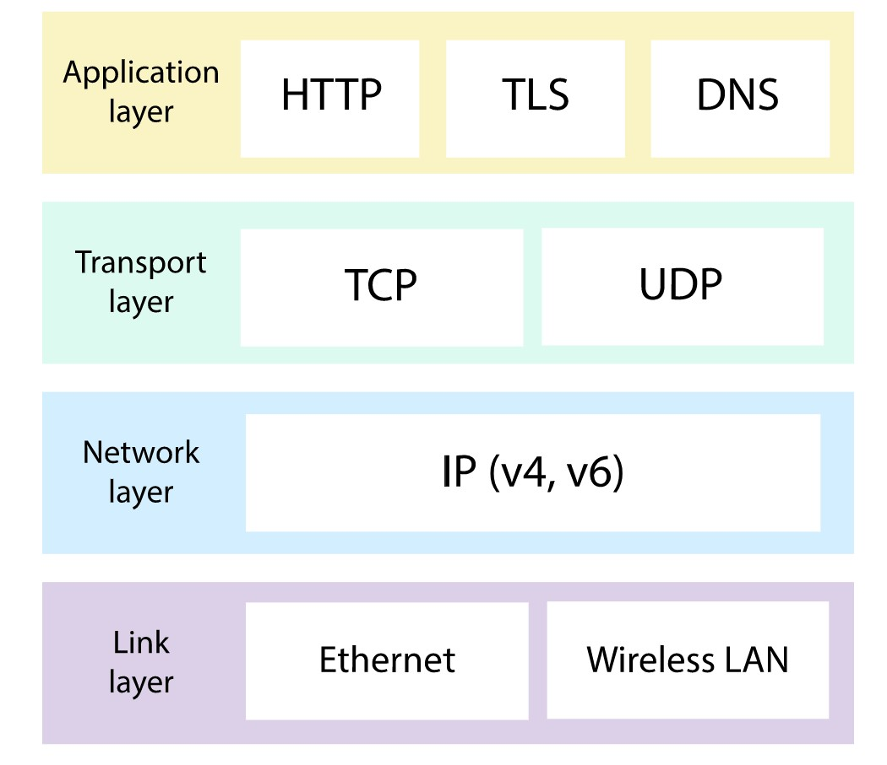

# Part I. Communication

> Communication between processes over the network is at the heart of distributed systems

## Network Protocols

- Network protocols determine how data is processed and formatted. 
- The protocols are arranged in a stack, where each layer is built on the abstraction provided by the layer below.
- Lower layer is close to the hardware.

(Image Retrieved from [1])

### Reliable Links - TCP

The nodes in a system that communicate with each other over the network.

### Coordination

Some form of coordination making individual nodes work in unison towards a shard objective.

### Scalability

For a system to be scalable, a load increase should not degrade the system performance. This also requires increasing the system capaticity at will.

- *Throughput*: The number of requests processed per second.
- *Response Time*: The time elapsed in seconds between sending a request to a system and receive a response.
- *Capacity*: The maximum load the system can withstand.

- *Scaling up*: Buying more expensive hardware with better performance.
- *Scaling out*: Adding more commodity machines to the system and having them work together.

### Resiliency

A distributed system is deemed as resilient when it can continue to do its job even then failures happen.

- *System Availability*: The percentage of time the system is available for use.
- *Uptime*: The amount of time the system can serve requests.
- *Downtime*: The amoount of time the system cannot serve requests.

Availablity is often described with nines:

|   Availability %    | Downtime per day |
| :----:        |    :----:   |
| 90% ("one nine")      | 2.40 hours       |
| 99% ("two nines")      | 14.40 minutes   |
| 99.9% ("three nines")      | 1.44 minutes   |
| 99.99% ("four nines")      | 8.64 seconds  |
| 99.999% ("five nines")      | 864 millisecnds  |

### Maintainability
*** 

> The business logic does not depend on technical details; instead, the technical details depend on the business logic.

In this book, the process running a service is referred as a `server`, and the process sending a request to a server is referred as a `client`. Sometimes, a process can be both a `server` and a `client`.

## References
[1] “The internet protocol suite (article),” Khan Academy. [Online]. Available: https://www.khanacademy.org/computing/computers-and-internet/xcae6f4a7ff015e7d:the-internet/xcae6f4a7ff015e7d:the-internet-protocol-suite/a/the-internet-protocols. [Accessed: 11-Apr-2023]. 