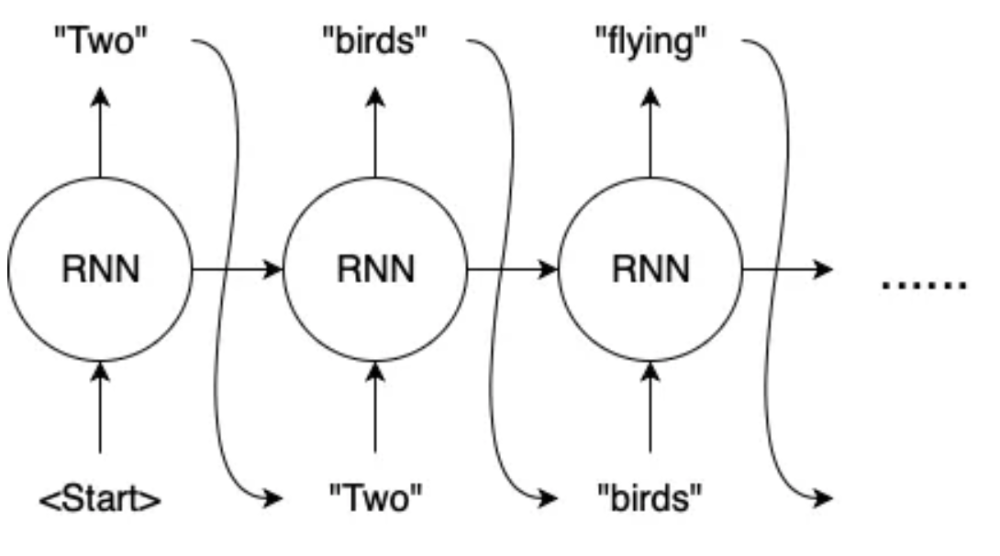
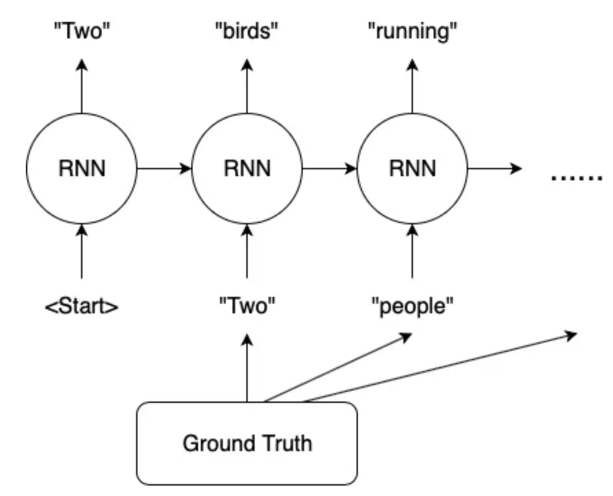

# Teacher Forcing[1]

A training technique where the ground truth is fed into the model as the `input` in the next `timestamp`.

## Comparison

| Without Teacher Forcing        | With Teacher Forcing        |
| :-------:  | :-------:  |
|  |  |

(Image Retrieved from [1])

## Pros & Cons

| Pros        | Cons        |
| -----------  | -----------  |
| Converge the model faster since it is trained on the correct labels. | Yield a discrapancy between training and inference. |
| Prevent gradient explosion, especially in the case of `RNN`. | Lead to poor model performance and stability. |

## Tips

1. We don't need to update the model at each timestep. Instead, we can store all the predicted output in a `Python list` and compute the losses in one go.

2. Teacher forcing can be used in any `time-series forecasting model` or `autoregressive models` such as `transformer`.

## Teacher Forcing vs Scheduled Sampling vs Normal Mode[2]

- `Normal Mode`: Predict next token based on the sentenced that the model is generating.
- `Teacher Forcing`: Predict next token based on the correct input (i.e. ground truth).
- `Scheduled Sampling`: Sometimes uses normal mode (using the half-finished sentence the model is generating), and sometimes uses teacher-forcing (using the correct sentence to predict the next token).

## References
[1] Wanshun Wong, “What is Teacher Forcing?,” Medium, Oct. 15, 2019. https://towardsdatascience.com/what-is-teacher-forcing-3da6217fed1c

[2] “Teacher Forcing vs Scheduled Sampling vs Normal Mode — Learning Machine,” rentruewang.github.io. https://rentruewang.github.io/learning-machine/layers/transformer/training/teacher/teacher.html (accessed Jun. 08, 2023).
