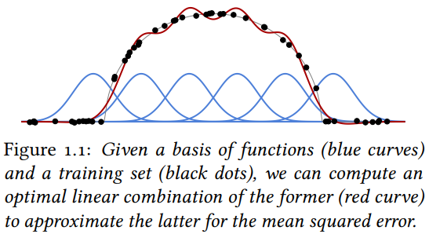

# Chapter 1. Machine Learning

- A machine learning model entails a complex analytical recipe that relates input and output.

## Machine Learning Training Essence

Let's take this in `Digital Signal Processing` terms:

- Think of those black dots as `input` (a.k.a. `modulating wave`)
- Think of the blue curves as `carrier`
    - The function of the `carrier` could consist of randomly initialized parameters OR `meta-parameters`, which are set per domain knowledge, best practices, or resource constraints.
- The red curve stands for `output` (a.k.a. `modulated result`)

(Image Retrieved from [1])

## Underfitting and Overfitting

**Essence**: The interplay between the `capacity` of the model (i.e. the flexibility and ability ot fit diverse data) and the `amount` and `quality` of the training data.

- `Underfitting`: The `capacity` is insufficient (i.e. the model cannot fit the data), and **the error during training is high**
- `Overfitting`: The `amount` of data is insufficient, **the performance during training can be excellent**, but unrelated to the actual fit to the data structure (i.e. the model learns `random noise` present in the signal)

## Categories of Models

**NOTE**: These categories do not cover all cases

- `Regression`: Predicting a continuous-valued vector, given an input signal.
- `Classification`: Predicting a value from a finite set.
- `Density Modeling`: Model the probability density function of the data itself.
    - The trained model should allow the evaluation of
        - The probability function,
        - The sampling from the distribution, or
        - Both above

## References

[1] F. Fleuret, “The Little Book of Deep Learning.” Accessed: Jul. 10, 2023. [Online]. Available: https://fleuret.org/public/lbdl.pdf