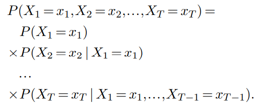
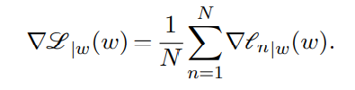
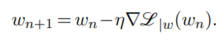

# Chapter 3. Training

## Loss Function

- `Logit`: Logarithm of a non-normalized probability.
- The loss function must have informative gradient, which enables gradient descent.
    - For example, in a classification scenario, `cross-entropy` is a standard loss entailing the gradient information, whereas `classification error rate` is not, even if the actual performance is measured by this metric.

## Autoregressive Model

- This model implements the `chain rule` from probability theory

(Image Retrieved from [1])

- The prediction at the current timestamp depends only on the input values that is **before** current timestamp. Hence, Autoregressive Model is `causal`.
- `Autoregressive Genearative Model`: One can sample a full sequence of length $T$ by sampling the $x_{t}$ s one after another, each according to the predicted `posterior distribution`, given the $x_{1}, ..., x_{t-1}$ already sampled.

## Gradient Descent -- The Tool to Minimize Losses

- The optimal weights do not have a `closed-form expression`.

> As with many algorithms, intuition breaks down in high dimensions.

- `Learning Rate`: Modulate how quickly the minimization is done.
    - If `Learning Rate` is too small, the optimization will move slow and easily be trapped in a `local minimum`.
    - If `Learning Rate` is too large, the optimization will bounce around the `global minimum` and never descend into it.

### Why Do We Need Batch

- In a nutshell, for doing more greadient steps (i.e. updating model parameters) under the same computational budget.
- Enable us to operate the datasets whose size is orders of magnitude greater than that of the computing device's memory.

| Gradient | Weight Update |
|:--:|:--:|
|||

(Images Retrieved from [1])

**Rationale:**
- Given the sample is properly shuffled, any partial sum in the Gradient formula above is an unbiased estimator of the full sum, albeit noisy.
- We estimate the `gradient` from these partial sums, even though the estimation is noisy, thereby having more parameter updates.

### SGD vs Adam

| SGD | Adam |
|:----|:----|
| Update the parameters by using the estimate of the current gradient computed from each batch. | Update the parameters by using the average of the last several gradients. |
|The process is extremly gradual, but SGD generalizes better than Adam, resulting in **better model performance**. | Converge **faster** than SGD|
| Use a fixed `learning rate` for all weight updates throughout the training. | Use adapative `learning rate` for different weights based on the 1st and 2nd `moment` of the gradients. |

## References

[1] F. Fleuret, “The Little Book of Deep Learning.” Accessed: Jul. 11, 2023. [Online]. Available: https://fleuret.org/public/lbdl.pdf