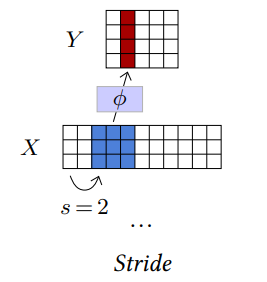
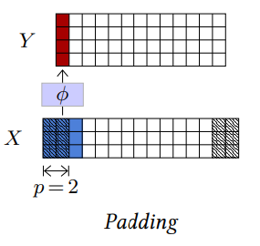
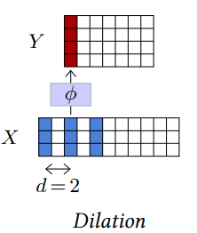
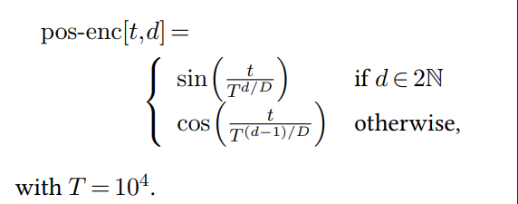
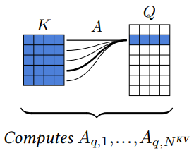
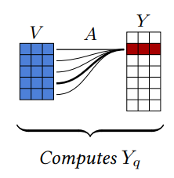

# Chapter 4. Model Components

- `Layers` can be seen as standard complex compounded tensor operations.

## Fully-Connected Layer

- Parameterized by $\omega = (W, b)$, where $W$ is a `weighted matrix`, and $b$ is a `bias vector`.
    - $Y[d1,...dk] = WX[d1, ..., dk] + b$

### Limitation

- Is poorly adpated to dealing with large tensors.
- Fail to capture `short-term correlations` or `statistical stationarity`, which completely ignores the `signal structure`

## Convolutional Layer

- `Receptive Field`: The portion of the input signal that generates a single `activation` / `output`.
- Convolutional layer trades `larger spatial size of representation` for `greater number of channels`, which translates into a richer local representation.

### Hyper-Parameters

- `Kernel Size`
- `Number of Input Channels`
- `Number of Output Channels`

| Stride | Padding | Dilation |
| :---- | :---- | :---- |
| Modulate the step size when going through the input tensor. | Specify how many zeros entries are added around the input tensor before processing it. | Parameterize the index count between coefficients of the filter. |
| Reduce the output size geometrically by using large steps. | Maintain the tensor size. | Increase the filter / kernel size while keeping the number of trainable parameters unchanged. |
|  |  |  |

(Images Retrieved from [1])

## Other Components

| Components | Description |
| :--- | :--- |
| `Activation Functions` | <li>Non-linear operation to capture non-linear features in data.</li> |
| `Pooling` | <li>Operation to reduce the signal size.</li>  |
| `Dropout` | <li>Facilitate training or improve the quality of learned representations.</li>  |
| `Skip Connection` | <li>Mitigate the vanishing gradient by propagating the gradient through skip connections.</li><li>Allow for the building of deep architectures.</li> |

## Normalization Layer

- Facilitate the training of deep architectures, which force the empirical mean and variance of groups of activations.

| Batch Normalization | Layer Normalization |
| :--- | :--- |
| Normalize features independently across each batch. | Normalize inputs in each batch independently across each feature. |
| Compute mean and variance of input on `batch` axis. | Compute mean and variance of input on `feature` axis. |
| In training, the mean and average is dynamic, whereas in testing, the mean and average is fixed. | Behave the same during training and testing. |

## Layers / Techniques Commonly Used in NLP

| Layers / Techniques | Description |
| :--- | :--- |
| `Attention Layer` | Associate local information that is at locations far apart in a tensor. |
| `Token Embedding` | Consist of a lookup table that maps integers to vectors, thereby convering discrete tokens into vectors before feeding into the model. |
| `Position Encoding` | <li>Encode positional features into a vector for processing. </li><li>$D$: The dimension of the encoding vectors</li><li>$t$: The position (timestamp) of the word in the sentence.</li><li>$d$: Index value in the encoded vector.</li> |

(Image Retrieved from [1])

### Attention Layer

| Steps | Description |
| :--- | :--- |
| | Match every `query` with all the `keys` to get **normalized** attention scores. |
| | Average the `values` with `attention scores` to get output. |

(Images Retrieved from [1])

## References

[1] F. Fleuret, “The Little Book of Deep Learning.” Accessed: Jul. 13, 2023. [Online]. Available: https://fleuret.org/public/lbdl.pdf