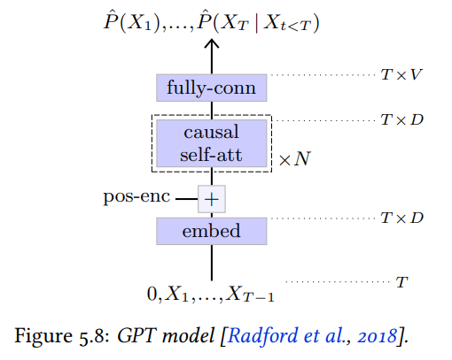

# Chapter 5. Architectures

## Multi-Layer Perceptrons (MLP)

- A succession of `fully-connected layers` separated by `activation functions`.
- MLP is a useful tool when the dimension of the signal to be processed is not too large.

## Convolutional Networks

- The standard architecture for processing images.
- Consist of multiple convolutional layers.

- `LeNet-Like`
    - The LeNet model, proposed by Yann LeCun, combines a series of 2D `convolutional layers` and `max pooling layers` that play the role of feature extractor, with a series of `fully-connected layers` which act like a MLP and perform the classification per se.
- `Residual Networks`
    - Address the vanishing gradient issue in deep architecture with `residual connections`

*NOTE*: Reducing / Upscaling the number of channels only with a 1 x 1 convolution.

## Attention Models

- `Transformer`
    - `Encoder`: Process the input sequence to get a refined representation.
    - `Decoder`: An autoregressive section that generates each token of the result sequence, given the encoder's representation of the input sequence and the output tokens generated so far.
- `Generative Pre-trained Transformer (GPT)`
    - A pure autoregressive model that consists of succession of causal `self-attention blocks`, hence a causal version of the `Transformer Encoder`.

(Image Retrieved from [1])

- `Vision Transformer`
    - Transformer used in image classification
    - Has an output named classification token (`CLS Token`)

## References

[1] F. Fleuret, “The Little Book of Deep Learning.” Accessed: Jul. 13, 2023. [Online]. Available: https://fleuret.org/public/lbdl.pdf
