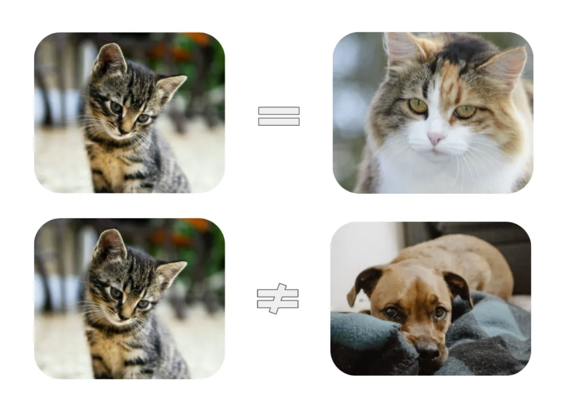

# Understanding Contrastive Learning[1]

- Contrastive learning is a `self-supervised` technique that is task-independent and allows model to learn the `general features` about data, even without labels.

- Contrastive learning allows model to
    - Find out the commonalities / similarities between same types of data (`positive pairs`).
    - Distinguish the discrepancy between different types of images (`negative pairs`).

- Example
    - Assume you are a newborn baby and you have two cats and a dog at home. Even though no one tells you they are 'cats' and 'dogs', you may still realize the two cats look similar compared to the dog.

(Image Retrieved from [1])

- Primary steps of contrastive learning:
    - Data Augmentation to enlarge the dataset size
    - Encoding the augmented data to feature maps
    - Loss minimization of representations

- This technique is extensively used in Natural Language Processing (NLP) realm.

## Difference between self-supervised learning and unsupervised learning

- Per [2], self-supervised learning is very similar to unsupervised, except for the fact that self-supervised learning aims to tackle tasks that are traditionally done by supervised learning.

## References
[1] E. Tiu, “Understanding contrastive learning,” Medium, 08-Jan-2021. [Online]. Available: https://towardsdatascience.com/understanding-contrastive-learning-d5b19fd96607. [Accessed: 20-Apr-2023]. 

[2] T. Cheng, “Supervised, semi-supervised, unsupervised, and self-supervised learning,” Medium, 13-Oct-2022. [Online]. Available: https://towardsdatascience.com/supervised-semi-supervised-unsupervised-and-self-supervised-learning-7fa79aa9247c. [Accessed: 20-Apr-2023]. 
