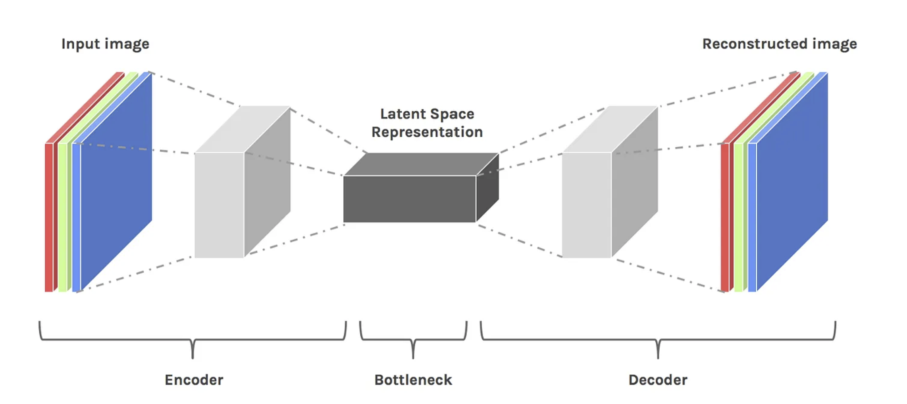
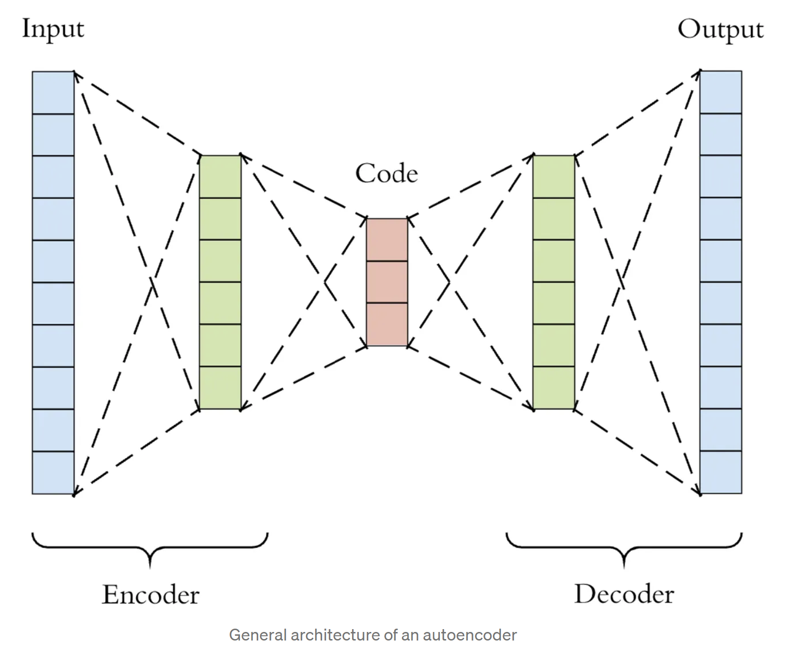
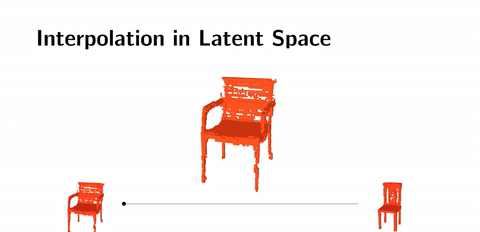

# Understanding Latent Space in Machine Learning[1]

> The core of deep learning — learning the features of data and simplifying data representations for the purpose of finding patterns

- Latent space is a representation of `compressed data` in which similar data points are closer toghther in space.
    - `Patterns` can be easier to be discovered in the latent space since similar data points tend to cluster toghther.
    - Through analyzing data in the latent space, the model learns the `patterns` or `structural similarities`.

- The encoder-decoder architecture is easier to learn the latent variable's distributions
    - In the `Encoder` stage, the dimensionality of the image is reduced (data compression). And the model learns the relevant features and disregard the extraneous information.
    - In the `Latent Space Representation`, only important features are stored, and the noise are eliminated.
    - In the `Decoder` stage, the compressed data gets reconstructed, the dimensionality of data is increased.
    - The value of compression - Allowing the model to get rid of any extraneous information, and only focus on the most important features.

(Image Retrieved from [1])

- `Autoencoder`
    - A neural network that acts as an identity function. In other words, an autoencoder learns to output whatever is inputted.
    - The model is forced to exclusively store relevant features of data, so that there is enough information in the compressed form such that the model can accurately reconstruct it.

(Image Retrieved from [1])

- We can `interpolate` data in the latent space, and use decoder to generate data, resulting in `image morph`.

(Image Retrieved from [1])

- We can visualize the latent space using algorithms such as `t-distributed Stochastic Neighbor Embedding (t-SNE)`, which takes our latent space representation and transforms it into 2D or 3D.

## References
[1] E. Tiu, “Understanding latent space in machine learning,” Medium, 04-Feb-2020. [Online]. Available: https://towardsdatascience.com/understanding-latent-space-in-machine-learning-de5a7c687d8d. [Accessed: 20-Apr-2023].  
 
