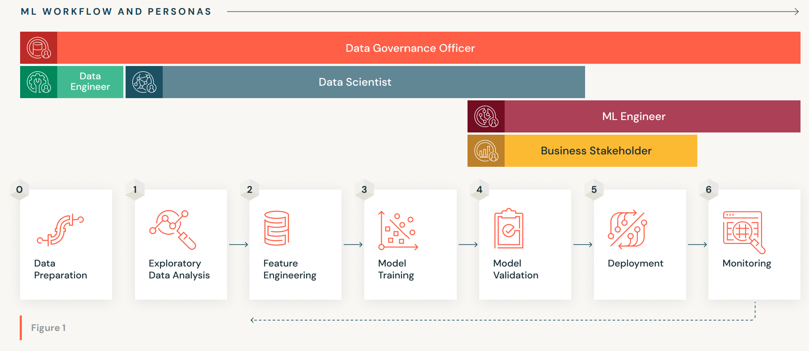
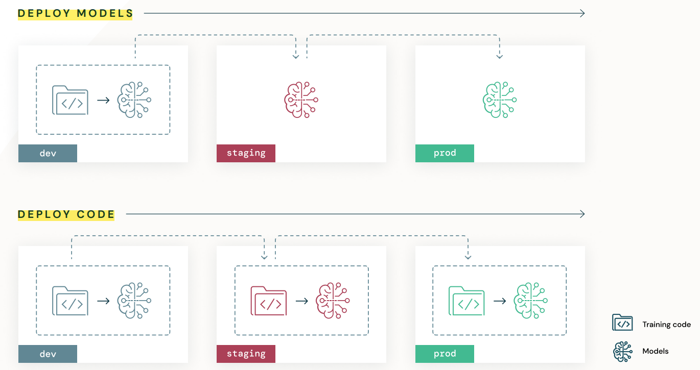
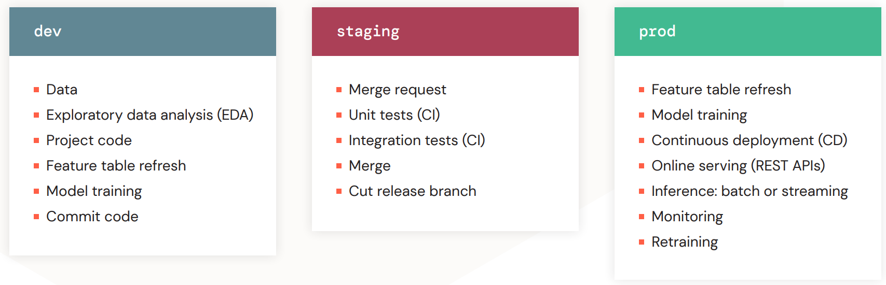

# The Big Book of MLOps[1]

`MLOps` = `ModelOps` + `DataOps` + `DevOps` 

> MLOps is a set of processes and automation for managing models, data and code to improve performance stability and long-term efficiency in ML systems.

## MLOps Workflow & Personas

(Image Retrieved from [1])

- **Data Engineer:** responsible for
    - Building data pipelines to process, organize, and persist datasets for ML nad other downstream applications
- **Data Scientist:** responsible for
    - Understanding the business problem and exploring available data to understand if machine learning is applicable
    - Training, tuning, and evaluating a model to be deployed
- **ML Engineer:** responsible for
    - Deploying ML models to production with appropriate governance, monitoring and software development best practices (such as CI / CD)
- **Business Stakeholder:** responsible for
    - Using the model to make decisions for the business or product
    - The business value generated by the model
- **Data Governance Officer:** responsible for
    - Ensuring that `data governance`, `data privacy` and other compliance measures are adhered
    - Not typically involved in day-to-day operations

## MLOps Guidelines

- Always keep your business goals in mind
    - Does MLOps enable new business use cases?
    - Does MLOps improve data team's productivity?
    - Does MLOps reduce operational costs or risks?
- Take a data-centric approach to machine learning
    - Develop ML applications on the same platform used to manage production data, such as `cloud storage`
- Implement MLOps in a modular fashion
    - Modularized code enables testing of individual components and mitigates difficulties with future code refactoring
- Process should guide automation
    - Not every step of a process can or should be automated
    - In some cases, human oversight or intervention is necessary

## MLOps Assets & Stages

| Assets        | Stages        |
| ------------- | ------------- |
| <ul><li>`Execution environments`</li><li>`Code`</li><li>`Models`</li><li>`Data`</li></ul>| <ul><li>`Developed (dev)`</li><li>`Tested (staging)`</li><li>`Deployed (prod)`</li></ul> |

## ML Deployment Patterns

- Deploy Models
    - Does not support `automated model retraining`
    - Use this pattern when your model is a one-off or when model training is very expensive
- Deploy Code
    - The code is moved to staing and then production
    - Models will be trained in each stage

(Image Retrieved from [1])

## Reference MLOps Architecture

- `dev`
    - Feature table has featurization (a.k.a. `Feature Engineering`) involved
- `staging`
    - `Merge request`: Request to merge into the `main` branch serving as the staging branch
    - `Unit Tests (CI)`: If this test fails, the merge request is rejected
    - `Integration Test (CI)`: Run all pipelines to confirm all the integrated parts function correctly together
    - `Merge`: If all tests pass, the code is merged into the staging branch
- `prod`
    - `Continuous Deployment (CD)`:
        - `Compliance checks`: Loading the model from the `Model Registry` and performing compliance checks (for `tags`, `documentation`, etc.)
        - `Compare Staging vs. Production`: To prevent performance degradation, models promoted to `stage=Staging` must be compared to the `stage=Production` models they are meant to replace.
        - `Request model trainsition to production`
    - `Monitoring`:
        - Check statistical properties (data drift, model performance, etc.)
        - Check computational performance (errors, throughput, etc.)
        - Publish metrics and may trigger model retraining

(Image Retrieved from [1]) 

## References
[1] J. Bradley, R. Kurlansik, M. Thomson, and N. Turbitt, The Big Book of MLOps, V6 ed. Databricks, 2022.
