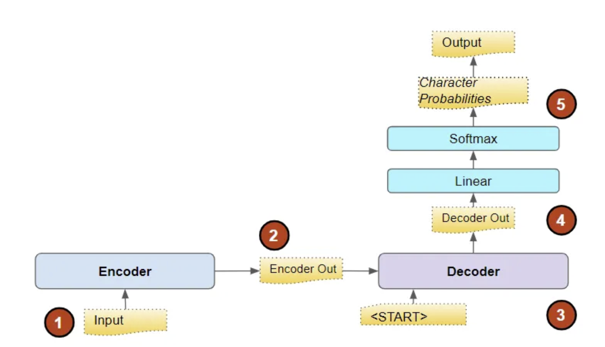
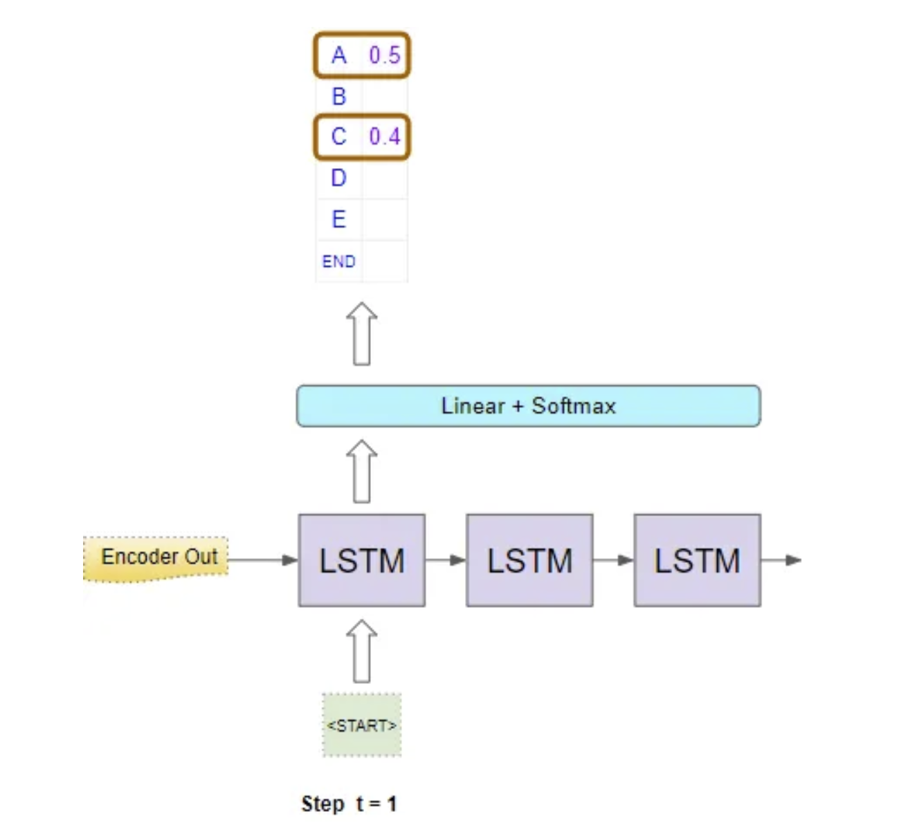
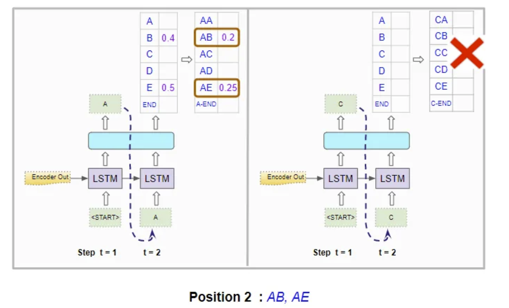
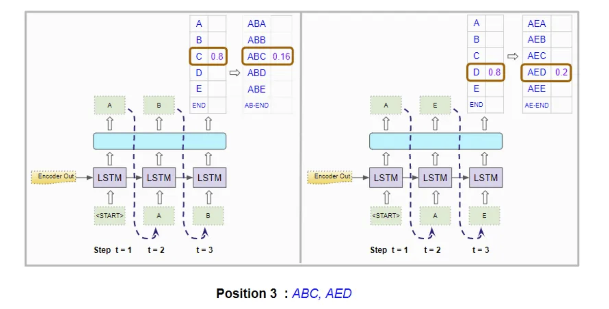

# Foundations of NLP Explained Visually: Beam Search, How It Works[1]

## How NLP models generate output

- NLP model constructs a `vocabulary` consisting of the entire set of words in the source and target languages
- The `Decoder` has the encoded latent features and `<START>` token as inputs
- The pure output are probabilities, which are numerical values. But we want a character/word/sentence. And there are two approaches to achieve that goal:
    - Greedy Search
    - Beam Search

(Image Retrieved from [1])

## Greedy Search vs Beam Search

- Simply take the word that has the highest probability at each position.
- Quick to compute and does produce the correct results sometimes.

| Greedy Search        | Beam Search        |
| -----------  | -----------  |
| Simply take the word that has the highest probability at each position. | Take the best $N$ words at each position. |
| Consider each position in isolation, regardless of the context. | Pick the best $N$ sequences so far and consider the probabilities of the **combination** of all the preceding words along with the word in the current position. |
| Quick to compute and does product the correct results sometimes. | Generate better results than Greedy search at the expense of increased computation and longer execution time. |

- $N$ is known as the `Beam Width`
- The search will be ended when the $N$ best predictions are all `<END>` token at that position

## Beam Search Example

In the example below, $N = 2$

| First Position        | Second Position        | Third Position        |
| -----------  | -----------  | -----------  |
|  |  |  |

(Images Retrieved from [1])

- In each timestep, the model chooses the sequence that has the highest **combined probability**
- At position 2, the two best sequences happen to be in the sequence with *A* as prefix
- The process will be ended till it generates two best sequences that end with an *<End>* token

## References
[1] K. Doshi, “Foundations of NLP Explained Visually: Beam Search, How it Works,” Medium, May 21, 2021. https://towardsdatascience.com/foundations-of-nlp-explained-visually-beam-search-how-it-works-1586b9849a24
