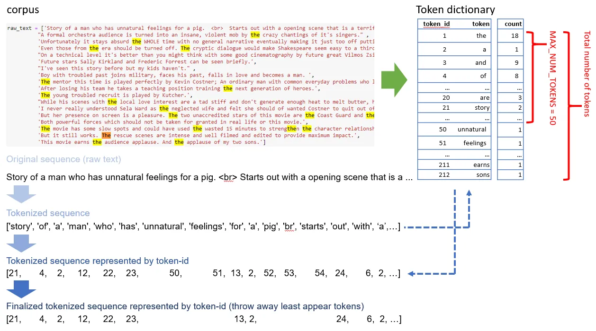

# Hands-on NLP Deep Learning Model Preparation in TensorFlow 2.X<sup>[1]</sup>


## Tokenization

**Essence**: Create a token `dictionary` thereby representing the original text with `tokens` (or say `token-ids`)

- Tokenization means breaking the raw text into unique units (a.k.a. tokens) which could be sentences, phrases, or words
- Some preprocessings may need to be involved, such as `lowercasing` or `punctuation removal`, but it depends on the **project requirements**.
- Inside the `dictionary`, the token is ranked in desceding order by the **counts** of each token, which is counted by the `tokenizer`

**NOTE:** When using `TensorFlow` tokenizer, 0-token-id is reserved for `empty token`, so the token-id starts at 1. But this may not be the case in other tokenizers in other NLP packages.

> NOTES: There is no simple answer to what should be num_words value. But here is my suggestion: to build a pipeline, you can start with a relatively small number, say, num_words=10,000, and come back to modify it after further analysis.



(Image Retrieved from [1])

### Out-of-Vocabulary (OOV) Issue

- OOV is harmful to both deep learning models and traditional machine learning models

- The example below is a tokenizer implemeted from `Tensorflow`, and the tokenizer fails to generated any output for the word `Storys` and `woman`

```python
from tensorflow.keras.preprocessing.text import Tokenizer
tokenizer = Tokenizer()
tokenizer.fit_on_texts(raw_text) # raw_text is defined elsewhere

test_sequence = ['Storys of a woman...'] 
print(test_sequence)
print(text_to_word_sequence(test_sequence[0]))
print(tokenizer.texts_to_sequences(test_sequence))

>>['Storys of a woman...']
>>['storys', 'of', 'a', 'woman']
>>[[4, 2]]
```

- How to mitigate this issue:
    - Train the tokenizer on a larger corpus or
    - **Adopt a pre-trained tokenizer**


## Padding

- Most of the neural networks require the input sequence data with the same length
- If the length of tokenized sequence is larger than the `MAX_SEQUENCE_LENGTH`, the tokens of the sequence after `MAX_SEQUENCE_LENGTH` will be truncated. Otherwise, it will be padded with 0.

```python
from tensorflow.keras.preprocessing.sequence import pad_sequences

MAX_SEQUENCE_LENGTH = 10
trainvalid_data_post = pad_sequences(train_sequences, maxlen=MAX_SEQUENCE_LENGTH, padding='post', truncating='post')
```

- Per [2], it is recommended using `post` padding when working with RNN layers. Plus, in English, the most information appears at the beginning. Truncating or padding sequence after can better represent the original text.
- We can choose the `mean` or `median` as the `MAX_SEQUENCE_LENGTH`
- For `RNN` architecture, we can choose a larger `MAX_SEQUENCE_LENGTH` and utilize `Masking` to mitigate storage and computation waste. 
- Padding sequences with 0s will introduce noises into the model if not handled properly

## Word Embedding

**Essence**: Convert word to vectors


## Embedding Layer in `TensorFlow`

> The key to modern NLP feature extraction: If everything works, the output of the embedding layers should represent well of the original text, with all the features storing in the word embedding weights; this is the key idea of modern NLP feature extraction.


## References

[1] K. Mo, “Hands-on NLP Deep Learning Model Preparation in TensorFlow 2.X,” Medium, Aug. 17, 2020. https://towardsdatascience.com/hands-on-nlp-deep-learning-model-preparation-in-tensorflow-2-x-2e8c9f3c7633 (accessed Aug. 16, 2023).

[2] “Understanding masking & padding | TensorFlow Core,” TensorFlow. https://www.tensorflow.org/guide/keras/understanding_masking_and_padding
