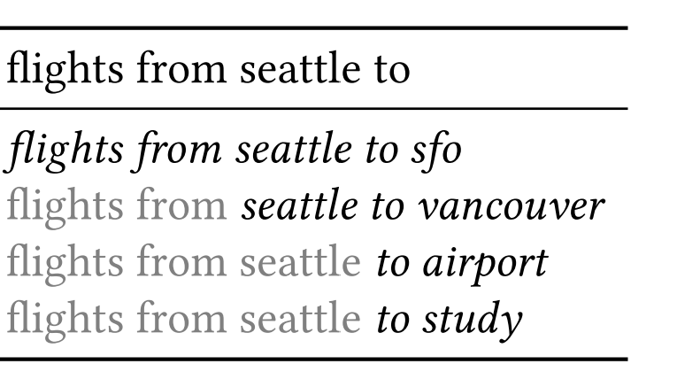
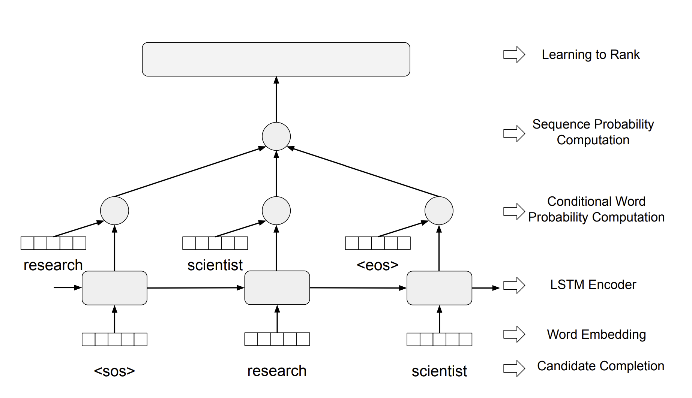
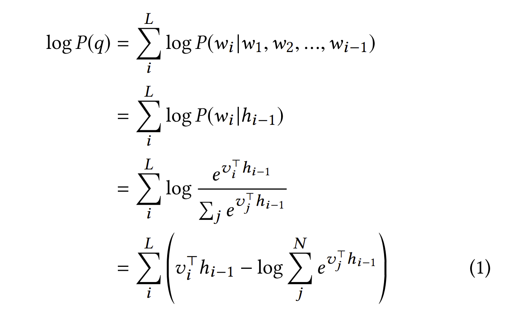
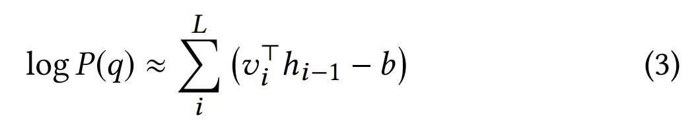

# Efficient Neural Query Auto Completion[1]

## Fundamentals

Query Auto Completion (QAC) is composed of two steps:

- Candidate Generation
- Candidate Ranking

Also, QAC enhance user experience in two ways:

- Save user keystrokes and return search results in less time.
- Guide users to type queries that are more likely to lead to desireable search results.

## Challenges to Overcome

- QAC has a strict latency requirement (the result must be returned within 10 ms), thereby implementing sophisticated language models (LM) is infeasible.
- Generated candidates for `unseen queries` are of poor quality, as the context is not fully utilized.
- Traditional QAC relies heavily on handcrafted features (e.g. query candidate frequency in `search log`), lacking semantic understanding.

## Candidate Generation

Essentially, the mechanism of the candidate generation is called `Maximum Context Generation (MCG)` consisting of two Finite State Transduceres[2]:

- `QueryFST`
    - Input: `background query`
        - e.g. *"flights from seattle to"*
    - Output: `Input` + `query suggestion`
        - e.g. *"flights from seattle to sfo"*

- `SuffixFST`
    - Input: all suffix `n-grams` of the queries
        - e.g. *["from seattle to", "seattle to", "to"]*
    - Output: `removed word` + `Input` + `query suggestion`
        - e.g. *["flights from seattle to vancouver", "flights from seattle to airport", "flights from seattle to study"]*

**NOTE:** If a word cannot be found in FSTs, no
suggestion will be made.

(Image Retrieved from [1])

## Candidate Ranking

The model entails two parts:

- An "unnormalized" language modeling layer
    - Compute a score for a query candidate efficiently
- A pairwise learning-to-rank layer
    - Applied on the scores of the clicked and non-clicked query pairs

Two special tokens are used:

- `<sos>`: start of sequence
- `<eos>`: end of sequence

(Image Retrieved from [1])

For computing the score for query suggestion:

| Normalized LM        | Unnormalized LM        |
| -----------  | -----------  |
|  |  |
| $L$: number of words in the query   $N$: vocabulary size   $w_{i}$: i-th word   $h_{i}$: hidden state of an LSTM cell for word $w_{i}$   $v_{i}$: embedding for for word $w_{i}$ | $b$: scalar parameter to learn |

(Image Retrieved from [1])

Approximating the `normalization term` to a scalar parameter yields three benefits:

- Decrease the computation overhead by avoiding iterating every word over the `vocabulary`
- Keep the ranking effectiveness by preserving the relative ranking position
- Impose length penalty by using a penalty term $b * L$

## Evaluation Metrics

- `Recall@10`: Recall among top 10 generated candidates
    - The probability that users' desired queries exist in the candidate list.
    - Used for `Candidate Generation` stage.
    - **Larger value mean better performance**
- `MRR@10`: Mean Reciprocal Rank[3] for the top 10 generated candidates
    - Measure the relevance performance of each candidate ranking method
    - Used for `Candidate Ranking` stage.
    - **Larger value mean better performance**
- `Latency`
    - Time consumption for both `Candidate Generation` and `Candidate Ranking`.
    - In this work, `Candidate Generation` costs less than 0.2 s, which is negligible.

## References
[1] S. Wang, W. Guo, H. Gao, and B. Long, “Efficient Neural Query Auto Completion,” Proceedings of the 29th ACM International Conference on Information & Knowledge Management, Oct. 2020, doi: https://doi.org/10.1145/3340531.3412701.

[2] “FST (Lucene 7.3.1 API),” lucene.apache.org. https://lucene.apache.org/core/7_3_1/core/org/apache/lucene/util/fst/FST.html (accessed Jun. 23, 2023).

[3] “Mean Reciprocal Rank (MRR) - Machine Learning Glossary,” machinelearning.wtf. https://machinelearning.wtf/terms/mean-reciprocal-rank-mrr/
