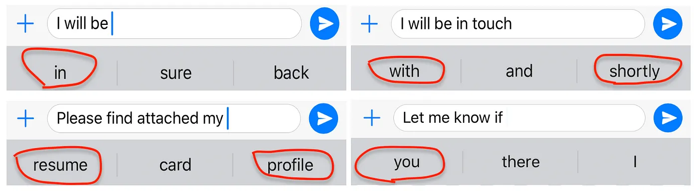
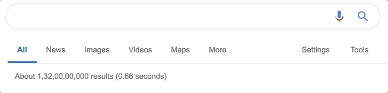
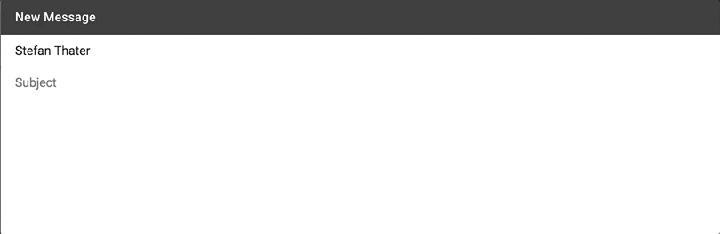
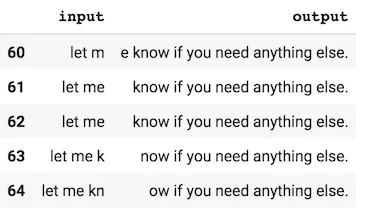

# Building Gmail style smart compose with a char ngram language model[1] & Google Gmail Smart Compose[2]

## Whatsapp Predictive Text vs Google Autocomplete vs Google Smart Compose

| Whatsapp        | Google Autocomplete |  Google Smart Compose |
| -----------  | -----------  | -----------  |
|  |  |  |
| A model-based solution that only predicts the next word (`unigram`) or at most the next word pair (`bigram`) | A model-based solution that factors in the query typed in so far and runs a `prefix search` on the trending searches | Not only use `current text`, but use the `subject` and `previous message` (if the user is replying) to complete the **sentence** | 

(Images Retrieved from [1])

## Language Model (LM)

- Essentially, LM estimates the probability below, where $N$ refers to the number of words 

(Image Retrieved from [1])

- LM learns a representation of a text corpus similar to a `word embedding` but **better** one

## Concepts

- LM generates a random sequence of arbitrary length with or without `prefix` (also referred as `seed` or `prompt` sometimes)
- `Conditioned Generation`: Generating an arbitrary length sequence given a arbitrary length sequence as input, since the output is conditioned on the input. A canonical case is `Seq2Seq Modelling`
- At earlier ages, people have been using a `Markov models` for learning a LM. Then `RNN` and its cousins (`LSTM`, `GRU`) emerge and become the first choice for LM
- The `many-to-many` RNN architecture where input and output are of different length is exactly the same as a `conditioned generator`
- `Conditioned generator` is just another name for the `Encoder-Decoder` architecture.
    - `Condtioned generator` explains what the architecture does
    - `Encoder-Decoder` names the components in the architecture

## Comparison

- [1] builds the model at `char ngram level`, since a LM much more granular than the ones at word level is needed. [3] entails the code for preprocessing the corpora into the format below:

(Image Retrieved from [1])

- [1] implements the model with `BiLSTM` as encoder and `LSTM` as decoder. While [2] builds the model with `BiGRU` as encoder and `GRU` as decoder

- Adding `Attention` mechanism can be the future development for both [1] and [2]. `Attention` provides a better understanding of the context.

## References
[1] P. Da, “Building Gmail style smart compose with a char ngram language model,” Medium, Jun. 08, 2019. https://towardsdatascience.com/gmail-style-smart-compose-using-char-n-gram-language-models-a73c09550447#2987 (accessed Jun. 28, 2023).

[2] “Gmail Smart Compose in Keras and Tensorflow.js,” Jiayi’s Chronicles. https://blog.jiayihu.net/gmail-smart-compose-in-keras-and-tensorflow-js/ (accessed Jun. 28, 2023).

[3] “Jupyter Notebook Viewer,” nbviewer.org. https://nbviewer.org/github/PrithivirajDamodaran/NLP-Experiments/blob/master/Gmail_style_smart_compose_with_char_ngram_based_language_model.ipynb (accessed Jun. 28, 2023).
