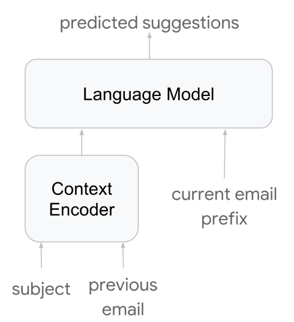
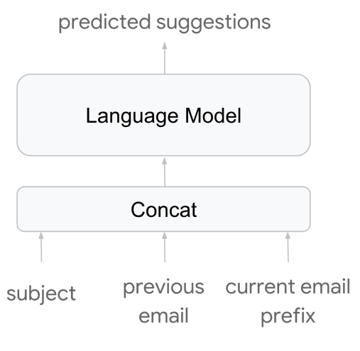
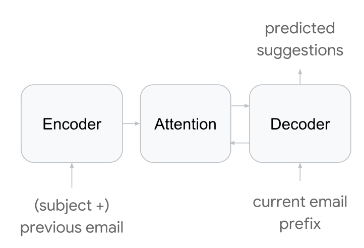
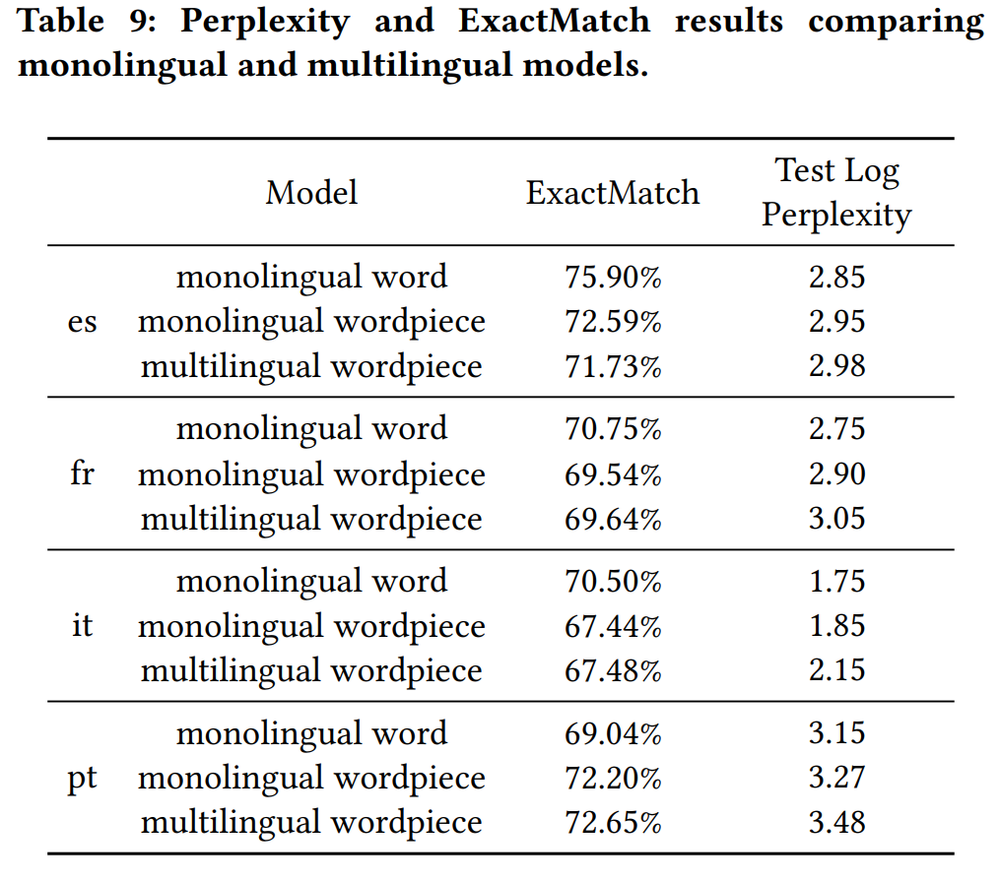

# Gmail Smart Compose: Real-Time Assisted Writing[1]

## Fundamentals
- The fundamental task in Smart Compose is to predict a sequence of `tokens` of variable length, conditioned on the prefix token sequence typed by a user and additional contextual information.
- At the core of Smart Compose is a powerful `neural language model` trained on a large amount of e-mail data.

## Data

- Tokenize e-mails into words
- Contextual information:
    - Previous e-mail in case the composed e-mail was a response.
    - Subject of the e-mail.
    - Date and time of the composed e-mail.
    - Locale of the user composing the e-mail.
        - e.g. *behavior* vs *behaviour*
- This paper uses a word-level model, and the vocabulary contains the most frequent **50K** English words. 

## Preprocess

- `Language detection`
- `Tokenization`: Sentences are broken into words and punctuation marks.
- `Normalization`: Infrequent words and entities like personal names, URLs, e-mail addresses, phone numbers etc. are replaced by special tokens.
- `Quotation removal`: Quoted original messages and forwarded messages are removed.
- `Salutation/close removal`: Salutations like *Hi John* and closes such as *Best regards, Mary* are removed.

## Model Architecture

- This paper proposes three model architectures, but implements **LM-A** to its production, due to strict latency constraint and very high request volume.

| LM-A | LM-B | Seq2Seq |
| -----------  | -----------  | -----------  |
|  |  |  |

(Images Retrieved from [1])

- With the introduction of `latent variables`, LM are expected to be able to capture `hidden features` like topic, sentiment writing style etc. from the text.

- The `attention mechanism` offers the `Seq2Seq` model the potential advantage of better understanding the context information.

> An encoder-decoder architecture with attention is more effective in modeling the context information.

## Inference Termination Conditions

- A sentence punctuation token is generated or
- A special end-of-sequence (<EOS>) toke is generated or
- The candidate reaches a predefined maximum output sequence length.

## Evaluation Metrics

- `Log Perplexity`
    - $Log  Perplexity(x) = -\sum_{x} p(x) \log p(x)$
    - A modle with lower perplexity assigns higher probabilities to the true target tokens.
- `ExactMatch@N`
    - A predicted phrase that is N words long, the percentage of predicted phrase that exactly matches the first N words in the ground truth text.

## Personalization and Multilingual Model

### Personalization

- Involve an `n-gram` language model with `Katz-backoff`, which is small, adaptive, easy for serving and periodical re-training.
- The final prediction probability is the linear interpolation between personal and global models
    - $P_{final} = \alpha P_{personal} + (1 - \alpha) P_{global}$
- For the personal model, the vocabulary size is constrained to be below a maximum threshold.

### Multilingual Model

- This paper uses `WordPiece` models and split `tokens` into sub-word units (wordpieces).
- The result shows `Monolingual word model` yields the lowest perplexity, lower than `multilingual wordpiece models`.
- Different languages have different triggering confidence threshold.

(Images Retrieved from [1])

## References

[1] M. X. Chen et al., “Gmail smart compose,” Proceedings of the 25th ACM SIGKDD International Conference on Knowledge Discovery &amp;amp; Data Mining, 2019. doi:10.1145/3292500.3330723 
